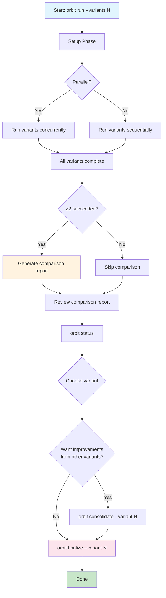
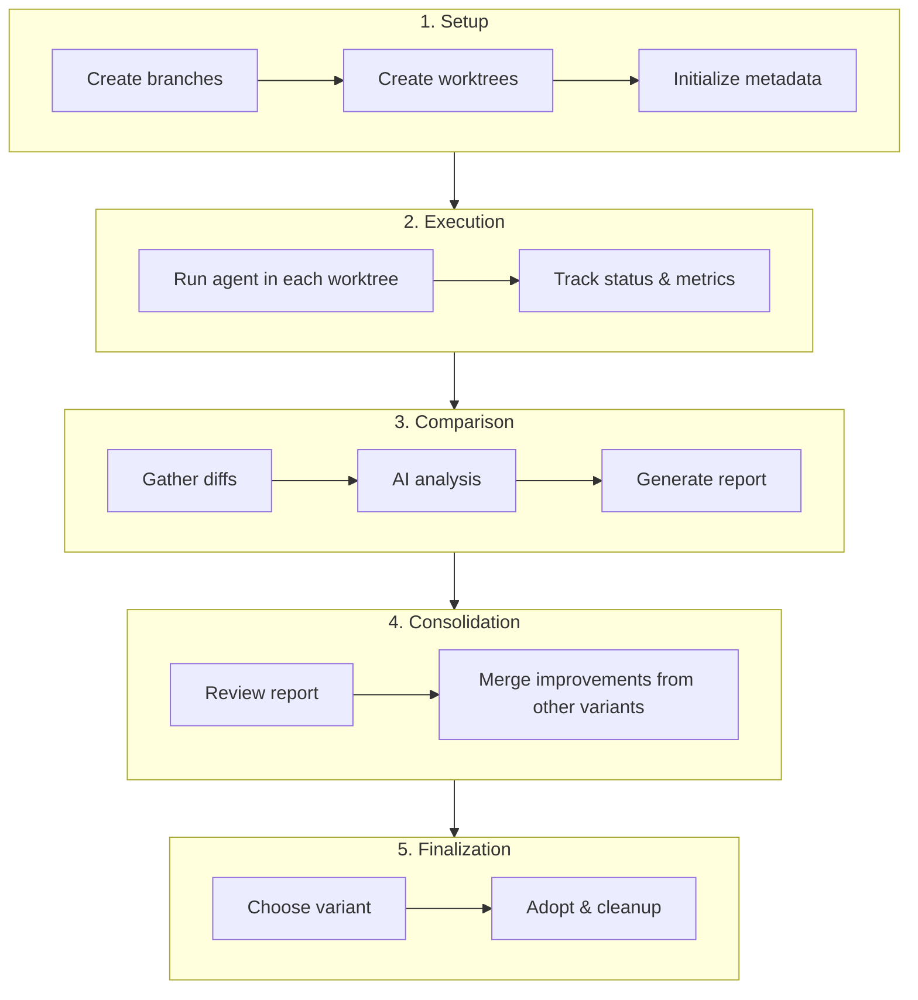
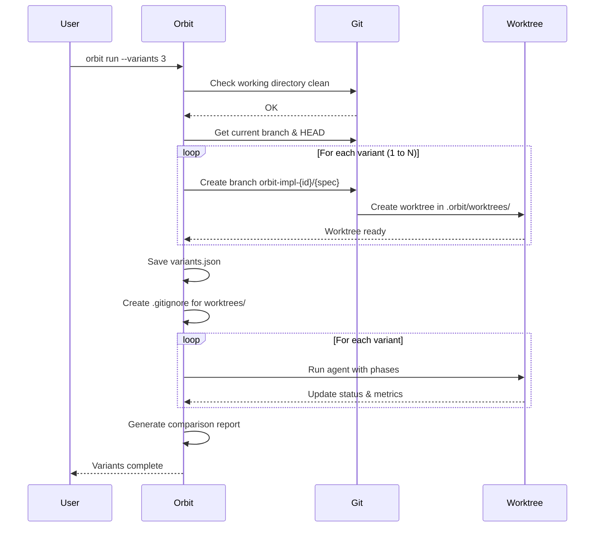
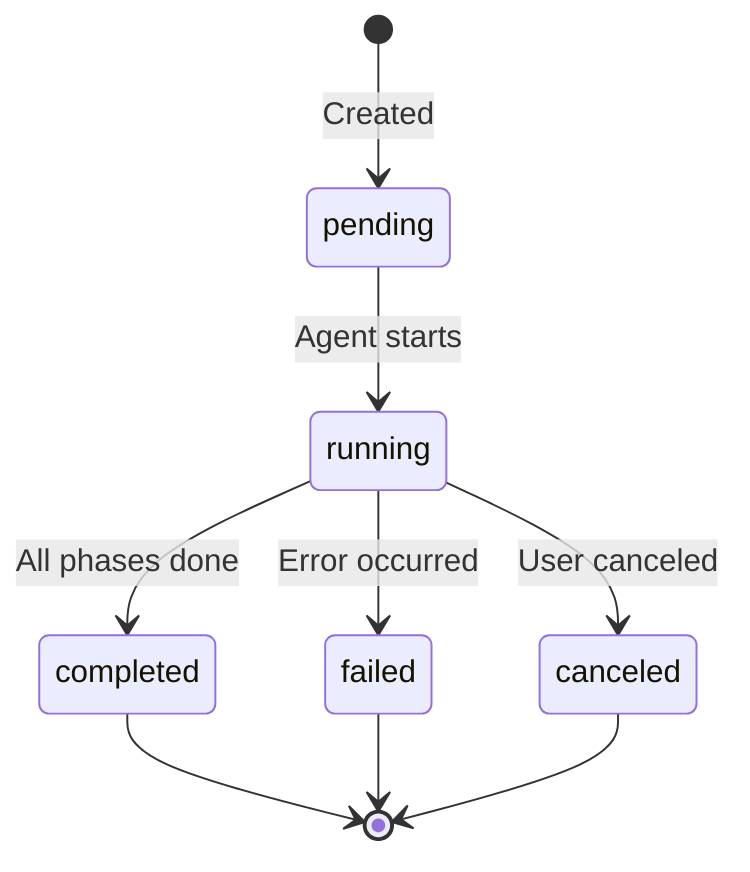
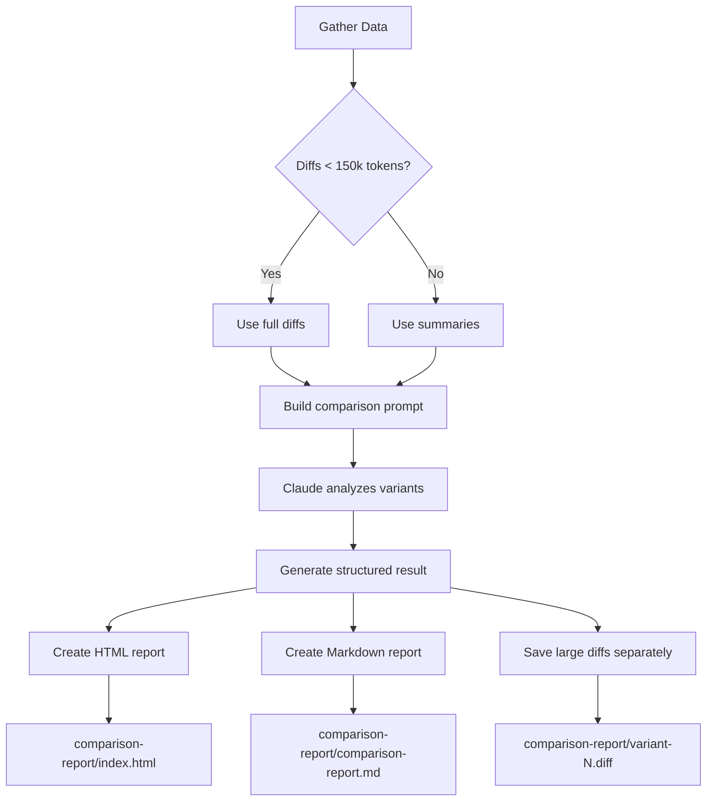
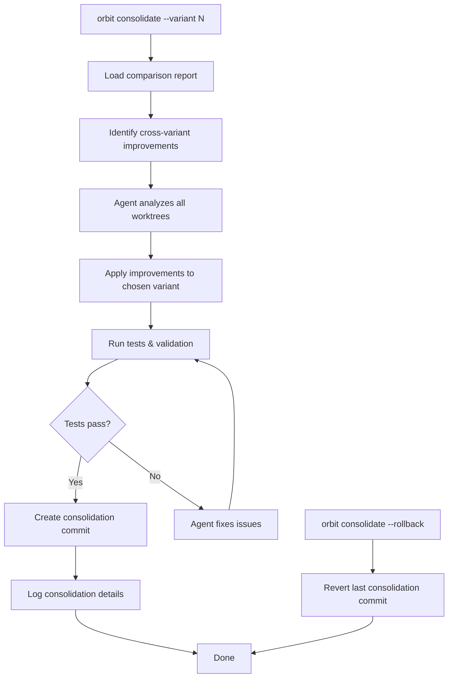
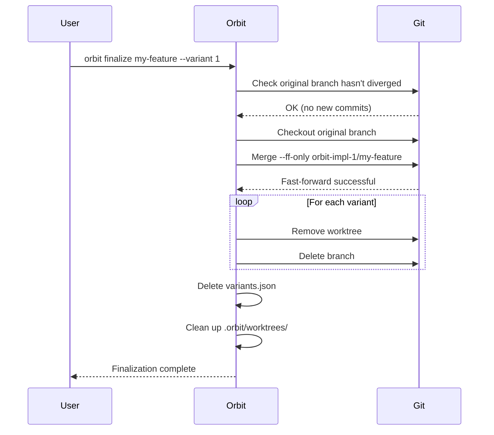
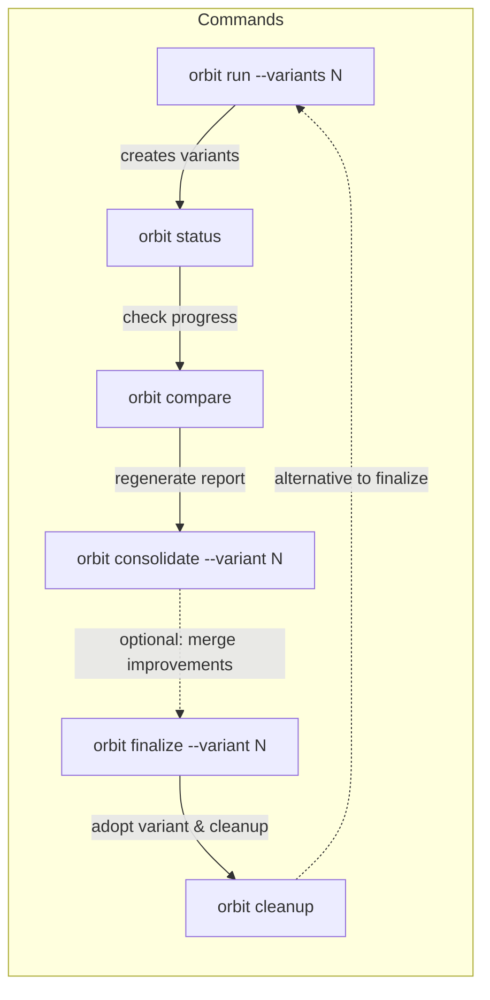

# Orbit

Orbit is a CLI tool that orchestrates AI coding agents to implement spec phases sequentially. It handles session lifecycle, error recovery, and log management.

## Overview

Orbit solves the problem of running AI coding agents through multiple implementation phases without manual intervention. It:

- Supports multiple AI agents: Claude Code, OpenAI Codex, AWS Kiro, GitHub Copilot, and OpenCode
- Automatically detects tasks from your git branch
- Runs agents in non-interactive mode for each phase
- Handles rate limits and connection errors with appropriate retries
- Saves session logs for debugging and auditing
- Supports multi-variant comparison runs to evaluate different implementations

## Installation

```bash
go install github.com/arjenschwarz/orbit/cmd/orbit@latest
```

## Prerequisites

- At least one AI coding agent installed and authenticated:
  - [Claude Code CLI](https://docs.anthropic.com/en/docs/agents-and-tools/claude-code/overview) (default)
  - [OpenAI Codex](https://github.com/openai/codex)
  - [AWS Kiro](https://kiro.dev/docs/cli)
  - [GitHub Copilot CLI](https://docs.github.com/en/copilot/using-github-copilot/using-github-copilot-in-the-command-line)
  - [OpenCode](https://opencode.ai) - open-source AI coding agent supporting multiple LLM providers
- [rune](https://github.com/arjenschwarz/rune) CLI installed
- Git repository with a spec containing a tasks file

## Usage

```bash
# From project root on a feature branch (auto-detects tasks file)
cd /path/to/project
git checkout feature/my-feature
orbit   # Detects specs/my-feature/tasks.md automatically

# With explicit tasks file
orbit --tasks-file specs/my-feature/tasks.md

# With options
orbit --verbose --log-dir ./logs

# Preview without executing
orbit --dry-run

# With custom commands
orbit --command "Run /next-task --phase" --post-command "Run all tests"

# Skip the post-completion review
orbit --no-post-command
```

## Options

### Core Options

| Flag | Default | Description |
|------|---------|-------------|
| `--tasks-file` | auto-detect | Path to rune tasks file |
| `--log-dir` | `.orbit` next to tasks file | Base directory for session logs |
| `--verbose` | `false` | Enable verbose output |
| `--debug` | `false` | Enable debug logging to stderr |
| `--centralized-log` | `true` | Enable centralized logging to `~/.orbit/logs/` |
| `--dry-run` | `false` | Show what would be executed without running |
| `--command` | see below | Custom prompt for agent phases |
| `--post-command` | see below | Command to run after all tasks complete |
| `--no-post-command` | `false` | Skip the post-completion command |
| `--date-subdirs` | `false` | Use date-based subdirectories for logs |
| `--no-continue-session` | `false` | Start fresh sessions instead of resuming |
| `--version` | - | Show version and exit |

### Agent Selection

| Flag | Default | Description |
|------|---------|-------------|
| `--agent` | `claude-code` | Agent to use: `claude-code`, `codex`, `kiro`, `copilot`, `opencode` |

### Multi-Variant Comparison

| Flag | Default | Description |
|------|---------|-------------|
| `--variants` | `0` | Number of implementation variants to run (0 = single-run mode) |
| `--variant-agents` | - | Comma-separated agent list for variants (cycles if fewer than variants) |
| `--parallel` | `false` | Run variants in parallel |
| `--max-parallel` | `3` | Maximum concurrent variants |
| `--branch-prefix` | `orbit-impl` | Branch naming prefix for variants |
| `--guidance-file` | - | YAML file with per-variant guidance |
| `--compare-command` | - | Custom comparison command |

### Default Commands

The default phase command is:
```
Run /next-task --phase and when complete run /commit
```

The default post-completion command is:
```
Review the implementation to verify it meets the requirements and all tests pass. If issues are found, fix them.
```

## Configuration

Orbit supports configuration via YAML files and environment variables.

### Configuration Files

Orbit loads configuration from two locations (in order of priority):

1. **Project config**: `.orbit.yaml` in the current directory
2. **Home config**: `~/.orbit.yaml` in your home directory

Create a default configuration with:

```bash
orbit init
```

Example `.orbit.yaml`:

```yaml
command: "Run /next-task --phase and when complete run /commit"
post-command: "Run tests and verify everything works"
date_subdirs: false      # Use flat .orbit/ directory (default)
continue_session: true   # Resume unfinished sessions (default)
agent: claude-code       # Default agent alias

# Agent aliases - each combines an agent type with configuration
agents:
  claude-code:
    type: claude-code                   # Required: underlying agent type
    auto-approve: true                  # Tool approval behavior (default: true)
    timeout: 30m                        # Execution timeout
  codex:
    type: codex                         # Required: underlying agent type
    timeout: 1h
  kiro:
    type: kiro                          # Required: underlying agent type
    timeout: 1h
  copilot:
    type: copilot                       # Required: underlying agent type

# Agent aliases can also specify models for per-variant model selection
# claude-sonnet:
#   type: claude-code
#   model: claude-sonnet-4-20250514
# claude-opus:
#   type: claude-code
#   model: claude-opus-4-20250514
```

### Auto-Approve Behavior

By default, `auto-approve` is **enabled** (`true`) for all agents. This allows Orbit to run agents non-interactively without prompting for tool approvals.

Each agent uses its equivalent auto-approval flag:

| Agent | Flag Used |
|-------|-----------|
| Claude Code | `--dangerously-skip-permissions` |
| Codex | `--full-auto` |
| Kiro | `--trust-all-tools` |
| Copilot | `--yolo` (equivalent to `--allow-all-tools --allow-all-paths --allow-all-url`) |
| OpenCode | N/A (works non-interactively without explicit flag) |

To disable auto-approval for a specific agent (requiring manual tool approval):

```yaml
agents:
  claude-code:
    auto-approve: false
```

To disable the post-completion command in config, set it to an empty string:

```yaml
post-command: ""
```

To use date-based subdirectories (legacy mode):

```yaml
date_subdirs: true
```

### Environment Variables

| Variable | Description |
|----------|-------------|
| `ORBIT_COMMAND` | Override the phase command |
| `ORBIT_POST_COMMAND` | Override the post-completion command (empty string disables) |
| `ORBIT_DATE_SUBDIRS` | Use date-based subdirectories (`true`/`false`) |
| `ORBIT_CONTINUE_SESSION` | Enable session continuation (`true`/`false`) |
| `ORBIT_CENTRALIZED_LOG` | Enable centralized logging to `~/.orbit/logs/` (`true`/`false`) |
| `ORBIT_AGENT` | Default agent to use |

Setting an environment variable to an empty string explicitly overrides config file values:

```bash
# Disable post-command even if config files set one
ORBIT_POST_COMMAND="" orbit

# Use empty command (not recommended, but supported)
ORBIT_COMMAND="" orbit
```

### Priority Order

Configuration is resolved in this order (highest priority first):

1. CLI flags (`--command`, `--post-command`, `--no-post-command`)
2. Environment variables (`ORBIT_COMMAND`, `ORBIT_POST_COMMAND`)
3. Project config (`.orbit.yaml` in working directory)
4. Home config (`~/.orbit.yaml`)
5. Built-in defaults

## How It Works

1. **Check Tasks**: Orbit queries `rune list --filter pending` to find remaining tasks
2. **Run Phase**: Executes the configured agent with the phase prompt (e.g., `/next-task --phase then /commit`)
3. **Handle Errors**: Classifies errors per-agent and retries appropriately:
   - Connection errors: Exponential backoff (1s, 2s, 4s, 8s, 16s)
   - Rate limits: Wait for retry-after duration or 60s default
   - API overload: Wait 30s and retry
   - Session invalid: Retry with fresh session
   - Other errors: Stop and preserve state
4. **Save Logs**: Stores session output and transcripts
5. **Repeat**: Loops until all tasks are complete

## Log Structure

Logs are saved to `.orbit/` next to the tasks file (e.g., `specs/my-feature/.orbit/`).

### Flat Mode (Default)

```
specs/my-feature/.orbit/
├── summary.json                      # Persistent run summary with session tracking
├── phase-1-run-1-session.json        # Full Claude output for phase 1, run 1
├── phase-1-run-1-session.txt         # Human-readable transcript
├── phase-2-run-1-session.json
├── phase-2-run-1-session.txt
├── ...
├── post-completion-run-1-session.json
└── post-completion-run-1-session.txt
```

When you run Orbit multiple times, files are numbered by run (e.g., `phase-1-run-2-session.json`).

### Date Subdirectories Mode (`--date-subdirs`)

```
specs/my-feature/.orbit/
└── 2025-01-15-143022-feature-branch/
    ├── summary.json                    # Run summary for this session
    ├── phase-1-session.json
    ├── phase-1-session.txt
    └── ...
```

## Centralized Logging

Orbit writes structured debug logs to a central location (`~/.orbit/logs/`) for debugging and analysis. This is enabled by default and independent of the `--debug` flag (which controls stderr output).

### Log Location

Centralized logs are stored in `~/.orbit/logs/` with the naming pattern:
- `{timestamp}-{run-id}.jsonl` - Main log file
- `{timestamp}-{run-id}-variant-{N}.jsonl` - Per-variant logs in multi-variant mode

Example: `~/.orbit/logs/20250128-120530-abc123def.jsonl`

At orchestration start, Orbit prints the log file path:
```
Centralized log: /home/user/.orbit/logs/20250128-120530-abc123def.jsonl
```

### Log Format

Logs are written in JSON Lines format (one JSON object per line), enabling queries with `jq` and `grep`:

```bash
# Show all errors
jq 'select(.level == "error")' ~/.orbit/logs/*.jsonl

# Find phase completion times
jq 'select(.message == "Phase completed")' ~/.orbit/logs/*.jsonl

# Extract retry attempts
grep -h '"Retry attempt"' ~/.orbit/logs/*.jsonl | jq
```

### Log Content

The centralized logs capture Orbit's internal operations:
- Orchestration start and shutdown (with version, agent, and configuration)
- Phase lifecycle (start, completion, duration)
- Agent invocations and completions
- Retry attempts with backoff details
- Errors with full wrapped error chains
- Configuration loading sources

The first entry in each log file contains a `schema_version` field (currently `1`) to support future format changes. The presence of a shutdown entry indicates normal completion; its absence indicates the run was interrupted.

### Configuration

Disable centralized logging for a single run:
```bash
orbit run --centralized-log=false
```

Via environment variable:
```bash
ORBIT_CENTRALIZED_LOG=false orbit run
```

In `.orbit.yaml`:
```yaml
centralized-log: false
```

### Cleanup

Orbit does not automatically delete log files. To clean up old logs:

```bash
# Delete logs older than 30 days
find ~/.orbit/logs -name "*.jsonl" -mtime +30 -delete

# Delete all centralized logs
rm -rf ~/.orbit/logs/
```

## Session Management

Orbit tracks session IDs to enable crash recovery and session continuation across all supported agents.

### How It Works

1. **Session ID Generation**: Before each phase, Orbit generates a UUID session ID
2. **Persistence**: The session ID is saved to `summary.json` before invoking the agent
3. **Resume on Restart**: If Orbit is interrupted mid-phase, it detects the unfinished phase and resumes using agent-specific resume mechanisms
4. **Session Export**: Some agents (like Kiro) require explicit session export, which Orbit handles automatically
5. **Fallback**: If session resume fails (e.g., session expired), Orbit automatically starts a fresh session

### Disabling Session Continuation

To always start fresh sessions instead of resuming:

```bash
orbit run --no-continue-session
```

Or in `.orbit.yaml`:

```yaml
continue_session: false
```

## Resumption

Orbit is inherently resumable. Since task state is tracked in the rune tasks file, you can:

- Stop Orbit at any time (Ctrl+C)
- Complete tasks manually in interactive mode
- Run Orbit again to continue from where you left off

With session continuation enabled (default), Orbit will also resume the agent session context, allowing it to remember what it was working on.

## Multi-Variant Workflow

Orbit supports running multiple implementation variants using different agents or guidance, then comparing the results to choose the best implementation. This section provides a complete guide to the variants workflow.

### Workflow Overview



### Complete Workflow Steps

The variants workflow consists of five main phases:



---

### Step 1: Run Variants

Start a multi-variant run to create and execute multiple implementations:

```bash
# Run 3 variants with the default agent
orbit run --variants 3

# Run 2 variants in parallel (faster)
orbit run --variants 2 --parallel

# Limit concurrent variants
orbit run --variants 5 --parallel --max-parallel 2

# Compare different agents
orbit run --variants 3 --variant-agents claude-code,codex,kiro

# Compare different models of the same agent (requires agent aliases in config)
orbit run --variants 2 --variant-agents claude-sonnet,claude-opus

# Use per-variant guidance
orbit run --variants 2 --guidance-file guidance.yaml

# Combine options
orbit run --variants 3 --variant-agents claude-code,codex --parallel --guidance-file guidance.yaml
```

**What happens during setup:**



#### Variant Flags Reference

| Flag | Default | Description |
|------|---------|-------------|
| `--variants` | `0` | Number of implementation variants to create |
| `--parallel` | `false` | Run variants concurrently |
| `--max-parallel` | `3` | Maximum concurrent variants when parallel |
| `--branch-prefix` | `orbit-impl` | Prefix for variant branch names |
| `--variant-agents` | - | Comma-separated agent list (cycles if fewer than variants) |
| `--guidance-file` | - | YAML file with per-variant instructions |

#### Guidance File Format

Provide different instructions to each variant:

```yaml
global_guidance: |
  Focus on performance and code readability.
  Ensure comprehensive test coverage.

variants:
  - id: 1
    guidance: "Use a functional programming approach with immutable data structures"
  - id: 2
    guidance: "Use an object-oriented approach with design patterns"
  - id: 3
    guidance: "Prioritize simplicity and minimize dependencies"
```

#### Agent Assignment

When using `--variant-agents`, agents are assigned in a cycling pattern:

```bash
# Example: 4 variants with 2 agents
orbit run --variants 4 --variant-agents claude-code,codex

# Result:
# Variant 1: claude-code
# Variant 2: codex
# Variant 3: claude-code
# Variant 4: codex
```

#### Recovering from Interrupted Runs

If a variant run is interrupted (Ctrl+C, system crash, or agent failure), you can recover by running the same command again. Orbit detects the existing run and prompts you:

```
Existing variant run detected. What would you like to do?
  [c] Continue existing run
  [n] Start new run (preserves completed variants)
  [q] Cancel
```

- **Continue [c]**: Resume from where it left off, keeping all variants exactly as they are. Completed variants are skipped during execution.
- **New run [n]**: Restart only unfinished variants. Completed variants are preserved with their worktrees and branches intact, while pending, running, failed, or canceled variants are cleaned up and recreated.
- **Cancel [q]**: Abort without making any changes.

This allows you to recover from partial failures without losing completed work. For example, if variants 1 and 2 completed but variant 3 failed:

```bash
# Re-run the command
orbit run --variants 3

# Choose [n] for new run
# Result: Variants 1 and 2 are preserved, variant 3 is recreated and re-run
```

---

### Step 2: Monitor Progress

Check the status of running or completed variants:

```bash
orbit status my-feature
```

**Example output:**

```
Variant Status: my-feature

Base Commit:     abc1234567
Original Branch: main
Started:         2025-01-25 10:00:00

Variant 2: orbit-impl-2/my-feature [running (dirty)]

Commits:
  a1b2c3d Add user authentication handler
  e4f5g6h Implement token validation
  i7j8k9l Add unit tests for auth

Last Action:
  fs_write: internal/auth/handler.go

Tasks:
→ Phase 2: Implementation: 3/5
  Phase 3: Testing: 0/2

---

Variant 1: orbit-impl-1/my-feature [completed]
Variant 3: orbit-impl-3/my-feature [pending]
```

The enhanced status command shows detailed information for active variants (running/failed):
- **Recent commits**: Last 3 commits made by the agent
- **Git state**: Whether the worktree has uncommitted changes (clean/dirty)
- **Last action**: Most recent agent activity (Claude Code only)
- **Task progress**: Phase-by-phase completion status with active phase indicator (→)

**Variant States:**



---

### Step 3: Review Comparison Report

After variants complete, Orbit automatically generates a comparison report (if ≥2 variants succeeded). The report is saved to `specs/{spec}/comparison-report/`.

```bash
# Regenerate comparison report (if needed)
orbit compare my-feature
```

**Report contents:**

| File | Description |
|------|-------------|
| `index.html` | Interactive HTML report with styling |
| `comparison-report.md` | Markdown report (AI-agent friendly) |
| `variant-{id}.diff` | Full diffs for each variant (if large) |

**Report sections:**

1. **Recommendation** - Which variant to choose and why
2. **Confidence Level** - High, medium, or low confidence
3. **Per-Variant Summary** - Key characteristics of each implementation
4. **File-Level Analysis** - Detailed comparison of individual files
5. **Documentation Assessment** - Quality of docs/comments per variant
6. **Cross-Variant Improvements** - Good ideas from non-recommended variants



---

### Step 4: Consolidate Improvements (Optional)

Before finalizing, you can merge good ideas from other variants into your chosen one. This must be done before finalize, as finalize removes all variant worktrees.

```bash
# Apply improvements from other variants to chosen variant 1
orbit consolidate my-feature --variant 1

# With custom instructions
orbit consolidate my-feature --variant 1 --prompt "Focus on error handling improvements"

# Rollback if consolidation didn't work well
orbit consolidate my-feature --rollback
```

**What consolidate does:**

1. Reads the comparison report for cross-variant improvements
2. Provides an AI agent with access to all variant worktrees
3. Agent analyzes and applies beneficial changes to the chosen variant
4. Creates a consolidation commit
5. Runs tests to verify the changes



**Consolidate flags:**

| Flag | Description |
|------|-------------|
| `--variant N` | Which variant is the target (required unless --rollback) |
| `--prompt` | Additional instructions for consolidation |
| `--allow-dirty` | Allow consolidation with uncommitted changes |
| `--rollback` | Revert the last consolidation commit |
| `--force` | Force consolidation even if report is stale |

---

### Step 5: Finalize a Variant

After reviewing the comparison (and optionally consolidating improvements), adopt your chosen variant:

```bash
# Adopt variant 1 as the final implementation
orbit finalize my-feature --variant 1
```

**What finalize does:**

1. Validates the original branch hasn't diverged (no new commits)
2. Rebases the chosen variant onto the original branch
3. Removes all variant worktrees
4. Deletes all variant branches
5. Cleans up `variants.json` and worktree directory



**Finalize flags:**

| Flag | Description |
|------|-------------|
| `--variant N` | Which variant to adopt (required) |
| `--force` | Force finalization even if branch diverged |
| `--dry-run` | Show what would happen without making changes |

---

### Cleanup Without Finalizing

If you want to abandon all variants without adopting any:

```bash
# Remove all variants
orbit cleanup my-feature

# Keep one variant for manual inspection
orbit cleanup my-feature --keep 2

# Preview cleanup without executing
orbit cleanup my-feature --dry-run
```

---

### Variant Directory Structure

During a multi-variant run, Orbit creates the following structure:

```
specs/my-feature/
├── tasks.md                              # Original tasks file
├── requirements.md                       # Spec requirements
├── design.md                             # Spec design
├── .orbit/
│   ├── variants.json                     # Variant metadata & status
│   ├── .gitignore                        # Excludes worktrees/
│   ├── worktrees/
│   │   ├── orbit-impl-1-my-feature/      # Variant 1 worktree (full repo)
│   │   ├── orbit-impl-2-my-feature/      # Variant 2 worktree
│   │   └── orbit-impl-3-my-feature/      # Variant 3 worktree
│   ├── logs/
│   │   ├── variant-1/
│   │   │   ├── summary.json              # Run summary for variant 1
│   │   │   ├── phase-1-run-1-session.json
│   │   │   └── phase-1-run-1-session.txt
│   │   └── variant-2/
│   │       └── ...
│   ├── consolidation-log.json            # Consolidation history
│   └── consolidation-*.md                # Agent reports
└── comparison-report/
    ├── index.html                        # HTML comparison report
    ├── comparison-report.md              # Markdown report
    ├── variant-1.diff                    # Full diff for variant 1
    └── variant-2.diff                    # Full diff for variant 2
```

**Git branch structure:**

```
main
├── feature/my-feature                    # Original working branch
├── orbit-impl-1/my-feature               # Variant 1 branch
├── orbit-impl-2/my-feature               # Variant 2 branch
└── orbit-impl-3/my-feature               # Variant 3 branch
```

---

### Complete Workflow Example

Here's a complete example of using the variants workflow:

```bash
# 1. Start on your feature branch
git checkout feature/user-auth
cd /path/to/project

# 2. Run 3 variants with different agents in parallel
orbit run --variants 3 \
  --variant-agents claude-code,codex,claude-code \
  --parallel \
  --guidance-file auth-guidance.yaml

# 3. Monitor progress (in another terminal)
watch -n 30 orbit status user-auth

# 4. Once complete, review the comparison report
open specs/user-auth/comparison-report/index.html
# or
cat specs/user-auth/comparison-report/comparison-report.md

# 5. (Optional) If variant 1 had some good error handling, consolidate it
#    Note: Must be done BEFORE finalize, as finalize removes worktrees
orbit consolidate user-auth --variant 2 \
  --prompt "Apply the error handling patterns from variant 1"

# 6. Finalize the best variant (cleans up all worktrees)
orbit finalize user-auth --variant 2

# 7. Continue development on your feature branch
git log --oneline -5  # See the variant commits merged in
```

### Command Quick Reference



| Command | Purpose | When to Use |
|---------|---------|-------------|
| `orbit run --variants N` | Create and run N variants | Start of workflow |
| `orbit status <spec>` | Check variant status | Monitor progress |
| `orbit compare <spec>` | Regenerate comparison | Report outdated or missing |
| `orbit consolidate <spec> --variant N` | Merge improvements | Before finalize, want ideas from other variants |
| `orbit finalize <spec> --variant N` | Adopt a variant | Choose final implementation, cleans up worktrees |
| `orbit cleanup <spec>` | Remove all variants | Abandon without adopting |

## Web Interface

Orbit includes a built-in web interface for viewing runs and transcripts.

### Starting the Server

```bash
# Start on default port (8080)
orbit serve

# Start on custom port
orbit serve --port 3000

# Bind to all interfaces (not just localhost)
orbit serve --bind 0.0.0.0
```

### Features

- **Dashboard**: View all runs grouped by repository
- **Run Details**: See phase status, duration, and summary
- **Transcript Viewer**: Read transcripts with syntax highlighting and navigation
- **Live Updates**: Auto-refresh for running sessions via HTMX
- **Mobile Responsive**: Works on phones and tablets
- **Dark Mode**: Follows system preference

### Run Registry

Orbit automatically registers runs when orchestrating. Runs are tracked in `~/.orbit/runs/` and persist across sessions.

To manually register an existing orbit log directory:

```bash
# Register from current directory (auto-detects .orbit/)
orbit register

# Register a specific path
orbit register specs/my-feature

# Register with a custom name
orbit register --name "My Feature" specs/my-feature/.orbit
```

The web interface shows all registered runs, their status, and provides links to view transcripts.

---

# Apsis

Apsis is a CLI tool for converting Claude Code session transcripts from JSONL format to readable Markdown or HTML.

## Installation

```bash
go install github.com/arjenschwarz/orbit/cmd/apsis@latest
```

## Usage

```bash
# Convert session by ID (looks in ~/.claude/projects)
apsis 550e8400-e29b-41d4-a716-446655440000

# Convert from file path
apsis /path/to/session.jsonl

# Convert from stdin
cat session.jsonl | apsis

# Follow mode: watch a live session (like tail -f)
apsis -F session-id
apsis --follow /path/to/session.jsonl

# Save to file
apsis -o transcript.md session-id

# Export as HTML
apsis -f html -o transcript.html session-id

# List available sessions for current project
apsis --list

# List sessions for a different project
apsis --list -p /path/to/project
```

## Options

| Flag | Description |
|------|-------------|
| `-l, --list` | List available sessions for the project |
| `-o, --output <file>` | Write output to file (default: stdout) |
| `-p, --project <path>` | Project directory (default: current directory) |
| `-f, --format <format>` | Output format: `md`, `markdown`, `html` (default: `md`) |
| `-F, --follow` | Follow mode: continuously monitor file for new entries (stdout only, markdown only) |
| `-v, --version` | Show version |
| `-h, --help` | Show help |

## Output Formats

### Markdown (default)

Generates a Markdown document with:
- Session header with ID
- User messages with 👤 icon
- Assistant messages with 🤖 icon
- Collapsible thinking blocks using `<details>` tags
- Tool usage with JSON input
- Tool results with success/error indicators

### HTML

Generates a styled HTML document with:
- Embedded CSS (no external dependencies)
- Dark mode support (follows system preference)
- Responsive layout for mobile viewing
- Collapsible thinking blocks
- Syntax-highlighted code blocks
- Color-coded success/error indicators

## License

MIT
