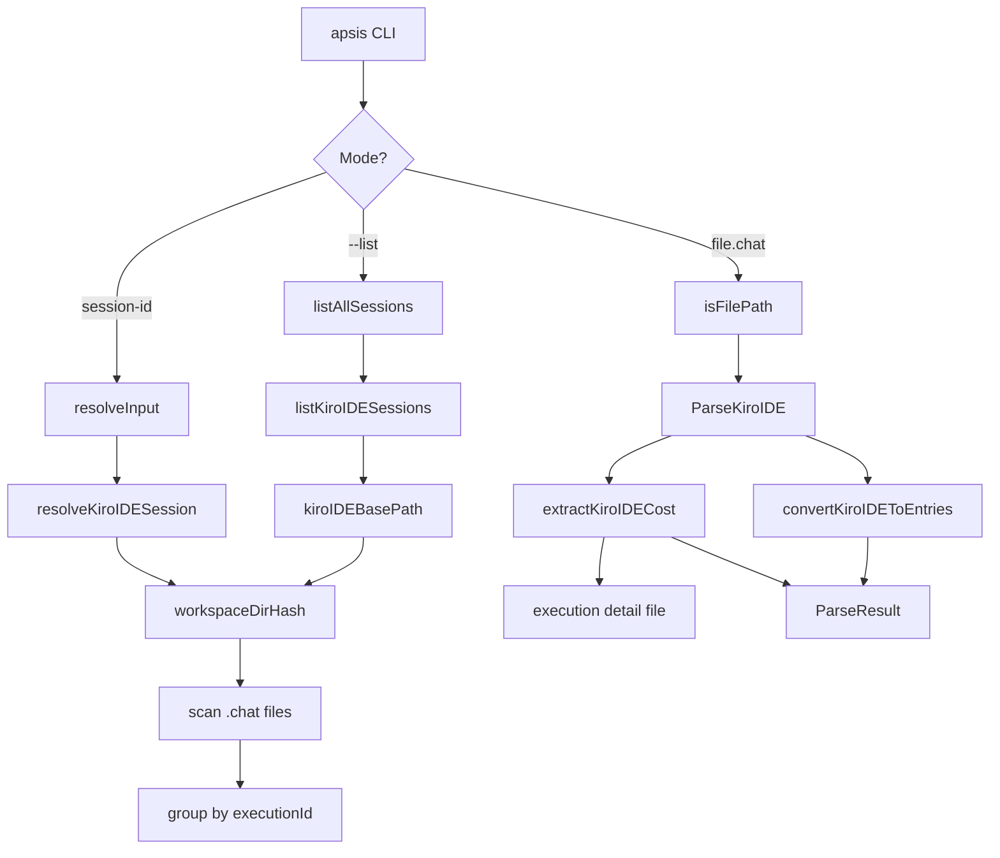

# Design: Kiro IDE Support for Apsis

## Overview

This design adds Kiro IDE as a fifth session source to the apsis CLI tool. Kiro IDE stores chat sessions as JSON `.chat` files on the local filesystem, organized by workspace directory. The implementation follows the same patterns established by the existing Claude, Codex, Copilot, and Kiro CLI integrations.

The work spans three areas:
1. **Session discovery and resolution** — finding and listing Kiro IDE sessions in `cmd/apsis/main.go`
2. **Transcript parsing** — converting `.chat` JSON to the common `Entry` format in `internal/transcript/`
3. **Cost enrichment** — extracting credit usage from execution detail files

## Architecture



### Data Flow

1. **Discovery**: `listKiroIDESessions(projectPath)` → compute workspace hash → scan `.chat` files → group by `executionId` → return `[]SessionInfo`
2. **Resolution**: `resolveKiroIDESession(sessionID, projectPath)` → compute workspace hash → find `.chat` file matching `executionId` → return `io.ReadCloser`
3. **Parsing**: `ParseKiroIDE(r)` → unmarshal JSON → convert `chat` array to `[]Entry` → locate execution detail file → extract cost → return `ParseResult`

## Components and Interfaces

### 1. Path Resolution (`internal/transcript/kiro_ide_path.go`)

Provides platform-specific path resolution for the Kiro IDE storage directory.

```go
// KiroIDEBasePath returns the platform-specific base directory for Kiro IDE session storage.
// Uses os.UserConfigDir() and appends the Kiro IDE-specific subdirectory.
// Returns ("", ErrKiroIDENotFound) if the directory does not exist.
func KiroIDEBasePath() (string, error)

// KiroIDEWorkspaceDir returns the workspace directory for a given project path.
// Normalizes the path (filepath.Abs + filepath.Clean), computes SHA-256[:32],
// and joins it with the base path.
// Returns ("", ErrKiroIDENotFound) if the directory does not exist.
func KiroIDEWorkspaceDir(projectPath string) (string, error)

// KiroIDEExecutionDetailPath returns the deterministic path to an execution detail file.
// Path: {workspaceDir}/414d1636299d2b9e4ce7e17fb11f63e9/{sha256_32(executionId)}
func KiroIDEExecutionDetailPath(workspaceDir, executionID string) string

// ErrKiroIDENotFound indicates the Kiro IDE storage directory does not exist.
var ErrKiroIDENotFound = errors.New("kiro ide storage not found")
```

**Satisfies:** [1.1], [2.1]-[2.4], [5.1]

The `executionSavesDir` constant (`414d1636299d2b9e4ce7e17fb11f63e9`) is computed from `SHA-256("KIRO::EXECUTION::SAVES")[:32]` and defined as a package-level constant. Both workspace directory hashing and execution detail file naming use the same `sha256Hex32()` helper.

### 2. Session Discovery (`cmd/apsis/main.go`)

New functions added to the existing apsis main package:

```go
// listKiroIDESessions returns all Kiro IDE sessions for a project directory.
// Returns nil with no error if Kiro IDE is not installed.
func listKiroIDESessions(projectPath string) ([]SessionInfo, error)

// resolveKiroIDESession attempts to find a Kiro IDE session by executionId.
// Returns an io.ReadCloser for the .chat file, the execution detail path
// (for cost extraction), or ErrKiroIDENotFound.
func resolveKiroIDESession(sessionID, projectPath string) (io.ReadCloser, string, error)
```

**`listKiroIDESessions` algorithm:**
1. Call `KiroIDEWorkspaceDir(projectPath)` — return `nil, nil` if `ErrKiroIDENotFound`
2. Read directory entries, filter for `.chat` suffix
3. For each `.chat` file, do a lightweight parse: unmarshal into `kiroIDEChatHeader` (only `executionId`, `metadata.startTime`, and `len(chat)` — not the full content)
4. Group by `executionId`, keeping the file with the most `chat` entries (tie-break: most recent mtime, then lexicographic filename)
5. Build `[]SessionInfo` with source `"kiro ide"`, using `os.Stat()` for file size

**`kiroIDEChatHeader` structure** (used only during discovery, not for full parsing):
```go
type kiroIDEChatHeader struct {
    ExecutionID string              `json:"executionId"`
    Chat        []json.RawMessage   `json:"chat"`
    Metadata    *kiroIDEMetadata    `json:"metadata"`
}
```

This avoids parsing the full chat content during listing. `len(Chat)` gives the message count, and `Metadata.StartTime` gives the timestamp, without unmarshalling each message.

**Satisfies:** [1.1]-[1.9], [3.1]-[3.4], [8.1]-[8.4]

### 3. Integration Points (`cmd/apsis/main.go`)

Changes to existing functions:

| Function | Change | Requirement |
|----------|--------|-------------|
| `isFilePath()` | Add `.chat` suffix check | [7.1] |
| `listAllSessions()` | Add `listKiroIDESessions()` call | [8.1] |
| `resolveInput()` | Add Kiro IDE lookup after Kiro CLI (see below) | [8.2] |
| `sortSessionsByTimestamp()` | Add `"kiro ide": 4` to priority map | [8.4] |
| `agentToFormat()` | Add `"kiro-ide": FormatKiroIDE` case | [8.5] |
| `printUsage()` | Add `kiro-ide` to agent format help text | [8.5] |

No changes to `resolveFollowInput()` per [8.3].

**Cost path threading:**

To pass the execution detail path from session resolution through to the parser, the following changes are needed:

1. `resolveInput()` gains an additional return value for the cost path: `resolveInput(arg, projectPath string) (io.ReadCloser, string, string, error)` — returns `(reader, sessionID, costPath, error)`. For non-Kiro-IDE sources, `costPath` is empty.

2. `convert()` gains a `costPath` parameter: `convert(input io.Reader, output io.Writer, sessionID, format, agent, costPath string) error`. When `costPath` is non-empty and the format is `FormatKiroIDE`, it passes it through to the parser.

3. `ParseJSONLWithFormat()` gains an optional `ParseOptions` parameter:
```go
type ParseOptions struct {
    KiroIDECostPath string // execution detail file path for cost extraction
}

func ParseJSONLWithFormat(r io.Reader, format Format, opts ...ParseOptions) (*ParseResult, error)
```

When the cost path is provided and format is `FormatKiroIDE`, the dispatcher calls `ParseKiroIDEWithCostPath(r, opts[0].KiroIDECostPath)`. When no cost path is provided (e.g., direct file path input), it falls back to `ParseKiroIDE(r)` without cost.

4. For direct `.chat` file path input: the workspace directory can be derived from the file's parent directory. `isFilePath()` recognizes `.chat` files, and `convert()` can derive the cost path from the file path by computing `KiroIDEExecutionDetailPath(filepath.Dir(filePath), executionID)` after initial parsing. This requires a two-pass approach or reading the `executionId` from the file first.

**Kiro IDE error handling in `resolveInput`:**

```go
// Try Kiro IDE location fifth
reader, costPath, err := resolveKiroIDESession(arg, projectPath)
if err == nil {
    return reader, arg, costPath, nil
}
if !errors.Is(err, transcript.ErrKiroIDENotFound) {
    return nil, "", "", fmt.Errorf("kiro ide lookup: %w", err)
}
```

The `ErrKiroIDENotFound` error causes fall-through to the "not found" message. Any other error (e.g., I/O errors reading `.chat` files) returns immediately.

### 4. Format Detection (`internal/transcript/parser.go`)

Extend `detectKiroFormat()` to detect both Kiro CLI and Kiro IDE formats:

```go
func detectKiroFormat(data []byte) Format {
    // Existing: check for conversation_id + history → FormatKiro

    // New: check for executionId + chat (array) + metadata → FormatKiroIDE
    var ideCheck struct {
        ExecutionID string `json:"executionId"`
        Chat        []any  `json:"chat"`
        Metadata    any    `json:"metadata"`
    }
    if err := json.Unmarshal(data, &ideCheck); err == nil {
        if ideCheck.ExecutionID != "" && ideCheck.Chat != nil && ideCheck.Metadata != nil {
            return FormatKiroIDE
        }
    }
    // Fallback for truncated buffers: string-based detection.
    // Only check for Kiro IDE-specific field names. No need to exclude JSONL
    // since JSONL files won't contain "executionId" as a top-level field.
    dataStr := string(data)
    if strings.Contains(dataStr, `"executionId"`) &&
        strings.Contains(dataStr, `"chat"`) &&
        strings.Contains(dataStr, `"metadata"`) {
        return FormatKiroIDE
    }

    return FormatUnknown
}
```

The Kiro CLI check runs first (checks `conversation_id` + `history`). The Kiro IDE check runs second (checks `executionId` + `chat` + `metadata`). There is no ambiguity because the field names are distinct.

**Extend the dispatcher:**
```go
func ParseJSONLWithFormat(r io.Reader, format Format, opts ...ParseOptions) (*ParseResult, error) {
    switch format {
    // ... existing cases ...
    case FormatKiroIDE:
        if len(opts) > 0 && opts[0].KiroIDECostPath != "" {
            return ParseKiroIDEWithCostPath(r, opts[0].KiroIDECostPath)
        }
        return ParseKiroIDE(r)
    }
}
```

**Satisfies:** [4.7]-[4.9], [8.6]-[8.7]

### 5. Types (`internal/transcript/kiro_ide_types.go`)

```go
// KiroIDEChatFile represents the top-level structure of a Kiro IDE .chat file.
// Fields like actionId, context, and validations are present in the source
// but not used for transcript conversion — they are omitted from this struct.
type KiroIDEChatFile struct {
    ExecutionID string              `json:"executionId"`
    Chat        []KiroIDEMessage    `json:"chat"`
    Metadata    *KiroIDEMetadata    `json:"metadata"`
}

// KiroIDEMessage represents a single message in the chat array.
type KiroIDEMessage struct {
    Role    string `json:"role"`    // "human", "bot", or "tool"
    Content string `json:"content"`
}

// KiroIDEMetadata contains session metadata.
type KiroIDEMetadata struct {
    ModelID       string `json:"modelId"`
    ModelProvider string `json:"modelProvider"`
    Workflow      string `json:"workflow"`
    WorkflowID    string `json:"workflowId"`
    StartTime     int64  `json:"startTime"` // milliseconds since epoch
    EndTime       int64  `json:"endTime"`   // milliseconds since epoch
}

// KiroIDEExecutionDetail represents the execution detail file (for cost extraction).
type KiroIDEExecutionDetail struct {
    ExecutionID  string                   `json:"executionId"`
    UsageSummary []KiroIDEUsageSummary    `json:"usageSummary"`
}

// KiroIDEUsageSummary represents a single usage entry in the execution detail file.
type KiroIDEUsageSummary struct {
    Unit       string  `json:"unit"`
    UnitPlural string  `json:"unitPlural"`
    Usage      float64 `json:"usage"` // Note: "usage" not "value" (differs from Kiro CLI)
}
```

**Satisfies:** [4.1]

### 6. Parser (`internal/transcript/kiro_ide_parser.go`)

```go
// ParseKiroIDE parses a Kiro IDE .chat JSON file and returns the result.
func ParseKiroIDE(r io.Reader) (*ParseResult, error)

// ParseKiroIDEWithCostPath parses a .chat file and extracts cost from the given
// execution detail file path. This is the internal implementation used when
// the workspace directory is known (e.g., during session resolution).
func ParseKiroIDEWithCostPath(r io.Reader, executionDetailPath string) (*ParseResult, error)

// convertKiroIDEToEntries converts a KiroIDEChatFile to the common Entry format.
func convertKiroIDEToEntries(chatFile *KiroIDEChatFile) ([]Entry, []ParseWarning)

// extractKiroIDECost reads an execution detail file and sums credit usage.
// Returns 0 if the file doesn't exist or can't be parsed.
func extractKiroIDECost(path string) float64
```

**`convertKiroIDEToEntries` algorithm:**

1. Iterate over `chatFile.Chat` messages
2. Skip the first message if it has `role == "human"` and `content` starts with `"<identity>"`
3. For each remaining message:
   - If `role` is empty, skip with a `ParseWarning`
   - If `role == "human"`, create an Entry with `Type: "user"` and `Message.Role: "user"`
   - If `role == "bot"`, create an Entry with `Type: "assistant"` and `Message.Role: "assistant"`
   - If `role == "tool"`, create an Entry with `Type: "user"` and a `tool_result` content item (without `ToolUseID` — the `.chat` format does not provide correlation IDs between tool calls and results; the renderer handles unlinked tool results as standalone entries)
   - Skip messages with empty `content` — these are streaming artifacts from Kiro IDE's snapshot mechanism (e.g., empty bot messages appear as placeholders before the model responds). They contain no meaningful content and would produce empty entries in the transcript.
4. Return entries and warnings

**Role mapping:**

| Kiro IDE Role | Entry Type | Message Role | Content Type |
|--------------|------------|--------------|--------------|
| `human` | `user` | `user` | `text` |
| `bot` | `assistant` | `assistant` | `text` |
| `tool` | `user` | `user` | `tool_result` |

The `tool` → `user` mapping matches the Anthropic API convention where tool results are sent as user messages.

**Cost extraction:**

`ParseKiroIDE()` (without cost path) returns entries without cost data. Cost extraction requires the execution detail file path, which is threaded through the pipeline via `ParseOptions` (see Integration Points section).

- **Session ID resolution**: `resolveKiroIDESession()` computes the cost path and returns it alongside the reader. `convert()` passes it through to `ParseJSONLWithFormat()` via `ParseOptions`.
- **Direct `.chat` file path**: The workspace directory is the file's parent directory. The cost path can be derived after reading the `executionId` from the file.
- **Stdin / auto-detect**: Cost extraction is skipped since the workspace directory is unknown.

**Satisfies:** [4.1]-[4.6], [4.10], [5.1]-[5.4]

### 7. JSON Output (`cmd/apsis/main.go`)

The existing `convertToJSON()` function reads all input data and runs format detection to determine how to handle the content. It already detects `FormatKiro` and unmarshals the JSON directly. The same pattern applies for `FormatKiroIDE` — the `.chat` format is already valid JSON, so it is read, unmarshalled, and re-serialised with indentation:

```go
if detectedFormat == transcript.FormatKiro || detectedFormat == transcript.FormatKiroIDE {
    // Already JSON - unmarshal to preserve structure
    if err := json.Unmarshal(data, &result); err != nil {
        return fmt.Errorf("failed to parse JSON: %w", err)
    }
}
```

When `-a kiro-ide` is specified, `convertToJSON()` uses `agentToFormat()` to determine the format directly, bypassing auto-detection.

**Satisfies:** [6.1], [6.2]

## Data Models

### Session Storage Layout

```
$CONFIG_DIR/Kiro/User/globalStorage/kiro.kiroagent/
├── {sha256(workspace_path)[:32]}/           # workspace directory
│   ├── *.chat                               # cumulative JSON snapshots
│   ├── 414d1636299d2b9e4ce7e17fb11f63e9/    # execution saves directory
│   │   └── {sha256(executionId)[:32]}       # execution detail file
│   └── ...                                  # other dirs (file snapshots, etc.)
└── ...
```

### `.chat` File Schema

```json
{
  "executionId": "ccfd398f-c4d8-44d7-ad56-532bb7f2ffa1",
  "actionId": "act",
  "context": [],
  "validations": {},
  "chat": [
    {"role": "human", "content": "<identity>...system prompt..."},
    {"role": "bot", "content": ""},
    {"role": "tool", "content": "workspace file tree..."},
    {"role": "bot", "content": "I'll explore the repo..."},
    {"role": "human", "content": "User's actual prompt"},
    {"role": "bot", "content": "Agent response text"}
  ],
  "metadata": {
    "modelId": "auto",
    "modelProvider": "qdev",
    "workflow": "act",
    "workflowId": "23720892-6e35-4e46-b37f-54f85edcca3e",
    "startTime": 1770349922198,
    "endTime": 1770349928223
  }
}
```

### Execution Detail File Schema (relevant fields only)

```json
{
  "executionId": "ccfd398f-c4d8-44d7-ad56-532bb7f2ffa1",
  "usageSummary": [
    {"unit": "credit", "unitPlural": "credits", "usage": 0.0024},
    {"unit": "credit", "unitPlural": "credits", "usage": 0.1022}
  ]
}
```

## Error Handling

| Scenario | Behavior | Requirement |
|----------|----------|-------------|
| Kiro IDE storage dir missing | Return `nil, nil` (empty session list) | [1.8] |
| Workspace dir missing | Return `nil, nil` (empty session list) | [1.8] |
| `.chat` file unparseable JSON | Skip file, log warning to stderr | [1.9] |
| Message missing `role` field | Skip message, add `ParseWarning` | [4.10] |
| Empty `chat` array | Return empty entry list, no error | [4.6] |
| Execution detail file missing | Proceed without cost data | [5.4] |
| Execution detail unparseable | Proceed without cost data | [5.4] |
| Session ID not found | Return `"session not found"` error | [3.4] |
| `os.UserConfigDir()` fails | Return `nil, nil` (treat as not installed) | [1.8] |

All error handling follows the pattern established by existing session sources: graceful degradation when an agent is not installed, warnings for recoverable issues, errors only for user-specified operations that cannot proceed.

## Testing Strategy

### Unit Tests: Parser (`internal/transcript/kiro_ide_parser_test.go`)

Map-based table-driven tests following the project's Go testing conventions.

**`TestParseKiroIDE`** — Core parsing tests:
- `"basic conversation"`: human + bot messages → user + assistant entries
- `"system prompt filtering"`: first human message with `<identity>` prefix is excluded
- `"tool messages"`: tool role → user entry with tool_result content
- `"empty chat array"`: produces empty entry list, no error
- `"missing role"`: message skipped, warning emitted
- `"empty content messages"`: empty bot/tool messages skipped
- `"no identity prefix"`: first human message without `<identity>` is included
- `"only system prompt"`: all messages filtered → empty list

**`TestExtractKiroIDECost`** — Cost extraction tests:
- `"valid usage summary"`: sums credit entries
- `"mixed units"`: only sums `unit == "credit"` entries
- `"missing file"`: returns 0
- `"invalid json"`: returns 0
- `"empty usage summary"`: returns 0

**`TestConvertKiroIDEToEntries`** — Entry conversion tests:
- Verify role mapping: human→user, bot→assistant, tool→user(tool_result)
- Verify content preservation
- Verify warning generation for malformed messages

### Unit Tests: Path Resolution (`internal/transcript/kiro_ide_path_test.go`)

**`TestSha256Hex32`** — Hash computation:
- Known input/output pairs (e.g., `"/Users/alice/myproject"` → expected hash)
- `"KIRO::EXECUTION::SAVES"` → `"414d1636299d2b9e4ce7e17fb11f63e9"`

**`TestKiroIDEBasePath`** — Platform path resolution:
- Verify correct subdirectory appended to `os.UserConfigDir()` result

**`TestKiroIDEWorkspaceDir`** — Workspace directory computation:
- Path normalization (trailing slashes, relative paths)
- Non-existent directory returns `ErrKiroIDENotFound`

### Unit Tests: Format Detection (`internal/transcript/parser_test.go`)

Add to existing format detection tests:

**`TestDetectKiroIDEFormat`**:
- `.chat` JSON with `executionId` + `chat` + `metadata` → `FormatKiroIDE`
- Kiro CLI JSON with `conversation_id` + `history` → `FormatKiro` (no false positive)
- Truncated `.chat` content → `FormatKiroIDE` (string-based fallback)
- JSONL content → not detected as Kiro IDE

### Integration Tests: Session Listing (`cmd/apsis/main_test.go`)

**`TestListKiroIDESessions`** — Using temp directory with mock `.chat` files:
- Workspace dir with multiple `.chat` files for same `executionId` → single session with most messages
- Workspace dir with multiple `executionId`s → multiple sessions
- Non-existent workspace dir → empty list, no error
- Malformed `.chat` file → skipped with warning, other files listed
- Tie-breaking: two files with same entry count → picks most recent mtime

**`TestResolveKiroIDESession`** — Session resolution:
- Valid `executionId` → returns reader for representative `.chat` file and cost path
- Unknown `executionId` → not found error
- Non-existent workspace dir → not found error

**`TestCostPathIntegration`** — End-to-end cost threading:
- Set up temp workspace dir with `.chat` file + execution detail file with known cost
- Resolve session by `executionId` → get reader and cost path
- Parse with `ParseKiroIDEWithCostPath` → verify `ParseResult.Metadata.TotalCost` matches expected value
- Parse without cost path → verify `ParseResult.Metadata.TotalCost` is zero

### Property-Based Tests

The SHA-256 hashing functions are good candidates for property-based testing using `pgregory.net/rapid`:

**`TestPropertySha256Hex32`**:
- Property: output is always exactly 32 hex characters
- Property: same input always produces same output (deterministic)
- Property: different inputs produce different outputs (collision-free for practical purposes)
- Generator: `rapid.String()` for arbitrary path inputs

### Test Data

Tests use inline JSON strings (following the pattern in `kiro_parser_test.go`) rather than fixture files. This keeps tests self-contained and easy to understand.
