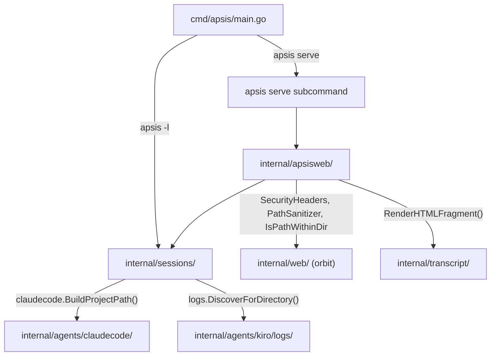
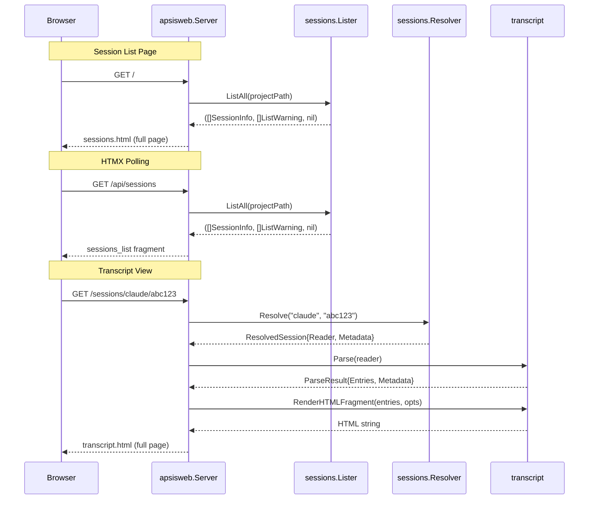

# Design: apsis-serve

## Overview

This feature adds an `apsis serve` subcommand that starts a local HTTP server for browsing and viewing AI coding agent session transcripts. It requires two new packages: `internal/sessions/` (session discovery extracted from `cmd/apsis/main.go`) and `internal/apsisweb/` (web server). The web interface follows the same patterns as `orbit serve` -- HTMX for auto-refresh, embedded templates and static assets, CSS variables for dark mode, responsive layout.

The implementation is a pure extraction (sessions) plus new code (web server). The existing `apsis -l` behaviour is preserved unchanged.

## Architecture



### Package Responsibilities

| Package | Responsibility |
|---------|---------------|
| `internal/sessions/` | Session discovery and resolution across all 5 agent types. Pure data layer with no HTTP or UI concerns. |
| `internal/apsisweb/` | HTTP server, routing, handlers, templates, static assets. Depends on `sessions` for data and `transcript` for rendering. |
| `internal/web/` | Unchanged except exporting `IsPathWithinDir`. Provides shared middleware. |

### Request Flow



## Components and Interfaces

### `internal/sessions/` Package

#### Source Constants and Display Names

```go
// Source constants - canonical identifiers used in URLs, code, and storage.
const (
    SourceClaude  = "claude"
    SourceCodex   = "codex"
    SourceCopilot = "copilot"
    SourceKiroCLI = "kiro-cli"
    SourceKiroIDE = "kiro-ide"
)

// AllSources returns all known source identifiers.
func AllSources() []string

// DisplayName returns the display string for a source constant.
// Used by apsis -l to preserve existing output format.
// e.g., "kiro-ide" -> "kiro ide", "claude" -> "claude"
func DisplayName(source string) string

// IsValidSource returns true if the source is a known agent type.
func IsValidSource(source string) bool

// FormatSize formats a file size in human-readable format.
// e.g., 1536 -> "1.5 KB", 0 -> "0 B"
func FormatSize(bytes int64) string
```

#### Lister

```go
// Lister discovers sessions from all agent types for a project.
type Lister struct {
    // No exported fields. Resolves os.UserHomeDir() once
    // during construction for agents that need it (Codex, Copilot, Claude).
    homeDir string
}

// NewLister creates a Lister.
// Resolves os.UserHomeDir() once. Returns an error if unavailable.
func NewLister() (*Lister, error)

// ListAll returns all sessions for the given project path,
// sorted by creation time (oldest first).
// Warnings are returned for agent sources that failed to list.
// A non-nil error is returned only if the listing cannot proceed
// at all (e.g., cannot determine home directory).
func (l *Lister) ListAll(projectPath string) ([]SessionInfo, []ListWarning, error)
```

The per-agent list methods are unexported. Each runs independently and returns its own `([]SessionInfo, error)`. `ListAll` collects results, records errors as warnings, merges, and sorts.

**Extracted from `cmd/apsis/main.go`:**
- `listClaudeSessions(projectPath)` -> `l.listClaude(projectPath)`
- `listCodexSessions(homeDir, projectPath)` -> `l.listCodex(homeDir, projectPath)`
- `listCopilotSessions(projectPath)` -> `l.listCopilot(projectPath)`
- `listKiroSessions(cwd)` -> `l.listKiro(cwd)`
- `listKiroIDESessions(projectPath)` -> `l.listKiroIDE(projectPath)`

Supporting functions extracted as unexported package functions:
- `getCodexSessionTimestamp()`, `getCodexSessionCwd()`
- `walkDirFollowSymlinks()`, `walkDirFollowSymlinksInternal()`
- `normalizePath()`
- `parseCopilotWorkspace()`

#### Resolver

```go
// Resolver finds and opens a specific session by source and ID.
type Resolver struct {
    projectPath string // Needed for Claude, Kiro CLI, and Kiro IDE resolution
    homeDir     string // Resolved once; needed for Codex and Copilot
}

// NewResolver creates a Resolver for the given project.
// Resolves os.UserHomeDir() once during construction.
// Returns an error if the home directory cannot be determined.
func NewResolver(projectPath string) (*Resolver, error)

// Resolve locates a session and returns a reader and metadata.
// The caller is responsible for closing the reader.
// Returns an error if the session cannot be found or opened.
// Performs symlink-safe path validation (IsPathWithinDir) on
// the resolved file path before opening it (req. 6.5).
func (r *Resolver) Resolve(source, sessionID string) (*ResolvedSession, error)
```

**Extracted from `cmd/apsis/main.go`:**
- `findCodexSession(homeDir, sessionID)` -> `r.findCodex(homeDir, sessionID)`
- `findCopilotSession(homeDir, sessionID)` -> `r.findCopilot(homeDir, sessionID)`
- `resolveKiroSession(sessionID, cwd)` -> `r.resolveKiro(sessionID, cwd)`
- `resolveKiroIDESession(sessionID, projectPath)` -> `r.resolveKiroIDE(sessionID, projectPath)`

The `Resolve` method dispatches based on the `source` parameter (validated via `IsValidSource`). Claude sessions are resolved by direct file path construction using `claudecode.BuildProjectPath()`.

**Path validation:** Before opening any resolved file, `Resolve` calls `web.IsPathWithinDir(resolvedPath, expectedBaseDir)` where the base directory depends on the agent type (e.g., `~/.claude/projects/` for Claude, `~/.codex/sessions/` for Codex). This satisfies req. 6.5. For Kiro CLI sessions (backed by SQLite, not files), path validation is not applicable since the data comes from a database query, not a direct file read.

**Size population:** For file-backed sessions (Claude, Codex, Copilot, Kiro IDE), `Resolve` calls `os.Stat` on the resolved path and populates `Metadata.Size`. For Kiro CLI sessions (SQLite-backed), the size is not known ahead of time and is set to 0. The 50MB size guard in the handler does not protect against large Kiro CLI sessions -- this is a known limitation documented in the testing strategy.

#### CLI Integration in main.go

After extraction, `cmd/apsis/main.go` uses the new package:

```go
func listSessions(projectPath string) error {
    lister, err := sessions.NewLister()
    if err != nil {
        return err
    }
    sessionList, warnings, err := lister.ListAll(projectPath)
    if err != nil {
        return err
    }
    for _, w := range warnings {
        fmt.Fprintf(os.Stderr, "warning: %s: %s\n", w.Source, w.Err)
    }
    for _, s := range sessionList {
        fmt.Printf("[%s]\t%s\t%s\t%s\n",
            sessions.DisplayName(s.Source),
            s.ID, s.CreatedAt.Format(time.RFC3339),
            sessions.FormatSize(s.Size))
    }
    return nil
}
```

The `resolveInput` function in main.go continues to handle stdin and file-path detection. It delegates to `sessions.Resolver.Resolve()` for session-ID lookups.

### `internal/apsisweb/` Package

#### Server

```go
// Config holds web server configuration.
type Config struct {
    Port        int    // Default: 8081
    Bind        string // Default: "localhost"
    ProjectPath string // Resolved project directory
}

// Server is the HTTP server for the apsis web interface.
type Server struct {
    config   Config
    router   *http.ServeMux
    server   *http.Server
    lister   *sessions.Lister
    resolver *sessions.Resolver
}

// New creates a new web server.
func New(config Config) *Server

// Start begins listening and serving requests. Blocks until the server
// is shut down. Does NOT handle signals -- the caller is responsible
// for calling Shutdown when appropriate (diverges from orbit's Start
// which handles signals internally; here signal handling is in serveCommand
// to keep the server type testable without signal side effects).
func (s *Server) Start() error

// Shutdown gracefully stops the server.
func (s *Server) Shutdown(ctx context.Context) error
```

`New` creates the `http.Server` with timeouts (req. 2.10):
```go
s.server = &http.Server{
    Addr:              fmt.Sprintf("%s:%d", config.Bind, config.Port),
    Handler:           s.router,
    ReadHeaderTimeout: 10 * time.Second,
    WriteTimeout:      120 * time.Second,
    IdleTimeout:       60 * time.Second,
}
```

#### Route Setup

```go
func (s *Server) setupRoutes() {
    static := stripPrefix("/static/", newStaticHandler())

    // Static assets
    s.router.Handle("GET /static/", web.SecurityHeaders(static))
    s.router.Handle("GET /static/transcript.css",
        web.SecurityHeaders(http.HandlerFunc(s.handleTranscriptCSS)))

    // Pages
    s.router.Handle("GET /",
        web.SecurityHeaders(web.PathSanitizer(http.HandlerFunc(s.handleSessionList))))
    s.router.Handle("GET /api/sessions",
        web.SecurityHeaders(web.PathSanitizer(http.HandlerFunc(s.handleSessionListFragment))))
    s.router.Handle("GET /sessions/{source}/{id}",
        web.SecurityHeaders(web.PathSanitizer(
            ValidateSource("source")(
                SanitizeSessionID("id")(
                    http.HandlerFunc(s.handleTranscript))))))
}
```

#### Middleware

```go
// ValidateSource validates the {source} path parameter against known agent types.
// Returns 404 for unknown sources.
func ValidateSource(paramName string) func(http.Handler) http.Handler

// SanitizeSessionID rejects session IDs containing path traversal characters.
// Checks for "..", "/", and "\" after URL decoding.
// Returns 404 for invalid IDs.
func SanitizeSessionID(paramName string) func(http.Handler) http.Handler
```

Both follow the same higher-order function pattern as orbit's `ValidateUUID`.

#### Handlers

**Session list page** (req. 3.1-3.12):
```go
func (s *Server) handleSessionList(w http.ResponseWriter, r *http.Request) {
    if r.URL.Path != "/" {
        s.handleNotFound(w, r)
        return
    }
    data, err := s.buildSessionListData()
    if err != nil {
        s.renderError(w, http.StatusInternalServerError, "Failed to list sessions")
        return
    }
    s.renderTemplate(w, "sessions.html", data)
}
```

**Session list fragment** for HTMX polling (req. 3.7):
```go
func (s *Server) handleSessionListFragment(w http.ResponseWriter, r *http.Request) {
    data, err := s.buildSessionListData()
    if err != nil {
        http.Error(w, "Failed to list sessions", http.StatusInternalServerError)
        return
    }
    s.renderFragment(w, "sessions_list", data)
}
```

**Transcript view** (req. 4.1-4.9):
```go
func (s *Server) handleTranscript(w http.ResponseWriter, r *http.Request) {
    source := r.PathValue("source")
    id := r.PathValue("id")

    // Resolve session
    resolved, err := s.resolver.Resolve(source, id)
    if err != nil {
        s.handleNotFound(w, r)
        return
    }
    defer resolved.Reader.Close()

    // Check file size (50MB limit)
    if resolved.Metadata.Size > 50*1024*1024 {
        s.renderError(w, http.StatusRequestEntityTooLarge,
            "This transcript is too large to render in the browser. Use the CLI instead: apsis "+id)
        return
    }

    // Parse transcript -- thread cost path for Kiro IDE sessions
    var parseOpts []transcript.ParseOption
    if resolved.Metadata.CostPath != "" {
        parseOpts = append(parseOpts, transcript.WithKiroIDECostPath(resolved.Metadata.CostPath))
    }
    result, err := transcript.ParseWithOptions(resolved.Reader, parseOpts...)
    if err != nil {
        s.renderError(w, http.StatusInternalServerError, "Failed to parse transcript")
        return
    }

    opts := transcript.RenderOptions{
        SessionID: id,
        TotalCost: result.Metadata.TotalCost,
        CostUnit:  result.Metadata.CostUnit,
    }
    content := transcript.RenderHTMLFragment(result.Entries, opts)

    data := TranscriptViewData{
        TemplateData: TemplateData{Title: "Transcript", CSSVersion: CSSVersion},
        SessionID:    id,
        Source:       source,
        Content:      template.HTML(content),
        CreatedAt:    resolved.Metadata.CreatedAt.Format("Jan 2, 2006 3:04 PM"),
        Size:         sessions.FormatSize(resolved.Metadata.Size),
        // Cost comes from ParseResult.Metadata, rendered in the HTML fragment
    }
    s.renderTemplate(w, "transcript.html", data)
}
```

**Build session list data** (shared between full page and HTMX fragment):
```go
func (s *Server) buildSessionListData() (SessionListData, error) {
    sessionList, warnings, err := s.lister.ListAll(s.config.ProjectPath)
    if err != nil {
        return SessionListData{}, err // Fatal error -> caller renders 500
    }

    // Convert warnings to human-readable strings
    var warningMessages []string
    for _, w := range warnings {
        warningMessages = append(warningMessages,
            fmt.Sprintf("Could not load %s sessions: %s", sessions.DisplayName(w.Source), w.Err))
    }

    // Reverse sort to newest-first for web display (req. 3.3)
    // Note: this also inverts the tie-breaking order from the Lister's sort.
    // For web display, this is acceptable -- the primary sort key (time) is
    // correct, and ties between agents at the same timestamp are a rare edge case.
    slices.Reverse(sessionList)

    // Convert SessionInfo to SessionView
    var views []SessionView
    for _, si := range sessionList {
        displayID := si.ID
        if len(displayID) > 40 {
            displayID = displayID[:37] + "..."
        }
        views = append(views, SessionView{
            ID:          si.ID,
            DisplayID:   displayID,
            Source:       si.Source,
            SourceClass: "source-" + si.Source,
            CreatedAt:   si.CreatedAt.Format("Jan 2, 2006 3:04 PM"),
            Size:        sessions.FormatSize(si.Size),
            URL:         fmt.Sprintf("/sessions/%s/%s", si.Source, si.ID),
        })
    }

    return SessionListData{
        TemplateData: TemplateData{Title: "Sessions", CSSVersion: CSSVersion},
        Sessions:     views,
        Warnings:     warningMessages,
        Sources:      sessions.AllSources(),
        Empty:        len(views) == 0,
    }, nil
}
```

**Error rendering** with correct HTTP status codes:
```go
func (s *Server) renderError(w http.ResponseWriter, code int, message string) {
    w.WriteHeader(code)
    s.renderTemplate(w, "error.html", ErrorData{
        TemplateData: TemplateData{Title: "Error", CSSVersion: CSSVersion},
        Code:         code,
        Message:      message,
    })
}

func (s *Server) handleNotFound(w http.ResponseWriter, r *http.Request) {
    s.renderError(w, http.StatusNotFound, "Page not found")
}
```

**Transcript CSS** (req. 7.5):
```go
func (s *Server) handleTranscriptCSS(w http.ResponseWriter, r *http.Request) {
    w.Header().Set("Content-Type", "text/css; charset=utf-8")
    w.Header().Set("Cache-Control", "public, max-age=31536000, immutable")
    fmt.Fprint(w, transcript.TranscriptCSS())
}
```

#### Template Rendering

Same pattern as orbit -- pre-parsed templates at package init:

```go
//go:embed templates/*
var templatesFS embed.FS

var pageTemplates = make(map[string]*template.Template)

func init() {
    pages := []string{"sessions.html", "transcript.html", "error.html"}
    for _, page := range pages {
        tmpl := template.Must(
            template.New("").Funcs(templateFuncs).
                ParseFS(templatesFS, "templates/layout.html", "templates/"+page))
        pageTemplates[page] = tmpl
    }
}

func (s *Server) renderTemplate(w http.ResponseWriter, page string, data any) {
    tmpl := pageTemplates[page]
    w.Header().Set("Content-Type", "text/html; charset=utf-8")
    if err := tmpl.ExecuteTemplate(w, "layout.html", data); err != nil {
        log.Printf("template error: %v", err)
    }
}

func (s *Server) renderFragment(w http.ResponseWriter, name string, data any) {
    // Uses the sessions.html template (which defines the "sessions_list" block)
    tmpl := pageTemplates["sessions.html"]
    w.Header().Set("Content-Type", "text/html; charset=utf-8")
    if err := tmpl.ExecuteTemplate(w, name, data); err != nil {
        log.Printf("fragment error: %v", err)
    }
}
```

**CSSVersion** is a package-level constant incremented on each release:
```go
const CSSVersion = "1"
```

Custom template functions:
```go
var templateFuncs = template.FuncMap{
    "sourceClass": func(source string) string {
        return "source-" + source
    },
}
```

### CLI Integration (`cmd/apsis/main.go`)

Subcommand detection before flag parsing (req. 2.8):

```go
func main() {
    if len(os.Args) > 1 && os.Args[1] == "serve" {
        if err := serveCommand(os.Args[2:]); err != nil {
            fmt.Fprintf(os.Stderr, "Error: %v\n", err)
            os.Exit(1)
        }
        return
    }
    cfg := parseFlags()
    exitCode, err := run(cfg)
    // ... existing logic ...
}
```

The `serveCommand` function uses a separate `flag.FlagSet`:

```go
func serveCommand(args []string) error {
    fs := flag.NewFlagSet("apsis serve", flag.ContinueOnError)
    port := fs.Int("port", 0, "Port to listen on (default 8081, or APSIS_SERVE_PORT)")
    bind := fs.String("bind", "", "Address to bind to (default localhost, or APSIS_SERVE_BIND)")
    project := fs.String("project", "", "Project directory (default: current directory)")
    showVersion := fs.Bool("version", false, "Show version and exit")

    if err := fs.Parse(args); err != nil {
        return err // flag.ContinueOnError: includes --help handling
    }

    // Resolve defaults: CLI flag > env var > default
    resolvedPort := resolveInt(*port, "APSIS_SERVE_PORT", 8081)
    resolvedBind := resolveString(*bind, "APSIS_SERVE_BIND", "localhost")

    // Network binding warning (req. 2.9)
    if resolvedBind == "0.0.0.0" {
        fmt.Fprintln(os.Stderr, "Warning: Server is accessible from the network. Session data may contain sensitive information.")
    }

    // Resolve project path
    projectPath, err := resolveProjectPath(*project)
    if err != nil {
        return fmt.Errorf("resolve project path: %w", err)
    }

    // Print URL (req. 2.6)
    fmt.Fprintf(os.Stderr, "Listening on http://%s:%d\n", resolvedBind, resolvedPort)

    // Create server
    server := apsisweb.New(apsisweb.Config{
        Port:        resolvedPort,
        Bind:        resolvedBind,
        ProjectPath: projectPath,
    })

    // Signal handling (req. 2.7)
    sigCh := make(chan os.Signal, 1)
    signal.Notify(sigCh, os.Interrupt, syscall.SIGTERM)
    go func() {
        <-sigCh
        ctx, cancel := context.WithTimeout(context.Background(), 5*time.Second)
        defer cancel()
        server.Shutdown(ctx)
    }()

    return server.Start()
}

// resolveInt returns: flag value if non-zero, env var if set, otherwise default.
func resolveInt(flag int, envKey string, defaultVal int) int

// resolveString returns: flag value if non-empty, env var if set, otherwise default.
func resolveString(flag, envKey, defaultVal string) string

// resolveProjectPath returns the absolute path of the project directory.
// If empty, uses the current working directory. Returns an error if
// os.Getwd() or filepath.Abs() fails.
func resolveProjectPath(project string) (string, error)
```

## Data Models

### `internal/sessions/types.go`

```go
// SessionInfo holds metadata about a discovered session.
type SessionInfo struct {
    ID        string
    CreatedAt time.Time
    Size      int64
    Source    string // One of the Source* constants
}

// SessionMetadata is returned by the Resolver alongside the reader.
type SessionMetadata struct {
    Source    string
    ID       string
    CreatedAt time.Time
    Size      int64
    CostPath  string // Non-empty only for Kiro IDE sessions
}

// ResolvedSession is the result of resolving a session by source and ID.
type ResolvedSession struct {
    Reader   io.ReadCloser
    Metadata SessionMetadata
}

// ListWarning represents a non-fatal error during session listing.
type ListWarning struct {
    Source string // Which agent source failed
    Err    error  // The underlying error
}
```

### `internal/apsisweb/` Template Data

```go
// TemplateData is the base data for all templates.
type TemplateData struct {
    Title      string
    CurrentURL string
    CSSVersion string
}

// SessionListData is passed to sessions.html.
type SessionListData struct {
    TemplateData
    Sessions []SessionView
    Warnings []string // Human-readable warning messages
    Sources  []string // All known sources (for filter pills)
    Empty    bool
}

// SessionView is a single session formatted for display.
type SessionView struct {
    ID          string // Full session ID
    DisplayID   string // Truncated for display (max 40 chars)
    Source      string // Canonical source identifier
    SourceClass string // CSS class (e.g., "source-claude")
    CreatedAt   string // Formatted timestamp (e.g., "Jan 2, 2006 3:04 PM")
    Size        string // Formatted size (e.g., "1.5 MB")
    URL         string // Link to /sessions/{source}/{id}
}

// TranscriptViewData is passed to transcript.html.
type TranscriptViewData struct {
    TemplateData
    SessionID string
    Source    string
    Content   template.HTML // Rendered transcript HTML
    CreatedAt string
    Size      string
}

// ErrorData is passed to error.html.
type ErrorData struct {
    TemplateData
    Code    int
    Message string
}
```

## Templates

### `layout.html`

Same structure as orbit's layout. Includes:
- HTML5 doctype, charset, viewport meta
- Links to `/static/style.css?v={{.CSSVersion}}` and `/static/transcript.css?v={{.CSSVersion}}`
- Script tag for `/static/htmx.min.js`
- Header with "Apsis" h1 linking to `/`
- Main container with `{{template "content" .}}`
- Noscript notice (req. 8.4): "Filtering, search, and auto-refresh require JavaScript."
- Connection status indicator div (req. 8.1-8.3)
- HTMX failure tracking JavaScript (same pattern as orbit)

### `sessions.html`

Defines two template blocks:

**`content` block** (full page):
- Search input (text, `id="session-search"`)
- Filter bar with pills for each source type plus "All" (uses `data-source` attributes)
- Warning banner container (`id="warnings"`) -- shown when `len(.Warnings) > 0`
- Session list container with HTMX: `<div id="session-list" hx-get="/api/sessions" hx-trigger="every 15s" hx-swap="innerHTML">`
- Inside the div: `{{template "sessions_list" .}}`
- Client-side JavaScript for filtering and search (see below)

**`sessions_list` block** (HTMX fragment):
- Iterates `.Sessions`, each as a clickable card
- Each card contains: source badge, display ID with title tooltip, formatted date, formatted size
- Each card has `data-source="{{.Source}}"` attribute for client-side filtering
- Empty state when no sessions

**Client-side JavaScript** (inline, within `content` block):
```javascript
// Filter by source: toggle 'active' class on pills, hide non-matching cards
// Search by ID: filter cards by text match on session ID
// Both filter and search work on data attributes, not DOM text
// HTMX afterSwap: reapply filters after poll refresh
document.body.addEventListener('htmx:afterSwap', function(evt) {
    if (evt.detail.target.id === 'session-list') {
        applyFilters(); // Reapply current filter + search state
    }
});
```

This approach preserves filter/search state across HTMX polls (req. 3.11) because the filters are stored in JavaScript variables and reapplied after each swap.

### `transcript.html`

- Back link to `/` (req. 4.4)
- Session metadata card: source badge, full session ID, date, size
- Transcript wrapper (`class="transcript-wrapper"`, max-width 900px): `{{.Content}}`

### `error.html`

- Error code as large heading
- Error message
- Link back to session list

## Static Assets

### `style.css`

Uses the same CSS variable system as orbit's `style.css`. Extends with:

**Agent badge colours:**
```css
.source-badge { /* base pill styles */ }
.source-claude  { background-color: rgba(124, 58, 237, 0.15); color: #7c3aed; }
.source-codex   { background-color: rgba(13, 110, 253, 0.1);  color: #0d6efd; }
.source-copilot { background-color: rgba(25, 135, 84, 0.1);   color: #198754; }
.source-kiro-cli { background-color: rgba(253, 126, 20, 0.1); color: #fd7e14; }
.source-kiro-ide { background-color: rgba(202, 138, 4, 0.1);  color: #ca8a04; }

@media (prefers-color-scheme: dark) {
    .source-claude  { background-color: rgba(139, 92, 246, 0.2); color: #a78bfa; }
    .source-codex   { background-color: rgba(110, 168, 254, 0.2); color: #6ea8fe; }
    .source-copilot { background-color: rgba(117, 183, 152, 0.2); color: #75b798; }
    .source-kiro-cli { background-color: rgba(255, 185, 128, 0.2); color: #ffb980; }
    .source-kiro-ide { background-color: rgba(251, 191, 36, 0.2); color: #fbbf24; }
}
```

**Filter bar:**
```css
.filter-bar { display: flex; flex-wrap: wrap; gap: 0.5rem; margin-bottom: 1rem; }
.filter-pill { /* pill button styles, 44px min touch target */ }
.filter-pill.active { /* highlighted state */ }
```

**Session cards:**
```css
.session-card {
    display: grid;
    grid-template-columns: auto 1fr auto auto;
    gap: 0.75rem;
    align-items: center;
    /* border, padding, hover state */
}

.session-id {
    font-family: "SF Mono", Monaco, "Cascadia Code", monospace;
    overflow: hidden;
    text-overflow: ellipsis;
    white-space: nowrap;
    max-width: 40ch;
}
```

**Responsive breakpoints** (same as orbit):
```css
@media (max-width: 768px) {
    .session-card { grid-template-columns: 1fr; }
    .filter-bar { /* wrap */ }
}
@media (max-width: 320px) {
    .container { padding: 0.5rem; }
}
```

### `htmx.min.js`

Copy of `/Users/arjen/projects/personal/orbit/internal/web/static/htmx.min.js` (v1.9.12).

## `internal/web/` Changes

One change to orbit's web package:

**Export `isPathWithinDir`** (req. 6.7):

In `internal/web/middleware.go`, rename `isPathWithinDir` to `IsPathWithinDir`. Update the single call site in `internal/web/handlers.go`.

## Error Handling

### Session Listing Errors

| Error | Handling |
|-------|----------|
| Home directory unavailable | Fatal error from `ListAll` -- server returns 500 |
| Individual agent source fails (e.g., Kiro DB corrupted) | Added to `[]ListWarning`, other sources proceed. Web shows warning banner. |
| No sessions found | Empty state page (not an error) |

### Session Resolution Errors

| Error | Handling |
|-------|----------|
| Unknown source | Blocked by `ValidateSource` middleware -- 404 |
| Path traversal in ID | Blocked by `SanitizeSessionID` middleware -- 404 |
| Session not found | `Resolver.Resolve` returns error -- handler renders 404 page |
| File read error | Handler renders 500 error page |
| File exceeds 50MB | Handler renders 413 error page with CLI suggestion |

### Transcript Parsing Errors

| Error | Handling |
|-------|----------|
| Format detection fails | Handler renders error page: "Could not detect transcript format" |
| Parse warnings (malformed lines) | Ignored -- partial transcript rendered |
| Parse fatal error | Handler renders error page |

### Server Lifecycle Errors

| Error | Handling |
|-------|----------|
| Port already in use | `Start()` returns error, printed to stderr, exit 1 |
| SIGINT/SIGTERM | Graceful shutdown with 5-second timeout |

## Testing Strategy

### `internal/sessions/` Tests

**`lister_test.go`:**
- Table-driven tests using temp directories with mock session files for each agent type
- Test `ListAll` with: no sessions, single source, multiple sources, one source failing
- Test sort order: verify oldest-first
- Test warning accumulation when sources fail
- Test source constants: `AllSources()`, `DisplayName()`, `IsValidSource()`

**`resolver_test.go`:**
- Test `Resolve` with each source type using actual test fixture files in `testdata/`
- Test unknown source returns error
- Test non-existent session returns error
- Test returned metadata fields are populated correctly

**Property-based test candidate:** `FormatSize` is a good candidate for property-based testing with `pgregory.net/rapid`:
- Property: output is always non-empty
- Property: output contains a size unit (B, KB, MB, GB)
- Property: `FormatSize(0)` returns "0 B"
- Property: monotonically increasing inputs produce monotonically non-decreasing formatted values

### `internal/apsisweb/` Tests

**`server_test.go`:**
- Test `New` creates server with correct config
- Test server starts and responds on configured port (use ephemeral port)
- Test graceful shutdown
- Follow orbit's `server_test.go` pattern with `findAvailablePort()`

**`handlers_test.go`:**
- Test each handler with `httptest.NewRequest` and `httptest.NewRecorder`
- Test session list: renders page with sessions, renders empty state, includes warnings
- Test session list fragment: returns partial HTML without layout
- Test transcript: renders transcript with metadata
- Test transcript 404: invalid source, unknown session
- Test transcript 413: mock a session exceeding 50MB
- Test transcript CSS: returns CSS with correct content type and cache headers
- Test exact root path: `/` returns 200, `/other` returns 404

**`middleware_test.go`:**
- Test `ValidateSource`: valid sources pass through, invalid return 404
- Test `SanitizeSessionID`: clean IDs pass, IDs with `..`, `/`, `\` return 404
- Test URL-decoded path traversal: `%2e%2e` is rejected

### Extraction Verification (Req 1.4)

To verify `apsis -l` output is identical before and after extraction:
1. Before starting extraction, capture output: `apsis -l > /tmp/apsis-before.txt`
2. After extraction, capture output: `apsis -l > /tmp/apsis-after.txt`
3. Diff: `diff /tmp/apsis-before.txt /tmp/apsis-after.txt`
4. Must produce no differences

### Known Limitations

- **Kiro CLI size guard**: The 50MB transcript size guard is based on `Metadata.Size`, which is 0 for Kiro CLI sessions (SQLite-backed). Large Kiro CLI sessions bypass the guard. This is acceptable for v1 since Kiro CLI sessions are typically small.
- **Filter state on navigation**: Filter and search state is stored in JavaScript memory and lost on page refresh or browser back/forward navigation. Acceptable for v1.
- **No access logging**: Request logging is not included, matching orbit's pattern. Errors are logged to stderr.

### Integration Test

A single integration test in `cmd/apsis/main_test.go` (or `internal/apsisweb/integration_test.go`):
1. Create temp directory with a mock `.jsonl` session file
2. Start server with `--project` pointing to temp dir
3. HTTP GET `/` -- verify session appears in list
4. HTTP GET `/sessions/claude/{id}` -- verify transcript renders
5. Shutdown server

### Requirement Traceability

| Requirement | Test |
|-------------|------|
| 1.1-1.6 | lister_test.go: extraction, listing, sorting |
| 1.7-1.8 | lister_test.go: source constants, display names |
| 2.1-2.11 | server_test.go: startup, config, timeouts, shutdown |
| 3.1-3.4, 3.8-3.9 | handlers_test.go: session list rendering |
| 3.7, 3.11 | handlers_test.go: fragment endpoint |
| 3.12 | handlers_test.go: warnings in list data |
| 4.1-4.9 | handlers_test.go: transcript rendering, size guard |
| 5.1-5.7 | Manual verification (CSS) |
| 6.1-6.7 | middleware_test.go, manual verification |
| 7.1-7.6 | handlers_test.go: static assets, transcript CSS |
| 8.1-8.4 | Manual verification (JavaScript, noscript) |
| 3.5-3.6, 3.10 | Manual verification (client-side JS) |

Requirements 5.x, 8.x, and client-side 3.x are verified manually since they involve browser rendering and JavaScript behaviour.
