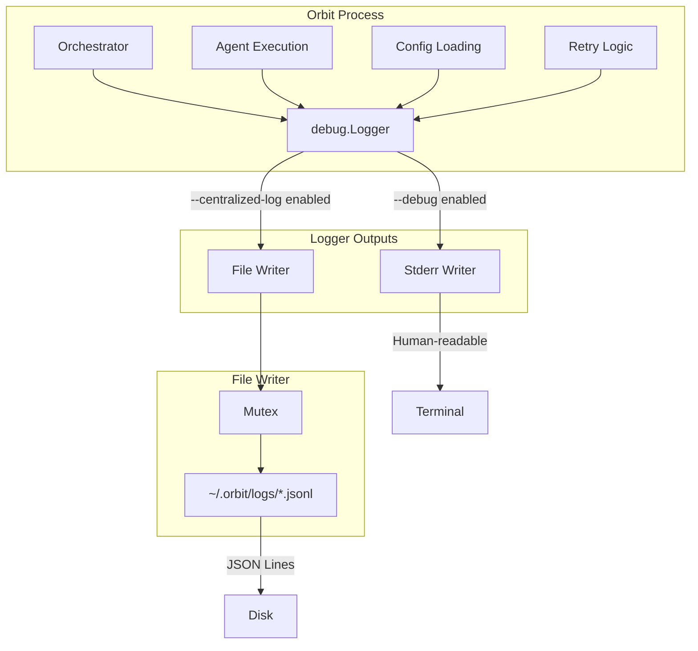
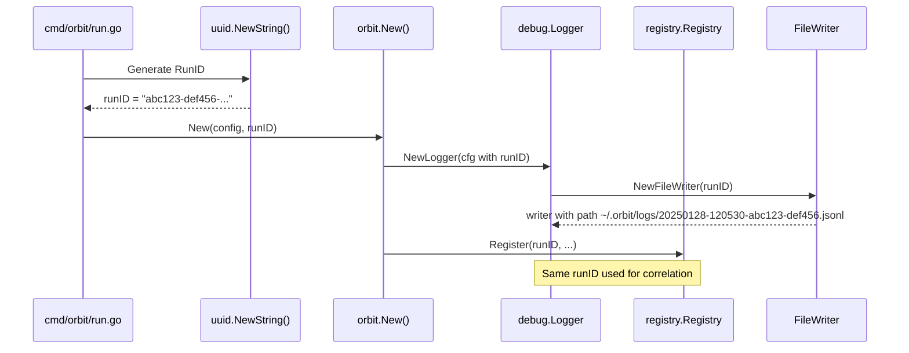
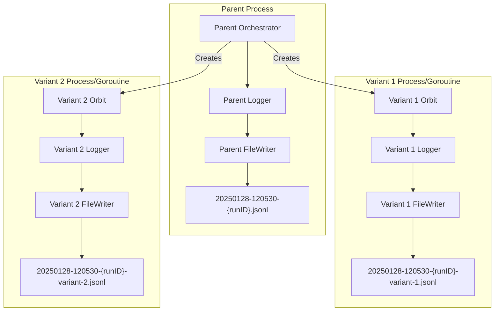

# Centralized Logging Design

## Overview

This design extends Orbit's existing `debug.Logger` to support dual-output logging: human-readable format to stderr (controlled by `--debug`) and structured JSON Lines to a centralized file location (controlled by `--centralized-log`, enabled by default). The implementation leverages the existing debug infrastructure to minimize code changes while providing persistent, queryable logs for debugging.

### Key Design Principles

1. **Extend, don't replace** - Build on existing `debug.Logger` rather than creating parallel infrastructure
2. **Backward compatible** - `--debug` behavior unchanged; existing method signatures preserved
3. **Fail-safe** - Logging failures never interrupt orchestration
4. **Structured for tools** - JSON Lines format enables `jq`, `grep`, and custom tooling

## Architecture



### RunID Generation and Flow

The RunID is generated once at the start of orchestration and shared between the Logger and Registry:



**Code location:** RunID generation happens in `cmd/orbit/run.go` before calling `orbit.New()`:

```go
// In cmd/orbit/run.go, before orbit.New()
runID := uuid.NewString()

// Pass to orbit.New() via config
orbitConfig := orbit.Config{
    // ... existing fields ...
    RunID: runID,
}
```

### Variant Mode Architecture

In variant mode, the parent orchestrator and each variant have separate Loggers with separate FileWriters:



**Key points:**
- Parent Logger logs to main file: variant creation, parallel start, completion
- Each variant's Orbit instance gets its own Logger with `VariantNum > 0`
- No coordination needed - each Logger writes to its own file
- Same `runID` ensures files are grouped and correlate with registry

### Variant Logger Creation Flow

When variants are created, each gets its own Logger with the shared `runID` and its variant number:

```go
// In variants.Manager.RunVariant() or equivalent
func (m *Manager) runVariant(ctx context.Context, variant *Variant, runID string) error {
    // Create variant-specific logger
    logger, err := debug.NewLogger(debug.LoggerConfig{
        StderrEnabled: m.config.Debug,
        FileEnabled:   m.config.CentralizedLog,
        RunID:         runID,         // Same RunID as parent
        VariantNum:    variant.Number, // 1, 2, 3, etc.
        Prefix:        fmt.Sprintf("variant-%d", variant.Number),
    })
    if err != nil {
        // Log error but continue - centralized logging is best-effort
        m.parentLogger.Log("failed to create variant logger: %v", err)
    }

    // Create Orbit instance for this variant with its own logger
    orbitInstance, err := orbit.New(orbit.Config{
        // ... variant-specific config ...
        Debug: logger, // Variant's own logger
    })
    // ...
}
```

**NewVariantFileWriter implementation:**

```go
func NewVariantFileWriter(runID string, variantNum int) (*FileWriter, error) {
    if runID == "" {
        return nil, fmt.Errorf("runID is required for centralized logging")
    }
    if variantNum < 1 {
        return nil, fmt.Errorf("variantNum must be >= 1")
    }

    homeDir, err := os.UserHomeDir()
    if err != nil {
        log.Printf("Warning: failed to get home directory, centralized logging disabled: %v", err)
        return nil, nil
    }

    logDir := filepath.Join(homeDir, ".orbit", "logs")
    if err := os.MkdirAll(logDir, 0755); err != nil {
        log.Printf("Warning: failed to create log directory, centralized logging disabled: %v", err)
        return nil, nil
    }

    // Generate filename: {timestamp}-{runID}-variant-{N}.jsonl
    timestamp := time.Now().Format("20060102-150405")
    filename := fmt.Sprintf("%s-%s-variant-%d.jsonl", timestamp, runID, variantNum)
    path := filepath.Join(logDir, filename)

    file, err := os.OpenFile(path, os.O_CREATE|os.O_WRONLY|os.O_APPEND, 0600)
    if err != nil {
        log.Printf("Warning: failed to create variant log file, centralized logging disabled: %v", err)
        return nil, nil
    }

    return &FileWriter{
        file:            file,
        path:            path,
        warningInterval: 10 * time.Second,
    }, nil
}
```

## Components and Interfaces

### 1. LogEntry Types (Flat Structs, No Embedding)

Using flat structs avoids JSON marshaling issues with embedded structs:

```go
// LogEntry represents a single structured log entry.
// Satisfies requirements 2.1-2.8
type LogEntry struct {
    Timestamp time.Time      `json:"timestamp"`        // ISO 8601 (Req 2.2)
    Level     string         `json:"level"`            // debug|info|warn|error (Req 2.3)
    Component string         `json:"component"`        // Source identifier (Req 2.5)
    Message   string         `json:"message"`          // Human-readable text (Req 2.4)
    Fields    map[string]any `json:"fields,omitempty"` // Additional structured data (Req 2.6)
}

// StartupEntry is the first entry in a log file.
// Flat struct to control exact JSON output.
// Satisfies requirements 2.7, 5.3
type StartupEntry struct {
    Timestamp        time.Time `json:"timestamp"`
    Level            string    `json:"level"`
    Component        string    `json:"component"`
    Message          string    `json:"message"`
    SchemaVersion    int       `json:"schema_version"`    // Always 1 (Req 2.7)
    OrbitVersion     string    `json:"orbit_version"`
    Agent            string    `json:"agent"`
    TasksFile        string    `json:"tasks_file"`
    WorkingDirectory string    `json:"working_directory"`
    BranchName       string    `json:"branch_name"`
}

// ShutdownEntry marks normal completion.
// Flat struct to control exact JSON output.
// Satisfies requirement 5.4
type ShutdownEntry struct {
    Timestamp     time.Time `json:"timestamp"`
    Level         string    `json:"level"`
    Component     string    `json:"component"`
    Message       string    `json:"message"`
    TotalDuration string    `json:"total_duration"`
    FinalStatus   string    `json:"final_status"` // completed|failed
}
```

**JSON output verification:**
```go
func TestStartupEntryJSON(t *testing.T) {
    entry := StartupEntry{
        Timestamp:     time.Date(2025, 1, 28, 12, 5, 30, 0, time.UTC),
        Level:         "info",
        Component:     "orchestrator",
        Message:       "Orchestration started",
        SchemaVersion: 1,
        OrbitVersion:  "0.1.0",
        // ...
    }
    data, _ := json.Marshal(entry)
    // Produces: {"timestamp":"2025-01-28T12:05:30Z","level":"info",...}
    // No "fields":null because Fields is not present in StartupEntry
}
```

### 2. FileWriter

```go
// FileWriter handles thread-safe JSON Lines file output.
// Satisfies requirements 1.1-1.7, 9.1-9.4, 10.1-10.2
type FileWriter struct {
    file            *os.File
    mu              sync.Mutex
    path            string
    lastWarningTime time.Time     // For rate limiting (Req 9.2)
    warningInterval time.Duration // 10 seconds (Req 9.2)
    closed          bool
}

// NewFileWriter creates a writer for the given run.
// Creates ~/.orbit/logs/ if needed (Req 1.2).
// Generates filename: {timestamp}-{runID}.jsonl (Req 1.3)
// Returns (nil, nil) on failure - not an error, just disabled.
func NewFileWriter(runID string) (*FileWriter, error)

// NewVariantFileWriter creates a writer for a variant run.
// Generates filename: {timestamp}-{runID}-variant-{N}.jsonl (Req 1.5)
func NewVariantFileWriter(runID string, variantNum int) (*FileWriter, error)

// Write serializes and writes an entry with mutex protection.
// Flushes after each write (Req 10.2).
// Returns nil on failure (Req 9.1), emits rate-limited warning (Req 9.2).
// Safe to call on nil receiver.
func (w *FileWriter) Write(entry any) error

// Path returns the absolute path to the log file.
// Returns empty string if writer is nil.
func (w *FileWriter) Path() string

// Close flushes and closes the file.
// Safe to call on nil receiver.
func (w *FileWriter) Close() error
```

### 3. Extended Logger (Backward Compatible)

The Logger keeps the existing method signatures and adds new structured methods:

```go
// Logger provides conditional debug logging with optional file output.
// Extended from existing implementation to satisfy Req 7.1-7.7
type Logger struct {
    stderrEnabled bool        // Controlled by --debug (Req 7.2)
    fileEnabled   bool        // Controlled by --centralized-log (Req 7.4)
    prefix        string      // Component name (used for both stderr prefix and JSON component)
    fileWriter    *FileWriter // Centralized log writer (may be nil)
    startTime     time.Time   // For shutdown duration calculation
    shutdownDone  bool        // Prevents double shutdown entry
    mu            sync.Mutex  // Protects shutdownDone
}

// LoggerConfig configures Logger creation.
type LoggerConfig struct {
    StderrEnabled bool   // --debug flag
    FileEnabled   bool   // --centralized-log flag (default: true)
    RunID         string // UUID for filename (required if FileEnabled)
    VariantNum    int    // 0 for main, 1+ for variants
    Prefix        string // Component name for this logger instance
}

// StartupConfig provides metadata for the startup log entry.
type StartupConfig struct {
    OrbitVersion     string // Orbit binary version
    Agent            string // Agent name (e.g., "claude-code")
    TasksFile        string // Absolute path to tasks file
    WorkingDirectory string // Absolute path to working directory
    BranchName       string // Current git branch
}

// NewLogger creates a logger with configured outputs.
// If FileEnabled but writer creation fails, continues with file logging disabled.
func NewLogger(cfg LoggerConfig) (*Logger, error)

// --- EXISTING METHOD SIGNATURES (preserved for backward compatibility) ---

// Log logs a debug message. EXISTING SIGNATURE - unchanged.
// Internally converts to structured entry for file output.
func (l *Logger) Log(format string, args ...any)

// LogCmd logs command execution details. EXISTING SIGNATURE.
func (l *Logger) LogCmd(name string, args []string, workingDir string)

// LogCmdResult logs command results. EXISTING SIGNATURE.
func (l *Logger) LogCmdResult(exitCode int, stdout, stderr string, duration time.Duration)

// LogRetry logs retry information. EXISTING SIGNATURE.
func (l *Logger) LogRetry(attempt, maxAttempts int, errType, waitDuration string)

// LogConfig logs configuration values. EXISTING SIGNATURE.
func (l *Logger) LogConfig(key string, value any)

// LogSession logs session information. EXISTING SIGNATURE.
func (l *Logger) LogSession(sessionID string, isResume bool, action string)

// LogError logs error classification. EXISTING SIGNATURE.
func (l *Logger) LogError(errType string, message string, retryable bool)

// LogJSON logs JSON parsing results. EXISTING SIGNATURE.
func (l *Logger) LogJSON(success bool, parseErr error)

// Enabled returns whether stderr logging is enabled. EXISTING SIGNATURE.
func (l *Logger) Enabled() bool

// --- NEW METHODS for structured logging ---

// LogStructured writes a structured log entry with explicit fields.
// Use this for new code that needs fine-grained control over fields.
func (l *Logger) LogStructured(level, message string, fields map[string]any)

// LogErrorWithChain logs an error with the full wrapped error chain.
// Satisfies Req 3.8.
func (l *Logger) LogErrorWithChain(message string, err error, fields map[string]any)

// LogStartup writes the startup entry. Called once at orchestration start.
// The StartupConfig provides metadata that appears in the first log entry.
func (l *Logger) LogStartup(cfg StartupConfig)

// LogShutdown writes the shutdown entry. Called on normal completion.
// Safe to call multiple times (only writes once).
func (l *Logger) LogShutdown(status string)

// Close writes shutdown entry if not already written, closes file writer.
// Hooks into signal handling for graceful shutdown.
func (l *Logger) Close()

// Path returns the centralized log file path (empty if disabled or nil writer).
func (l *Logger) Path() string
```

### 4. Backward Compatible Method Implementations

Here's exactly how existing methods convert to structured output:

```go
// LogCmd - EXISTING SIGNATURE, internal conversion to structured
func (l *Logger) LogCmd(name string, args []string, workingDir string) {
    if l == nil {
        return
    }

    cmd := name + " " + strings.Join(args, " ")

    // Stderr output (existing behavior, unchanged)
    if l.stderrEnabled {
        l.logToStderr("Executing: %s", cmd)
        if workingDir != "" {
            l.logToStderr("Working dir: %s", workingDir)
        }
    }

    // File output (new structured format)
    if l.fileEnabled && l.fileWriter != nil {
        l.fileWriter.Write(LogEntry{
            Timestamp: time.Now(),
            Level:     "debug",
            Component: l.prefix,
            Message:   "Command execution",
            Fields: map[string]any{
                "command":     cmd,
                "working_dir": workingDir,
            },
        })
    }
}

// LogRetry - EXISTING SIGNATURE, internal conversion to structured
func (l *Logger) LogRetry(attempt, maxAttempts int, errType, waitDuration string) {
    if l == nil {
        return
    }

    // Stderr output (existing behavior)
    if l.stderrEnabled {
        l.logToStderr("Retry %d/%d: error_type=%s wait=%s", attempt, maxAttempts, errType, waitDuration)
    }

    // File output (structured)
    if l.fileEnabled && l.fileWriter != nil {
        l.fileWriter.Write(LogEntry{
            Timestamp: time.Now(),
            Level:     "info",
            Component: "retry",
            Message:   "Retry attempt",
            Fields: map[string]any{
                "attempt":       attempt,
                "max_attempts":  maxAttempts,
                "error_type":    errType,
                "wait_duration": waitDuration,
            },
        })
    }
}

// Log - EXISTING SIGNATURE preserved
// For file output, extracts what structure it can from the format string
func (l *Logger) Log(format string, args ...any) {
    if l == nil {
        return
    }

    msg := fmt.Sprintf(format, args...)

    // Stderr output (existing behavior, unchanged)
    if l.stderrEnabled {
        l.logToStderr("%s", msg)
    }

    // File output - message only, no structured fields
    // (callers should migrate to LogStructured for richer output)
    if l.fileEnabled && l.fileWriter != nil {
        l.fileWriter.Write(LogEntry{
            Timestamp: time.Now(),
            Level:     "debug",
            Component: l.prefix,
            Message:   msg,
        })
    }
}

// logToStderr is the internal method for stderr output (existing format)
func (l *Logger) logToStderr(format string, args ...any) {
    msg := fmt.Sprintf(format, args...)
    if l.prefix != "" {
        log.Printf("[DEBUG:%s] %s", l.prefix, msg)
    } else {
        log.Printf("[DEBUG] %s", msg)
    }
}
```

### 5. Signal Handling Integration

The Logger integrates with Orbit's existing signal handling to write shutdown entry on interrupt:

```go
// In orbit.New() - existing signal handling code
ctx, cancel := signal.NotifyContext(context.Background(),
    os.Interrupt, syscall.SIGTERM)

// Modified shutdown handler
go func() {
    <-ctx.Done()
    // Write shutdown entry before exit
    if o.debug != nil {
        o.debug.LogShutdown("interrupted")
        o.debug.Close()
    }
    // ... existing cleanup code ...
}()
```

**Logger.Close() implementation:**

```go
func (l *Logger) Close() {
    if l == nil {
        return
    }

    l.mu.Lock()
    defer l.mu.Unlock()

    // Write shutdown entry if not already done
    if !l.shutdownDone && l.fileWriter != nil {
        l.fileWriter.Write(ShutdownEntry{
            Timestamp:     time.Now(),
            Level:         "info",
            Component:     "orchestrator",
            Message:       "Orchestration shutdown",
            TotalDuration: time.Since(l.startTime).String(),
            FinalStatus:   "interrupted", // default, overridden by explicit LogShutdown
        })
        l.shutdownDone = true
    }

    if l.fileWriter != nil {
        l.fileWriter.Close()
    }
}

func (l *Logger) LogShutdown(status string) {
    if l == nil {
        return
    }

    l.mu.Lock()
    defer l.mu.Unlock()

    if l.shutdownDone {
        return // Already written
    }

    if l.fileWriter != nil {
        l.fileWriter.Write(ShutdownEntry{
            Timestamp:     time.Now(),
            Level:         "info",
            Component:     "orchestrator",
            Message:       "Orchestration completed",
            TotalDuration: time.Since(l.startTime).String(),
            FinalStatus:   status,
        })
        l.shutdownDone = true
    }
}

func (l *Logger) LogStartup(cfg StartupConfig) {
    if l == nil || l.fileWriter == nil {
        return
    }

    l.fileWriter.Write(StartupEntry{
        Timestamp:        time.Now(),
        Level:            "info",
        Component:        "orchestrator",
        Message:          "Orchestration started",
        SchemaVersion:    1,
        OrbitVersion:     cfg.OrbitVersion,
        Agent:            cfg.Agent,
        TasksFile:        cfg.TasksFile,
        WorkingDirectory: cfg.WorkingDirectory,
        BranchName:       cfg.BranchName,
    })
}
```

### 6. Thread-Safe Rate Limiting

Rate limiting for warnings is protected by the same mutex used for writes:

```go
func (w *FileWriter) Write(entry any) error {
    if w == nil {
        return nil
    }

    w.mu.Lock()
    // Check closed inside mutex to avoid data race
    if w.closed {
        w.mu.Unlock()
        return nil
    }

    data, err := json.Marshal(entry)
    if err != nil {
        warning := w.checkWarningLocked("failed to marshal log entry: %v", err)
        w.mu.Unlock()
        if warning != "" {
            log.Print(warning) // Emit warning outside mutex
        }
        return nil
    }

    if _, err := w.file.Write(append(data, '\n')); err != nil {
        warning := w.checkWarningLocked("failed to write log entry: %v", err)
        w.mu.Unlock()
        if warning != "" {
            log.Print(warning)
        }
        return nil
    }

    if err := w.file.Sync(); err != nil {
        warning := w.checkWarningLocked("failed to flush log entry: %v", err)
        w.mu.Unlock()
        if warning != "" {
            log.Print(warning)
        }
        return nil
    }

    w.mu.Unlock()
    return nil
}

// checkWarningLocked determines if a warning should be emitted.
// Returns the warning message if rate limit allows, empty string otherwise.
// MUST be called with w.mu held. Does NOT emit the warning (caller does after unlock).
func (w *FileWriter) checkWarningLocked(format string, args ...any) string {
    now := time.Now()
    if now.Sub(w.lastWarningTime) >= w.warningInterval {
        w.lastWarningTime = now
        return fmt.Sprintf("Warning: "+format, args...)
    }
    return ""
}
```

### 7. Configuration Extension

Add to `internal/config/config.go`:

```go
// In Config struct (Req 6.3)
type Config struct {
    // ... existing fields ...
    CentralizedLog bool // Enable centralized file logging (default: true)
}

// In Load() defaults (Req 5.1)
v.SetDefault("centralized-log", true)

// In Load() environment handling (Req 6.2)
if envCentralizedLog, exists := os.LookupEnv("ORBIT_CENTRALIZED_LOG"); exists {
    centralizedLog = !(envCentralizedLog == "false" || envCentralizedLog == "0")
}
```

Add CLI flag in `cmd/orbit/run.go` (Req 6.1):

```go
centralizedLog := fs.Bool("centralized-log", true, "Enable centralized debug logging to ~/.orbit/logs/")
```

### 8. Error Chain Extraction

```go
// extractErrorChain builds the error_chain array from wrapped errors.
// Satisfies Req 3.8.
func extractErrorChain(err error) []string {
    if err == nil {
        return nil
    }
    var chain []string
    for e := err; e != nil; e = errors.Unwrap(e) {
        chain = append(chain, e.Error())
    }
    return chain
}

func (l *Logger) LogErrorWithChain(message string, err error, fields map[string]any) {
    if l == nil {
        return
    }

    if fields == nil {
        fields = make(map[string]any)
    }
    fields["error"] = err.Error()
    fields["error_chain"] = extractErrorChain(err)

    if l.stderrEnabled {
        l.logToStderr("Error: %s: %v", message, err)
    }

    if l.fileEnabled && l.fileWriter != nil {
        l.fileWriter.Write(LogEntry{
            Timestamp: time.Now(),
            Level:     "error",
            Component: l.prefix,
            Message:   message,
            Fields:    fields,
        })
    }
}
```

## Data Models

### Log Entry Schema (v1)

```json
{
  "timestamp": "2025-01-28T12:05:30.123Z",
  "level": "info",
  "component": "orchestrator",
  "message": "Phase started",
  "fields": {
    "phase": 1,
    "task_count": 5
  }
}
```

### Startup Entry Schema

```json
{
  "timestamp": "2025-01-28T12:05:30.000Z",
  "level": "info",
  "component": "orchestrator",
  "message": "Orchestration started",
  "schema_version": 1,
  "orbit_version": "0.1.0",
  "agent": "claude-code",
  "tasks_file": "/Users/user/project/specs/feature/tasks.md",
  "working_directory": "/Users/user/project",
  "branch_name": "feature/my-feature"
}
```

### Shutdown Entry Schema

```json
{
  "timestamp": "2025-01-28T12:15:45.789Z",
  "level": "info",
  "component": "orchestrator",
  "message": "Orchestration completed",
  "total_duration": "10m15.789s",
  "final_status": "completed"
}
```

### Error Entry with Chain

```json
{
  "timestamp": "2025-01-28T12:10:30.456Z",
  "level": "error",
  "component": "agent",
  "message": "Agent execution failed",
  "fields": {
    "error": "connection refused",
    "error_chain": [
      "agent execution failed: connection refused",
      "connection refused"
    ],
    "exit_code": 1,
    "attempt": 2
  }
}
```

### Component Values

| Component | Usage |
|-----------|-------|
| `orchestrator` | Phase lifecycle, startup/shutdown |
| `agent` | Agent invocation and completion |
| `config` | Configuration loading |
| `retry` | Retry attempts and backoff |
| `variant` | Variant creation and cleanup |
| `registry` | Run registry operations |

### Level Values

| Level | Usage |
|-------|-------|
| `debug` | Detailed diagnostic information |
| `info` | Normal operational events |
| `warn` | Warning conditions (non-fatal) |
| `error` | Error conditions |

## Error Handling

### Nil Safety

All public methods handle nil receivers and nil fileWriter:

```go
func (l *Logger) Log(format string, args ...any) {
    if l == nil {
        return
    }
    // ... stderr handling ...

    // Nil-safe file writer access
    if l.fileEnabled && l.fileWriter != nil {
        l.fileWriter.Write(...)
    }
}

func (w *FileWriter) Write(entry any) error {
    if w == nil {
        return nil // Safe no-op
    }
    w.mu.Lock()
    if w.closed {
        w.mu.Unlock()
        return nil // Safe no-op, checked inside mutex
    }
    // ...
}

func (w *FileWriter) Path() string {
    if w == nil {
        return ""
    }
    return w.path
}
```

### Directory Creation Failure (Req 9.4)

```go
func NewFileWriter(runID string) (*FileWriter, error) {
    // Empty RunID is a programming error - fail explicitly
    if runID == "" {
        return nil, fmt.Errorf("runID is required for centralized logging")
    }

    homeDir, err := os.UserHomeDir()
    if err != nil {
        log.Printf("Warning: failed to get home directory, centralized logging disabled: %v", err)
        return nil, nil // Return nil writer, not error
    }

    logDir := filepath.Join(homeDir, ".orbit", "logs")
    if err := os.MkdirAll(logDir, 0755); err != nil {
        log.Printf("Warning: failed to create log directory, centralized logging disabled: %v", err)
        return nil, nil // Return nil writer, not error
    }

    // Generate filename: {timestamp}-{runID}.jsonl
    timestamp := time.Now().Format("20060102-150405")
    filename := fmt.Sprintf("%s-%s.jsonl", timestamp, runID)
    path := filepath.Join(logDir, filename)

    // Create file with restricted permissions (0600 - owner read/write only)
    // Log files may contain sensitive information like paths and commands
    file, err := os.OpenFile(path, os.O_CREATE|os.O_WRONLY|os.O_APPEND, 0600)
    if err != nil {
        log.Printf("Warning: failed to create log file, centralized logging disabled: %v", err)
        return nil, nil
    }

    return &FileWriter{
        file:            file,
        path:            path,
        warningInterval: 10 * time.Second,
    }, nil
}
```

## Testing Strategy

### Unit Tests

| Test | Requirement | Description |
|------|-------------|-------------|
| `TestLogEntryJSONFormat` | 2.1-2.6 | Verify JSON structure and required fields |
| `TestStartupEntrySchema` | 2.7, 5.3 | Verify schema_version and metadata fields, no extra fields |
| `TestShutdownEntryPresence` | 5.4-5.5 | Verify shutdown entry on normal close |
| `TestFileWriterConcurrency` | 1.7 | Parallel writes produce valid JSONL |
| `TestFileWriterFlush` | 10.2 | Each write is flushed immediately |
| `TestErrorChainExtraction` | 3.8 | Wrapped errors produce correct chain |
| `TestWriteFailureResilience` | 9.1-9.3 | Write failures don't propagate |
| `TestWarningRateLimit` | 9.2 | Warnings limited to one per 10 seconds |
| `TestDirectoryCreationFailure` | 9.4 | Graceful degradation on directory failure |
| `TestLoggerOutputModes` | 7.2-7.5 | Correct output based on flag combinations |
| `TestStderrFormatting` | 7.6 | Human-readable stderr, JSON file |
| `TestNilReceiverSafety` | - | All methods safe on nil Logger/Writer |
| `TestBackwardCompatibility` | 7.1 | Existing method signatures unchanged |
| `TestEmptyRunIDError` | - | NewFileWriter returns error on empty RunID |
| `TestFilePermissions` | - | Log files created with 0600 permissions |
| `TestWarningEmittedOutsideMutex` | 9.2 | Warnings don't block other writers |

### Integration Tests

| Test | Requirement | Description |
|------|-------------|-------------|
| `TestFullOrchestrationLogging` | 3.1-3.10 | All events logged during real run |
| `TestVariantSeparateFiles` | 1.4-1.6 | Each variant gets separate file |
| `TestConfigurationHierarchy` | 6.1-6.4 | CLI > env > yaml > defaults |
| `TestLogPathDiscoverability` | 8.1-8.3 | Path printed at start |
| `TestCrossReferenceAbsolutePaths` | 4.1-4.3 | Session paths are absolute |
| `TestOrbitNewWiresLogger` | - | orbit.New() correctly creates and configures Logger |
| `TestSignalHandlerWritesShutdown` | 5.4 | SIGTERM triggers shutdown entry |
| `TestVariantModeCreatesCorrectWriters` | 1.4-1.6 | N variants = N+1 files with correct names |
| `TestLogCmdProducesExpectedJSON` | 7.6 | LogCmd() produces correct structured output |
| `TestVariantLoggerCreation` | 1.4-1.5 | Each variant gets separate Logger and FileWriter |
| `TestStartupConfigPassthrough` | 5.3 | StartupConfig fields appear in startup entry |

### Property-Based Tests

| Property | Generator | Invariant |
|----------|-----------|-----------|
| JSONL validity | Random log entries | Every line parses as valid JSON |
| Concurrent write safety | Parallel entry writers | No interleaved lines, all entries present |
| Error chain completeness | Nested wrapped errors | Chain length equals wrap depth |

## File Structure

```
internal/
  debug/
    debug.go           # Extended Logger implementation
    entry.go           # LogEntry, StartupEntry, ShutdownEntry types
    writer.go          # FileWriter implementation
    writer_test.go     # FileWriter unit tests
    logger_test.go     # Logger unit tests
  config/
    config.go          # Add CentralizedLog field and loading
cmd/
  orbit/
    run.go             # Add --centralized-log flag, RunID generation
```

## Migration Path

### Phase 1: Add New Types and Writer
1. Create `entry.go` with LogEntry types (flat structs)
2. Create `writer.go` with FileWriter
3. Add unit tests for new components

### Phase 2: Extend Logger
1. Add new fields to Logger struct (fileEnabled, fileWriter, startTime, shutdownDone, mu)
2. Add new structured logging methods (LogStructured, LogErrorWithChain, LogStartup, LogShutdown)
3. Update existing methods to output to file writer while preserving signatures
4. Add nil-safety checks throughout

### Phase 3: Configuration
1. Add `CentralizedLog` to Config struct
2. Add environment variable handling
3. Add CLI flag to run.go
4. Add RunID generation in run.go

### Phase 4: Integration
1. Update `orbit.New()` to create extended Logger with RunID
2. Update signal handler to call Logger.Close()
3. Add log path output at startup
4. Add startup/shutdown entry logging at orchestration boundaries

### Phase 5: Testing
1. Add unit tests for all new functionality
2. Add integration tests for wiring and signal handling
3. Add property-based tests for format guarantees

## Requirement Traceability

| Requirement | Component | Implementation |
|-------------|-----------|----------------|
| 1.1 | FileWriter.NewFileWriter | `~/.orbit/logs/` directory |
| 1.2 | FileWriter.NewFileWriter | `os.MkdirAll` call |
| 1.3 | FileWriter.NewFileWriter | Filename pattern generation |
| 1.4 | FileWriter.NewVariantFileWriter | Separate writer per variant |
| 1.5 | FileWriter.NewVariantFileWriter | Variant filename pattern |
| 1.6 | orbit.Orbit | Main writer for parent events |
| 1.7 | FileWriter.mu | Mutex for all writes |
| 2.1-2.6 | LogEntry | JSON structure with required fields |
| 2.7 | StartupEntry | schema_version field |
| 2.8 | LogEntry | No run_id field |
| 3.1-3.10 | orbit.Orbit | Log calls at each event |
| 4.1-4.3 | orbit.Orbit | Absolute path fields in entries |
| 5.1 | config.Load | Default true |
| 5.2 | orbit.New | Logger created after config |
| 5.3 | Logger.LogStartup | StartupEntry with metadata |
| 5.4 | Logger.LogShutdown | ShutdownEntry on completion |
| 5.5 | (documentation) | Absence indicates crash |
| 6.1 | run.go | `--centralized-log` flag |
| 6.2 | config.Load | `ORBIT_CENTRALIZED_LOG` env var |
| 6.3 | config.Load | YAML key loading |
| 6.4 | config.Load | Existing priority chain |
| 6.5 | orbit.New | Skip writer creation when disabled |
| 7.1 | Logger | Extended with FileWriter |
| 7.2-7.5 | Logger | Separate enabled flags |
| 7.6 | Logger methods | Format selection by output |
| 7.7 | Logger.LogStructured | Structured parameters |
| 8.1-8.3 | orbit.New | Log path printed to stderr |
| 9.1 | FileWriter.Write | Return nil on error |
| 9.2 | FileWriter.emitWarningLocked | Rate-limited warnings (mutex-protected) |
| 9.3 | FileWriter.Write | Continue after failures |
| 9.4 | FileWriter.NewFileWriter | Return nil writer on dir failure |
| 10.1 | FileWriter | No auto-deletion |
| 10.2 | FileWriter.Write | Sync after each write |
| 10.3 | (not implemented) | No rotation code |
| 10.4 | (documentation) | User docs update |
