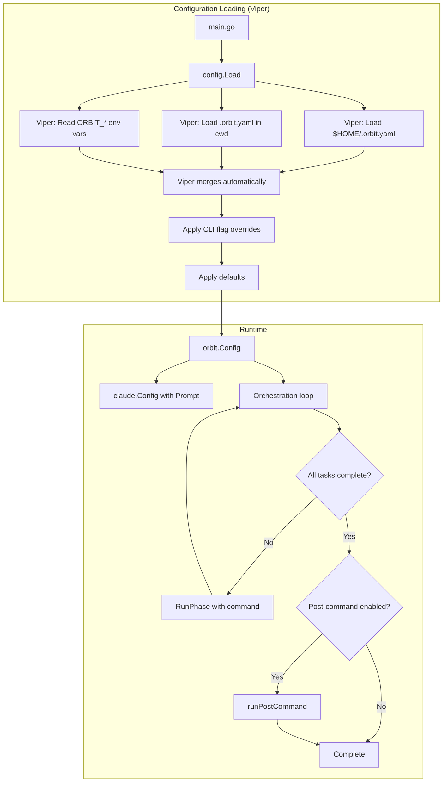

# Custom Commands Feature Design

## Overview

This design adds configurable commands to Orbit using Viper for configuration management. Viper handles YAML file loading, merging, and environment variable support. The changes propagate through the existing architecture: config values flow from main.go → orbit.Config → claude.Config, with the orchestrator executing the post-command after successful task completion.

## Architecture



## Components and Interfaces

### 1. Config Package (`internal/config/config.go`)

New package using Viper for configuration loading.

```go
package config

import (
    "log"
    "os"
    "path/filepath"
    "strings"

    "github.com/spf13/viper"
)

const (
    DefaultCommand     = "Run /next-task --phase and when complete run /commit"
    DefaultPostCommand = "Review the implementation to verify it meets the requirements and all tests pass. If issues are found, fix them."
)

// Config holds the resolved configuration values.
type Config struct {
    Command     string
    PostCommand string

    // Tracks explicit setting for post-command disable detection
    postCommandExplicit bool
}

// Load reads configuration from home and project directories using Viper.
// Priority: project config > home config > defaults
// Also reads ORBIT_COMMAND and ORBIT_POST_COMMAND environment variables.
func Load(workingDir string) *Config {
    v := viper.New()

    // Set defaults
    v.SetDefault("command", DefaultCommand)
    v.SetDefault("post-command", DefaultPostCommand)

    // Environment variables: ORBIT_COMMAND, ORBIT_POST_COMMAND
    v.SetEnvPrefix("ORBIT")
    v.SetEnvKeyReplacer(strings.NewReplacer("-", "_"))
    v.AutomaticEnv()

    // Config file name (without extension)
    v.SetConfigName(".orbit")
    v.SetConfigType("yaml")

    // Load home config first (lowest priority)
    if homeDir, err := os.UserHomeDir(); err == nil {
        v.AddConfigPath(homeDir)
        if err := v.ReadInConfig(); err != nil {
            if _, ok := err.(viper.ConfigFileNotFoundError); !ok {
                log.Printf("Warning: could not read %s/.orbit.yaml: %v", homeDir, err)
            }
        }
    }

    // Load project config (higher priority, merges with home)
    projectViper := viper.New()
    projectViper.SetConfigName(".orbit")
    projectViper.SetConfigType("yaml")
    projectViper.AddConfigPath(workingDir)

    postCommandExplicit := false
    if err := projectViper.ReadInConfig(); err == nil {
        // Merge project config into main viper
        if err := v.MergeConfigMap(projectViper.AllSettings()); err != nil {
            log.Printf("Warning: could not merge project config: %v", err)
        }
        // Check if post-command was explicitly set in project config
        postCommandExplicit = projectViper.IsSet("post-command")
    } else if _, ok := err.(viper.ConfigFileNotFoundError); !ok {
        log.Printf("Warning: could not read %s/.orbit.yaml: %v", workingDir, err)
    }

    return &Config{
        Command:             v.GetString("command"),
        PostCommand:         v.GetString("post-command"),
        postCommandExplicit: postCommandExplicit,
    }
}

// IsPostCommandDisabled returns true if post-command was explicitly set to empty.
// This allows distinguishing "use default" from "disable".
func (c *Config) IsPostCommandDisabled() bool {
    return c.postCommandExplicit && c.PostCommand == ""
}
```

**Key features:**
- Viper handles YAML parsing and file discovery
- Environment variable support: `ORBIT_COMMAND`, `ORBIT_POST_COMMAND`
- Automatic merging of config sources
- `IsSet()` detects explicit empty strings

### 2. Claude Client Updates (`internal/claude/client.go`)

Add `Prompt` field to Config and use it in `RunPhase()`.

```go
type Config struct {
    SkipPermissions bool
    WorkingDir      string
    Prompt          string  // Prompt for phase execution
}

func (c *Client) RunPhase() (*SessionResult, error) {
    prompt := c.config.Prompt
    if prompt == "" {
        prompt = "Run /next-task --phase and when complete run /commit"
    }
    // ... rest unchanged, uses prompt variable instead of hardcoded string
}
```

Note: The existing `RunCustomPrompt()` method remains available for post-command execution.

### 3. Orbit Config Updates (`internal/orbit/orbit.go`)

Extend Config struct and add post-command execution.

```go
type Config struct {
    TasksFile       string
    LogDir          string
    BranchName      string
    SkipPermissions bool
    Verbose         bool
    DryRun          bool
    WorkingDir      string
    Command         string  // Custom phase command
    PostCommand     string  // Post-completion command (empty = disabled)
}
```

### 4. Log Manager Updates (`internal/logs/manager.go`)

Add a separate method for post-completion logging.

```go
// SavePostCompletionSession saves the post-command session with distinct naming.
func (m *Manager) SavePostCompletionSession(result *claude.SessionResult, startTime time.Time) error {
    baseName := "post-completion-session"

    // Save JSON
    jsonPath := filepath.Join(m.sessionDir, baseName+".json")
    if err := os.WriteFile(jsonPath, result.RawJSON, 0644); err != nil {
        return fmt.Errorf("failed to write post-completion JSON: %w", err)
    }

    // Save transcript
    txtPath := filepath.Join(m.sessionDir, baseName+".txt")
    transcript := formatPostCompletionTranscript(result, startTime, time.Now())
    if err := os.WriteFile(txtPath, []byte(transcript), 0644); err != nil {
        return fmt.Errorf("failed to write post-completion transcript: %w", err)
    }

    // Copy and format session transcript from ~/.claude/projects
    if err := m.copySessionTranscript(result.SessionID, baseName); err != nil {
        log.Printf("Warning: could not copy session transcript: %v", err)
    }

    return nil
}

func formatPostCompletionTranscript(result *claude.SessionResult, start, end time.Time) string {
    var sb strings.Builder
    sb.WriteString("# Post-Completion Session Transcript\n\n")
    sb.WriteString(fmt.Sprintf("**Started:** %s\n", start.Format(time.RFC3339)))
    sb.WriteString(fmt.Sprintf("**Completed:** %s\n", end.Format(time.RFC3339)))
    sb.WriteString(fmt.Sprintf("**Duration:** %s\n", end.Sub(start).Round(time.Second)))
    sb.WriteString(fmt.Sprintf("**Cost:** $%.4f\n", result.Cost))
    sb.WriteString(fmt.Sprintf("**Turns:** %d\n\n", result.NumTurns))
    sb.WriteString("## Output\n\n")
    sb.WriteString(result.Output)
    return sb.String()
}
```

### 5. Main Entry Point Updates (`cmd/orbit/main.go`)

Add flags and config loading with priority resolution.

```go
func main() {
    // Existing flags...
    commandFlag := flag.String("command", "", "Custom prompt for Claude phases")
    postCommandFlag := flag.String("post-command", "", "Command after all tasks complete")
    noPostCommand := flag.Bool("no-post-command", false, "Skip post-completion command")

    flag.Parse()

    // After determining workingDir...

    // Load configuration (Viper handles merging)
    cfg := config.Load(workingDir)

    // Resolve effective command (priority: flag > config/env > default)
    command := cfg.Command  // Already has default from Viper
    if *commandFlag != "" {
        command = *commandFlag
    }

    // Resolve effective post-command (priority: flag > config/env > default)
    postCommand := cfg.PostCommand
    if cfg.IsPostCommandDisabled() {
        postCommand = "" // Config explicitly disabled
    }
    if *postCommandFlag != "" {
        postCommand = *postCommandFlag
    }
    if *noPostCommand {
        postCommand = "" // Flag disables
    }

    // Build orbit.Config
    orbitCfg := orbit.Config{
        // ... existing fields ...
        Command:     command,
        PostCommand: postCommand,
    }
}
```

### 6. Dry-Run Output Updates (`internal/orbit/orbit.go`)

Update dry-run mode to display configured commands.

```go
func (o *Orbit) Run() error {
    // ... existing setup ...

    if o.config.DryRun {
        log.Printf("[DRY RUN] Would execute phase %d with %d pending tasks", phaseNum, len(pending))
        log.Printf("[DRY RUN] Phase command: %s", o.config.Command)
        if o.config.PostCommand != "" {
            log.Printf("[DRY RUN] Post-command: %s", o.config.PostCommand)
        } else {
            log.Printf("[DRY RUN] Post-command: (disabled)")
        }
        return nil
    }
    // ...
}
```

## Data Models

### Config File Schema

```yaml
# .orbit.yaml
command: "Run /next-task --phase and when complete run /commit"
post-command: "Review the implementation..."

# To disable post-command:
post-command: ""
```

### Environment Variables

| Variable | Description |
|----------|-------------|
| `ORBIT_COMMAND` | Custom phase command |
| `ORBIT_POST_COMMAND` | Post-completion command (empty string disables) |

### Configuration Priority

1. CLI flags (`--command`, `--post-command`, `--no-post-command`)
2. Environment variables (`ORBIT_COMMAND`, `ORBIT_POST_COMMAND`)
3. Project config (`.orbit.yaml` in working directory)
4. Home config (`$HOME/.orbit.yaml`)
5. Defaults

### Config Merging Rules

| Scenario | home config | project config | Result |
|----------|-------------|----------------|--------|
| Both set | `"cmd-a"` | `"cmd-b"` | `"cmd-b"` (project wins) |
| Home only | `"cmd-a"` | (omitted) | `"cmd-a"` |
| Project disabled | `"cmd-a"` | `""` | `""` (disabled) |
| Home disabled, project omitted | `""` | (omitted) | `""` (home's disabled state kept) |
| Neither set | (omitted) | (omitted) | default value |

## Error Handling

### Config Loading Errors

| Error Type | Handling | Reference |
|------------|----------|-----------|
| File doesn't exist | Continue silently (Viper default) | [1.4](#1.4) |
| Invalid YAML | Log warning with path, continue | [1.5](#1.5) |
| Permission error | Log warning with path, continue | [1.5](#1.5) |
| $HOME not set | Skip home config, continue | [1.4](#1.4) |

### Post-Command Errors

| Error Type | Handling | Reference |
|------------|----------|-----------|
| Claude execution fails | Log error, exit non-zero | [3.7](#3.7) |
| Retryable error | Apply same retry logic as phases | Design decision |
| Non-retryable error | Log clearly, exit non-zero | [3.7](#3.7) |

### Exit Code Strategy

```go
func (o *Orbit) Run() error {
    // ... task loop ...

    // On successful completion:
    if o.config.PostCommand != "" {
        log.Println("Running post-completion command...")
        if err := o.runPostCommand(); err != nil {
            log.Printf("Orchestration succeeded but post-command failed: %v", err)
            return o.fail(err)  // Non-zero exit
        }
        log.Println("Post-completion command finished")
    }

    log.Println("All tasks complete!")
    if o.logManager != nil {
        return o.logManager.Complete()
    }
    return nil
}

func (o *Orbit) runPostCommand() error {
    startTime := time.Now()

    result, err := o.claudeClient.RunCustomPrompt(o.config.PostCommand)
    if err != nil {
        if o.logManager != nil && result != nil {
            _ = o.logManager.SavePostCompletionSession(result, startTime)
        }
        classified := orberrors.Classify(1, result.Stderr, result.Output)
        return classified
    }

    if result.IsError {
        if o.logManager != nil {
            _ = o.logManager.SavePostCompletionSession(result, startTime)
        }
        classified := orberrors.Classify(1, result.Stderr, result.Output)
        return classified
    }

    if o.logManager != nil {
        if err := o.logManager.SavePostCompletionSession(result, startTime); err != nil {
            log.Printf("Warning: failed to save post-completion log: %v", err)
        }
    }

    if o.config.Verbose {
        log.Printf("Post-completion: cost=$%.4f, duration=%s, turns=%d",
            result.Cost, result.Duration, result.NumTurns)
    }

    return nil
}
```

## Testing Strategy

### Unit Tests

| Component | Test File | Key Tests |
|-----------|-----------|-----------|
| Config loading | `internal/config/config_test.go` | Load from project, home, both; merge logic; env vars |
| Claude prompt | `internal/claude/client_test.go` | Custom prompt used in RunPhase |
| Orbit config | `internal/orbit/orbit_test.go` | New fields wired correctly |
| Log naming | `internal/logs/manager_test.go` | SavePostCompletionSession creates correct files |

### Config Package Tests

```go
func TestLoad_ProjectOnly(t *testing.T)
func TestLoad_HomeOnly(t *testing.T)
func TestLoad_MergesBoth(t *testing.T)
func TestLoad_NoFiles(t *testing.T)
func TestLoad_InvalidYAML(t *testing.T)
func TestLoad_EmptyPostCommand(t *testing.T)
func TestLoad_EnvVarOverride(t *testing.T)
func TestLoad_EnvVarPostCommand(t *testing.T)

func TestIsPostCommandDisabled(t *testing.T)
```

### Integration Tests

- Verify CLI flags override config file values
- Verify environment variables override config files
- Verify `--no-post-command` disables even when config has value
- Verify dry-run shows configured commands
- Verify empty string in config disables post-command

## File Changes Summary

| File | Changes |
|------|---------|
| `internal/config/config.go` | New file - Viper-based config loading |
| `internal/config/config_test.go` | New file - tests for config package |
| `internal/claude/client.go` | Add `Prompt` to Config, use in RunPhase |
| `internal/orbit/orbit.go` | Add fields to Config, implement runPostCommand, update dry-run |
| `internal/logs/manager.go` | Add SavePostCompletionSession method |
| `cmd/orbit/main.go` | Add flags, load config, apply priority |
| `go.mod` | Add `github.com/spf13/viper` dependency |
