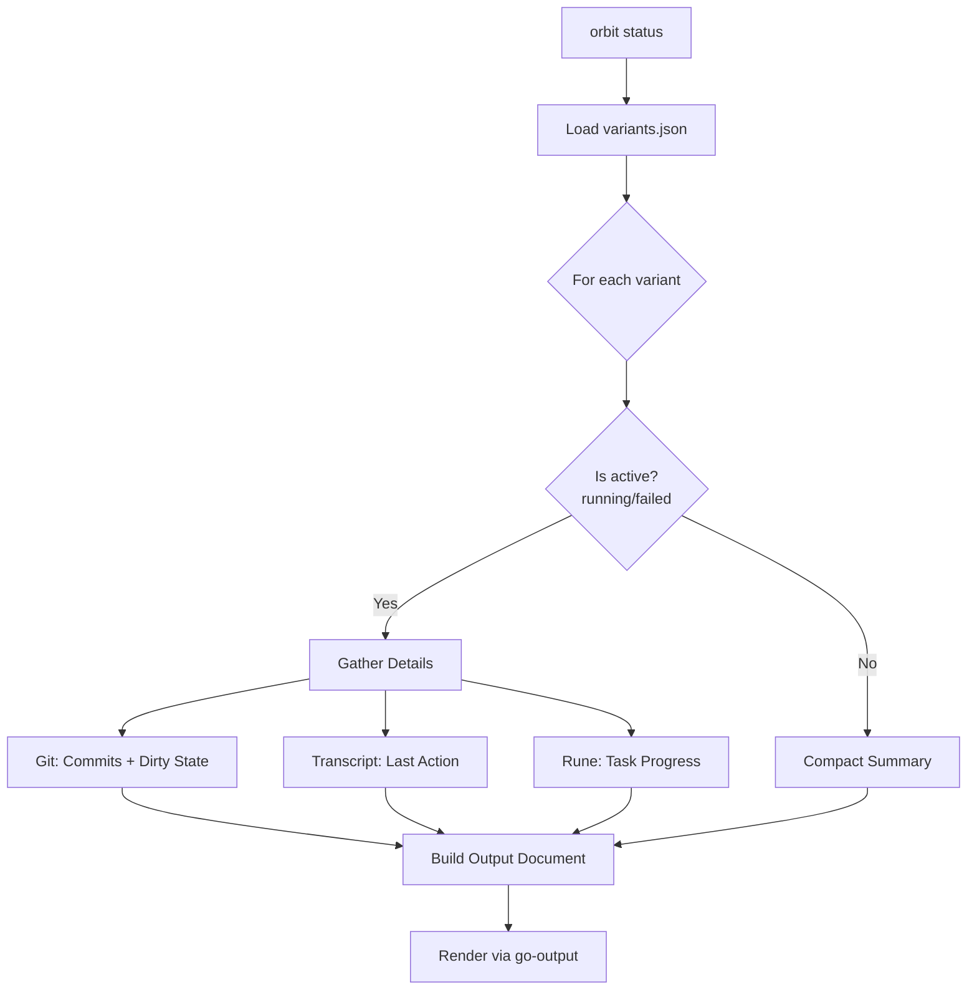

# Design: Enhanced Status Command

## Overview

This design describes the enhanced `orbit status` command that provides detailed visibility into active variant implementations. The command will display recent commits, git dirty state, last agent action, and task progress for variants with status "running" or "failed", while showing a compact summary for other variants.

The implementation extends the existing `cmd/orbit/status.go` with new data gathering functions and structured output rendering via go-output.

## Architecture



### Data Flow

1. **Input**: Spec name (from argument or git branch detection)
2. **Load**: Read `variants.json` via existing `variants.Manager`
3. **Gather**: For each active variant, collect git info, transcript, and task data
4. **Render**: Build structured document with go-output, render to terminal

## Components and Interfaces

### New Package: `internal/status`

A new package encapsulates the status gathering logic, keeping `cmd/orbit/status.go` focused on CLI concerns.

```go
// Package status provides variant status data gathering for the orbit status command.
package status

import (
    "github.com/arjenschwarz/orbit/internal/rune"
    "github.com/arjenschwarz/orbit/internal/variants"
)

// VariantInfo contains all gathered information for a single variant.
type VariantInfo struct {
    // From variants.json
    ID           int
    Branch       string
    WorktreePath string
    Status       variants.VariantStatus
    AgentType    string
    Error        string

    // Git information (nil if gathering failed)
    GitInfo *GitInfo

    // Last action from transcript
    LastAction *LastActionResult

    // Task progress (nil if gathering failed)
    TaskProgress *TaskProgress
}

// GitInfo contains git-related status for a variant.
type GitInfo struct {
    Commits    []Commit // Most recent commits (up to 3)
    IsDirty    bool     // Has uncommitted changes
    DirtyState string   // "clean" or "dirty"
}

// Commit represents a single commit entry.
type Commit struct {
    Hash    string // Short hash (7 chars)
    Subject string // Commit message subject line
}

// LastActionResult represents the result of attempting to get the last action.
// Uses explicit state to distinguish between different outcomes.
type LastActionResult struct {
    State   LastActionState
    Summary string // Only set when State == LastActionFound
}

// LastActionState represents the outcome of last action retrieval.
type LastActionState int

const (
    // LastActionFound means a displayable action was found
    LastActionFound LastActionState = iota
    // LastActionWaiting means no session ID yet or transcript doesn't exist
    LastActionWaiting
    // LastActionUnavailable means there was an error reading/parsing
    LastActionUnavailable
    // LastActionNotSupported means the agent type doesn't support transcript access
    LastActionNotSupported
)

// TaskProgress contains phase-by-phase task completion status.
type TaskProgress struct {
    Phases []PhaseProgress
}

// PhaseProgress contains task counts for a single phase.
type PhaseProgress struct {
    Name      string
    Completed int
    Total     int
    IsActive  bool // Currently in progress
}
```

### Gatherer Implementation

```go
// Gatherer collects status information for variants.
type Gatherer struct {
    git        variants.GitClient
    specName   string
    baseCommit string
    repoRoot   string
}

// NewGatherer creates a Gatherer for the given spec.
func NewGatherer(git variants.GitClient, specName, baseCommit, repoRoot string) *Gatherer {
    return &Gatherer{
        git:        git,
        specName:   specName,
        baseCommit: baseCommit,
        repoRoot:   repoRoot,
    }
}

// GatherAllVariants collects status information for all variants concurrently.
// This improves performance by parallelizing git, transcript, and rune operations.
func (g *Gatherer) GatherAllVariants(ctx context.Context, variants []*variants.Variant) []*VariantInfo {
    results := make([]*VariantInfo, len(variants))
    var wg sync.WaitGroup

    for i, v := range variants {
        wg.Add(1)
        go func(idx int, variant *variants.Variant) {
            defer wg.Done()
            results[idx] = g.GatherVariantInfo(ctx, variant)
        }(i, v)
    }

    wg.Wait()
    return results
}

// GatherVariantInfo collects all available information for a single variant.
// Errors in individual data sources are captured, not propagated.
func (g *Gatherer) GatherVariantInfo(ctx context.Context, v *variants.Variant) *VariantInfo {
    info := &VariantInfo{
        ID:           v.ID,
        Branch:       v.Branch,
        WorktreePath: v.WorktreePath,
        Status:       v.Status,
        AgentType:    v.AgentType,
        Error:        v.Error,
    }

    // Only gather details for active variants
    if v.Status != variants.StatusRunning && v.Status != variants.StatusFailed {
        return info
    }

    // Git info (commits + dirty state)
    info.GitInfo = g.gatherGitInfo(ctx, v.WorktreePath)

    // Last action from transcript
    info.LastAction = g.gatherLastAction(v)

    // Task progress via rune
    info.TaskProgress = g.gatherTaskProgress(v.WorktreePath)

    return info
}

func (g *Gatherer) gatherGitInfo(ctx context.Context, worktreePath string) *GitInfo {
    gitInfo := &GitInfo{}

    // Get commits
    commits, err := g.git.GetRecentCommits(ctx, worktreePath, g.baseCommit, 3)
    if err != nil {
        return nil // Git info unavailable
    }
    gitInfo.Commits = commits

    // Get dirty state
    isDirty, err := g.git.HasUncommittedChangesInPath(worktreePath)
    if err != nil {
        return nil // Git info unavailable
    }
    gitInfo.IsDirty = isDirty
    if isDirty {
        gitInfo.DirtyState = "dirty"
    } else {
        gitInfo.DirtyState = "clean"
    }

    return gitInfo
}

func (g *Gatherer) gatherLastAction(v *variants.Variant) *LastActionResult {
    // Check agent type first
    if v.AgentType != "claude-code" {
        return &LastActionResult{State: LastActionNotSupported}
    }

    // Build path to variant's spec directory within worktree
    worktreeSpecDir := filepath.Join(v.WorktreePath, "specs", g.specName)

    // Get transcript path
    transcriptPath, err := GetLiveTranscriptPath(v.WorktreePath, worktreeSpecDir)
    if err != nil || transcriptPath == "" {
        return &LastActionResult{State: LastActionWaiting}
    }

    // Check if file exists
    if _, err := os.Stat(transcriptPath); os.IsNotExist(err) {
        return &LastActionResult{State: LastActionWaiting}
    }

    // Read last displayable entry
    entry, err := transcript.GetLastDisplayableEntry(transcriptPath)
    if err != nil {
        return &LastActionResult{State: LastActionUnavailable}
    }
    if entry == nil {
        return &LastActionResult{State: LastActionWaiting}
    }

    return &LastActionResult{
        State:   LastActionFound,
        Summary: transcript.FormatLastAction(entry),
    }
}

func (g *Gatherer) gatherTaskProgress(worktreePath string) *TaskProgress {
    // Construct path to tasks.md within the variant's worktree
    tasksFile := filepath.Join(worktreePath, "specs", g.specName, "tasks.md")

    // Create a rune client for this specific tasks file
    runeClient := rune.NewClient(tasksFile)

    // Get phase summaries
    summaries, err := runeClient.GetPhaseSummaries()
    if err != nil {
        return nil // Task progress unavailable
    }

    progress := &TaskProgress{
        Phases: make([]PhaseProgress, len(summaries)),
    }

    for i, s := range summaries {
        progress.Phases[i] = PhaseProgress{
            Name:      s.Name,
            Completed: s.Completed,
            Total:     s.Total,
            IsActive:  s.Status == rune.PhaseStatusInProgress,
        }
    }

    return progress
}
```

### Git Operations (extends `internal/variants/git.go`)

Add new methods to `GitClient` interface:

```go
// HasUncommittedChangesInPath checks for uncommitted changes in a specific worktree.
// Only considers tracked files (ignores untracked per requirement 2.4).
func (g *Git) HasUncommittedChangesInPath(path string) (bool, error)

// GetRecentCommits returns the N most recent commits since baseCommit in a worktree.
// Returns commits in reverse chronological order (newest first).
func (g *Git) GetRecentCommits(ctx context.Context, worktreePath, baseCommit string, limit int) ([]Commit, error)
```

Implementation using single `git status --porcelain` command for efficiency:

```go
func (g *Git) HasUncommittedChangesInPath(path string) (bool, error) {
    // Use git status --porcelain to check for changes
    // The -uno flag excludes untracked files (requirement 2.4)
    cmd := exec.Command("git", "status", "--porcelain", "-uno")
    cmd.Dir = path
    out, err := cmd.Output()
    if err != nil {
        return false, fmt.Errorf("check uncommitted changes in %s: %w", path, err)
    }
    // Any output means there are changes (staged or unstaged to tracked files)
    return len(strings.TrimSpace(string(out))) > 0, nil
}

// Commit represents a single commit for status display.
type Commit struct {
    Hash    string
    Subject string
}

func (g *Git) GetRecentCommits(ctx context.Context, worktreePath, baseCommit string, limit int) ([]Commit, error) {
    // --format to get just hash and subject, separated by a delimiter we can split on
    // Using %x00 (null byte) as delimiter since it won't appear in commit messages
    cmd := exec.CommandContext(ctx, "git", "log",
        fmt.Sprintf("-%d", limit),
        "--format=%h%x00%s",
        baseCommit+"..HEAD")
    cmd.Dir = worktreePath
    out, err := cmd.Output()
    if err != nil {
        if ctx.Err() != nil {
            return nil, fmt.Errorf("get commits cancelled: %w", ctx.Err())
        }
        return nil, fmt.Errorf("get commits: %w", err)
    }

    var commits []Commit
    lines := strings.Split(strings.TrimSpace(string(out)), "\n")
    for _, line := range lines {
        if line == "" {
            continue
        }
        parts := strings.SplitN(line, "\x00", 2)
        if len(parts) == 2 {
            commits = append(commits, Commit{Hash: parts[0], Subject: parts[1]})
        }
    }
    return commits, nil
}
```

### Transcript Reading (new in `internal/transcript`)

Add efficient last-entry reading with expanding search window:

```go
// GetLastDisplayableEntry reads the transcript file from the end and returns
// the most recent displayable entry (assistant message with tool_use or text).
// Uses an expanding search window to handle large entries.
// Returns nil, nil if no displayable entry exists (file empty or only system messages).
// Returns nil, error for actual read/parse errors.
func GetLastDisplayableEntry(filePath string) (*Entry, error)

// FormatToolUse formats a tool_use content item for display.
// Returns format: "{ToolName}: {key_input}" with truncation to 60 chars.
func FormatToolUse(name string, input any) string

// FormatLastAction formats an entry as a last action summary.
// Prioritizes tool_use over text when both are present in the same message.
func FormatLastAction(entry *Entry) string
```

Implementation with expanding search window:

```go
const (
    initialChunkSize    = 64 * 1024       // 64KB initial read
    maxChunkSize        = 4 * 1024 * 1024 // 4MB max before fallback
    maxFullFileFallback = 32 * 1024 * 1024 // 32MB - read full file if smaller
    chunkGrowFactor     = 2 // Double each iteration (more balanced memory growth)
)

func GetLastDisplayableEntry(filePath string) (*Entry, error) {
    f, err := os.Open(filePath)
    if err != nil {
        return nil, err
    }
    defer f.Close()

    // Start with initial chunk, expand if needed
    chunkSize := int64(initialChunkSize)

    for {
        // Re-stat file each iteration (file may be growing as agent writes)
        stat, err := f.Stat()
        if err != nil {
            return nil, err
        }
        fileSize := stat.Size()
        if fileSize == 0 {
            return nil, nil // Empty file
        }

        // Check if we've exceeded max chunk and need to fallback to full file
        if chunkSize > int64(maxChunkSize) {
            if fileSize <= int64(maxFullFileFallback) {
                chunkSize = fileSize // Read entire file as last resort
            } else {
                // File is too large to read entirely, give up
                return nil, nil
            }
        }

        if chunkSize > fileSize {
            chunkSize = fileSize
        }

        offset := fileSize - chunkSize
        if offset < 0 {
            offset = 0
        }

        buf := make([]byte, chunkSize)
        n, err := f.ReadAt(buf, offset)
        if err != nil && err != io.EOF {
            return nil, err
        }
        buf = buf[:n]

        // Find complete JSON lines by looking for newlines
        // If we're not at the start, skip partial first line
        startIdx := 0
        if offset > 0 {
            idx := bytes.IndexByte(buf, '\n')
            if idx >= 0 {
                startIdx = idx + 1
            } else {
                // No newline found - entire chunk is a partial line
                // Grow window and retry without trying to parse
                chunkSize *= chunkGrowFactor
                continue
            }
        }

        // Split into lines and process from end
        lines := bytes.Split(buf[startIdx:], []byte("\n"))

        for i := len(lines) - 1; i >= 0; i-- {
            line := bytes.TrimSpace(lines[i])
            if len(line) == 0 {
                continue
            }

            var entry Entry
            if err := json.Unmarshal(line, &entry); err != nil {
                // Skip malformed lines (may be incomplete at chunk boundary
                // or actively being written)
                continue
            }

            if isDisplayableEntry(&entry) {
                return &entry, nil
            }
        }

        // If we've read the entire file and found nothing, return nil
        if offset == 0 {
            return nil, nil
        }

        // Expand search window
        chunkSize *= chunkGrowFactor
    }
}

func isDisplayableEntry(e *Entry) bool {
    if e.IsMeta {
        return false
    }
    if e.Message == nil || e.Message.Role != "assistant" {
        return false
    }
    for _, c := range e.Message.Content {
        if c.Type == "tool_use" || c.Type == "text" {
            return true
        }
    }
    return false
}
```

### FormatToolUse and FormatLastAction Implementation

```go
// parameterPriority defines the order for extracting key_input from tool parameters.
// Per requirement 3.6: file_path, path, command, pattern, query, url, prompt
var parameterPriority = []string{"file_path", "path", "command", "pattern", "query", "url", "prompt"}

// FormatToolUse formats a tool_use content item for display.
func FormatToolUse(name string, input any) string {
    keyInput := extractKeyInput(input)
    if keyInput == "" {
        return name
    }
    // Truncate to 60 characters per requirement 3.6
    if len(keyInput) > 60 {
        keyInput = keyInput[:57] + "..."
    }
    return fmt.Sprintf("%s: %s", name, keyInput)
}

func extractKeyInput(input any) string {
    inputMap, ok := input.(map[string]any)
    if !ok {
        return ""
    }

    // Try parameters in priority order
    for _, key := range parameterPriority {
        if val, exists := inputMap[key]; exists {
            if str, ok := val.(string); ok && str != "" {
                return str
            }
        }
    }

    // Fall back to first parameter value
    for _, val := range inputMap {
        if str, ok := val.(string); ok && str != "" {
            return str
        }
    }

    return ""
}

// FormatLastAction formats an entry as a last action summary.
// Per requirement 3.5: prioritizes tool_use over text when both present.
func FormatLastAction(entry *Entry) string {
    if entry == nil || entry.Message == nil {
        return ""
    }

    // First pass: look for tool_use (higher priority per req 3.5)
    for _, c := range entry.Message.Content {
        if c.Type == "tool_use" {
            return FormatToolUse(c.Name, c.Input)
        }
    }

    // Second pass: fall back to text
    for _, c := range entry.Message.Content {
        if c.Type == "text" && c.Text != "" {
            text := c.Text
            // Truncate to 80 chars per requirement 3.7
            if len(text) > 80 {
                return text[:77] + "..."
            }
            return text
        }
    }

    return ""
}
```

### Transcript Path Resolution

```go
// GetLiveTranscriptPath returns the path to the live Claude transcript.
//
// Parameters:
// - worktreePath: The variant's worktree path (e.g., "/repo/specs/feature/.orbit/worktrees/impl-1")
//   This is used as the working directory for BuildProjectPath since Claude is invoked from here.
// - worktreeSpecDir: Path to the spec directory within the worktree
//   (e.g., "/repo/specs/feature/.orbit/worktrees/impl-1/specs/feature")
//
// Returns empty string if session ID not available or agent is not Claude.
func GetLiveTranscriptPath(worktreePath, worktreeSpecDir string) (string, error) {
    // Read summary.json from variant's .orbit directory
    summaryPath := filepath.Join(worktreeSpecDir, ".orbit", "summary.json")
    data, err := os.ReadFile(summaryPath)
    if err != nil {
        return "", err
    }

    var summary logs.Summary
    if err := json.Unmarshal(data, &summary); err != nil {
        return "", err
    }

    // Get current session ID from in-progress phase
    var sessionID string
    if summary.CurrentPhase != nil {
        sessionID = summary.CurrentPhase.SessionID
    }
    if sessionID == "" {
        return "", nil
    }

    // Build Claude project path
    // Claude is invoked from the worktree root, so that's the project path
    homeDir, err := os.UserHomeDir()
    if err != nil {
        return "", err
    }

    // Example: worktreePath = "/Users/foo/repo/specs/feature/.orbit/worktrees/impl-1"
    // BuildProjectPath converts to: "-Users-foo-repo-specs-feature--orbit-worktrees-impl-1"
    // Claude stores at: ~/.claude/projects/{project-hash}/{session-id}.jsonl
    projectHash := claudecode.BuildProjectPath(worktreePath)
    return filepath.Join(homeDir, ".claude", "projects", projectHash, sessionID+".jsonl"), nil
}
```

### Output Data Types

Define structured output types that support both terminal rendering and JSON serialization:

```go
// StatusOutput represents the complete status output for all variants.
// This enables JSON/Markdown output formats via go-output.
type StatusOutput struct {
    SpecName       string          `json:"spec_name"`
    BaseCommit     string          `json:"base_commit"`
    OriginalBranch string          `json:"original_branch"`
    StartedAt      string          `json:"started_at"`
    ActiveVariants []VariantOutput `json:"active_variants"`
    OtherVariants  []VariantOutput `json:"other_variants"`
}

// VariantOutput represents a single variant in the output.
type VariantOutput struct {
    ID         int           `json:"id"`
    Branch     string        `json:"branch"`
    Status     string        `json:"status"`
    GitState   string        `json:"git_state,omitempty"`
    Commits    []CommitOutput `json:"commits,omitempty"`
    LastAction string        `json:"last_action,omitempty"`
    Tasks      []TaskOutput  `json:"tasks,omitempty"`
    Error      string        `json:"error,omitempty"`
}

// CommitOutput represents a single commit in the output.
type CommitOutput struct {
    Hash    string `json:"hash"`
    Subject string `json:"subject"`
}

// TaskOutput represents a single phase's task progress.
type TaskOutput struct {
    Phase     string `json:"phase"`
    Completed int    `json:"completed"`
    Total     int    `json:"total"`
    IsActive  bool   `json:"is_active"`
}
```

### Output Rendering

The status command uses go-output with structured data for format flexibility:

```go
func renderStatus(ctx context.Context, specName string, metadata *variants.VariantsMetadata, infos []*status.VariantInfo, format string) error {
    // Build structured output
    statusData := buildStatusOutput(specName, metadata, infos)

    // Choose rendering approach based on format
    switch format {
    case "json":
        return renderJSON(ctx, statusData)
    case "markdown":
        return renderMarkdown(ctx, statusData)
    default:
        return renderTerminal(ctx, statusData)
    }
}

func buildStatusOutput(specName string, metadata *variants.VariantsMetadata, infos []*status.VariantInfo) *StatusOutput {
    result := &StatusOutput{
        SpecName:       specName,
        BaseCommit:     truncateHash(metadata.BaseCommit, 12),
        OriginalBranch: metadata.OriginalBranch,
        StartedAt:      metadata.StartedAt.Format("2006-01-02 15:04:05"),
    }

    for _, info := range infos {
        vo := buildVariantOutput(info)
        if info.Status == variants.StatusRunning || info.Status == variants.StatusFailed {
            result.ActiveVariants = append(result.ActiveVariants, vo)
        } else {
            result.OtherVariants = append(result.OtherVariants, vo)
        }
    }

    return result
}

func buildVariantOutput(info *status.VariantInfo) VariantOutput {
    vo := VariantOutput{
        ID:     info.ID,
        Branch: info.Branch,
        Status: string(info.Status),
        Error:  info.Error,
    }

    // Git info
    if info.GitInfo != nil {
        vo.GitState = info.GitInfo.DirtyState
        for _, c := range info.GitInfo.Commits {
            vo.Commits = append(vo.Commits, CommitOutput{Hash: c.Hash, Subject: c.Subject})
        }
    }

    // Last action
    if info.LastAction != nil {
        switch info.LastAction.State {
        case status.LastActionFound:
            vo.LastAction = info.LastAction.Summary
        case status.LastActionWaiting:
            vo.LastAction = "Waiting for activity..."
        case status.LastActionUnavailable:
            vo.LastAction = "Transcript unavailable"
        case status.LastActionNotSupported:
            vo.LastAction = fmt.Sprintf("Last action tracking not available for %s", info.AgentType)
        }
    }

    // Task progress
    if info.TaskProgress != nil {
        for _, p := range info.TaskProgress.Phases {
            vo.Tasks = append(vo.Tasks, TaskOutput{
                Phase:     p.Name,
                Completed: p.Completed,
                Total:     p.Total,
                IsActive:  p.IsActive,
            })
        }
    }

    return vo
}

// renderJSON outputs structured JSON using go-output
func renderJSON(ctx context.Context, data *StatusOutput) error {
    builder := output.New()
    builder.WithObject(data)
    doc := builder.Build()

    out := output.NewOutput(
        output.WithFormat(output.JSON()),
        output.WithWriter(output.NewStdoutWriter()),
    )
    return out.Render(ctx, doc)
}

// renderTerminal outputs formatted text for terminal display
func renderTerminal(ctx context.Context, data *StatusOutput) error {
    builder := output.New()

    // Header
    builder.Text(fmt.Sprintf("Variant Status: %s", data.SpecName))
    builder.Text("")
    builder.Text(fmt.Sprintf("Base Commit:     %s", data.BaseCommit))
    builder.Text(fmt.Sprintf("Original Branch: %s", data.OriginalBranch))
    builder.Text(fmt.Sprintf("Started:         %s", data.StartedAt))
    builder.Text("")

    // Active variants with details
    for i, v := range data.ActiveVariants {
        if i > 0 {
            builder.Text("")
            builder.Text("---")
        }
        renderActiveVariantText(builder, &v)
    }

    // Inactive variants summary
    if len(data.OtherVariants) > 0 {
        builder.Text("")
        builder.Text("---")
        builder.Text("")
        if len(data.ActiveVariants) == 0 {
            builder.Text("No active variants")
            builder.Text("")
        }
        for _, v := range data.OtherVariants {
            builder.Text(fmt.Sprintf("Variant %d: %s [%s]", v.ID, v.Branch, v.Status))
        }
    }

    doc := builder.Build()
    out := output.NewOutput(
        output.WithFormat(output.Text()),
        output.WithWriter(output.NewStdoutWriter()),
    )
    return out.Render(ctx, doc)
}

func renderActiveVariantText(builder *output.DocumentBuilder, v *VariantOutput) {
    // Header
    header := fmt.Sprintf("Variant %d: %s [%s", v.ID, v.Branch, v.Status)
    if v.GitState != "" {
        header += fmt.Sprintf(" (%s)", v.GitState)
    }
    header += "]"
    builder.Text(header)
    builder.Text("")

    // Commits
    builder.Text("Commits:")
    if v.GitState == "" && len(v.Commits) == 0 {
        builder.Text("  Git info unavailable")
    } else if len(v.Commits) == 0 {
        builder.Text("  No commits yet")
    } else {
        for _, c := range v.Commits {
            builder.Text(fmt.Sprintf("  %s %s", c.Hash, c.Subject))
        }
    }
    builder.Text("")

    // Last Action
    builder.Text("Last Action:")
    if v.LastAction == "" {
        builder.Text("  Waiting for activity...")
    } else {
        builder.Text(fmt.Sprintf("  %s", v.LastAction))
    }
    builder.Text("")

    // Tasks
    builder.Text("Tasks:")
    if len(v.Tasks) == 0 {
        builder.Text("  Task progress unavailable")
    } else {
        for _, t := range v.Tasks {
            prefix := "  "
            if t.IsActive {
                prefix = "→ "
            }
            builder.Text(fmt.Sprintf("%s%s: %d/%d", prefix, t.Phase, t.Completed, t.Total))
        }
    }
}

func truncateHash(hash string, length int) string {
    if len(hash) <= length {
        return hash
    }
    return hash[:length]
}
```

## Data Models

### Existing Models (unchanged)

- `variants.Variant` - From `internal/variants/types.go`
- `variants.VariantsMetadata` - From `internal/variants/types.go`
- `logs.Summary` - From `internal/logs/manager.go`
- `transcript.Entry` - From `internal/transcript/types.go`
- `rune.PhaseSummary` - From `internal/rune/client.go`

### New Models

Located in `internal/status/types.go`:

```go
// VariantInfo - aggregated status for one variant
// GitInfo - git commits and dirty state
// Commit - single commit (hash + subject)
// LastActionResult - result with explicit state enum
// LastActionState - enum: Found, Waiting, Unavailable, NotSupported
// TaskProgress - phase-by-phase progress
// PhaseProgress - single phase stats
```

Located in `internal/variants/git.go` (extending existing):

```go
// Commit - single commit for status display
```

Located in `internal/transcript/last_entry.go`:

```go
// GetLastDisplayableEntry - efficient tail reading with expanding window
// FormatToolUse - formats tool_use with parameter priority
// FormatLastAction - formats entry, preferring tool_use over text
```

## Error Handling

### Principle: Graceful Degradation

Individual data source failures do not stop the command. Each section displays a fallback message based on explicit error states.

### Error State Mapping

| Failure | State/Field | Display |
|---------|-------------|---------|
| Git operations fail | `GitInfo == nil` | Header: no `(dirty/clean)`; Commits: "Git info unavailable" |
| Worktree doesn't exist | `GitInfo == nil` | Same as git operations fail |
| summary.json missing/invalid | `LastActionWaiting` | "Waiting for activity..." |
| Transcript file missing | `LastActionWaiting` | "Waiting for activity..." |
| Transcript parse error | `LastActionUnavailable` | "Transcript unavailable" |
| No displayable entry found | `LastActionWaiting` | "Waiting for activity..." |
| Non-Claude agent | `LastActionNotSupported` | "Last action tracking not available for {type}" |
| Rune not installed | `TaskProgress == nil` | "Task progress unavailable" |
| Rune command fails | `TaskProgress == nil` | "Task progress unavailable" |
| tasks.md missing | `TaskProgress == nil` | "Task progress unavailable" |
| variants.json missing | N/A | Exit code 0, message "No variant run in progress" |
| variants.json parse error | N/A | Exit code 1, error message |

### Exit Codes

- **0**: Success (including when no variants exist)
- **1**: Fatal error (can't load variants.json)

## Testing Strategy

### Unit Tests

#### Git Operations (`internal/variants/git_test.go`)

```go
func TestGetRecentCommits(t *testing.T) {
    // Test cases using real git operations in temp repo:
    // - Returns correct number of commits (respects limit)
    // - Returns commits in reverse chronological order (newest first)
    // - Returns empty slice when no commits since base
    // - Handles context cancellation
    // - Returns error for invalid worktree path
}

func TestHasUncommittedChangesInPath(t *testing.T) {
    // Test cases using real git operations in temp repo:
    // - Returns false for clean worktree (no changes)
    // - Returns true for staged changes only
    // - Returns true for unstaged changes only
    // - Returns true for both staged and unstaged changes
    // - Returns false when only untracked files exist (requirement 2.4)
    // - Returns error for invalid worktree path
}
```

#### Transcript Reading (`internal/transcript/last_entry_test.go`)

```go
func TestGetLastDisplayableEntry(t *testing.T) {
    // Test cases using fixture files:
    // - Finds tool_use entry at end of file
    // - Finds text entry at end of file
    // - Skips isMeta entries to find displayable one
    // - Skips thinking content items
    // - Handles incomplete JSON line at end (returns previous valid entry)
    // - Returns nil, nil for empty file
    // - Returns nil, error for missing file
    // - Handles file with only system/user messages (returns nil, nil)
    // - Expands search window when entry spans 64KB boundary
}

func TestFormatToolUse(t *testing.T) {
    // Test parameter priority (requirement 3.6):
    // - Extracts file_path when present
    // - Falls back to path when file_path absent
    // - Extracts command for Bash tool
    // - Extracts pattern for Grep/Glob
    // - Falls back to first parameter for unknown tools
    // - Truncates to 60 characters with "..."
    // - Returns just tool name when no extractable input
}

func TestFormatLastAction(t *testing.T) {
    // Test priority (requirement 3.5):
    // - When Message.Content has both tool_use and text items, returns tool_use format
    // - When only text items, returns truncated text (80 chars per req 3.7)
    // - Returns empty string for nil entry
}
```

#### Status Gatherer (`internal/status/gatherer_test.go`)

```go
func TestGatherVariantInfo(t *testing.T) {
    // Test with mocked GitClient and file system:
    // - All data sources succeed -> all fields populated
    // - Git fails, others succeed -> GitInfo nil, others populated
    // - Transcript fails, others succeed -> LastAction.State = Unavailable
    // - Rune fails, others succeed -> TaskProgress nil
    // - All fail -> returns variant with appropriate nil/state fields
    // - Non-active variant -> only basic fields, no details gathered
}

func TestGatherTaskProgress(t *testing.T) {
    // Test rune client integration:
    // - Creates client with correct tasks file path for variant
    // - Converts PhaseSummary to PhaseProgress correctly
    // - Marks active phase with IsActive = true
}
```

### Integration Tests

```go
func TestStatusCommand_Integration(t *testing.T) {
    // End-to-end test:
    // 1. Create temporary git repo
    // 2. Create worktree structure
    // 3. Create variants.json with running variant
    // 4. Create summary.json with session ID
    // 5. Create mock transcript file
    // 6. Create tasks.md file
    // 7. Run status command
    // 8. Verify output contains:
    //    - Variant header with status
    //    - Commits section
    //    - Last Action section
    //    - Tasks section
}
```

### Test Fixtures

Store in `internal/transcript/testdata/`:
- `transcript_tool_use.jsonl` - Transcript ending with tool_use entry
- `transcript_text.jsonl` - Transcript ending with text entry
- `transcript_mixed.jsonl` - Entry with both tool_use AND text (tests priority)
- `transcript_thinking.jsonl` - Transcript ending with thinking (should skip)
- `transcript_incomplete.jsonl` - File with incomplete JSON on last line
- `transcript_large_entry.jsonl` - Entry larger than 64KB to test window expansion
- `transcript_system_only.jsonl` - Only system/user messages, no assistant

Store in `internal/status/testdata/`:
- `variants.json` - Sample metadata with multiple variants
- `summary.json` - Sample with CurrentPhase and session ID

## Implementation Sequence

1. **Add git methods** - `HasUncommittedChangesInPath`, `GetRecentCommits` in `internal/variants/git.go`
2. **Add transcript functions** - `GetLastDisplayableEntry`, `FormatToolUse`, `FormatLastAction` in `internal/transcript/last_entry.go`
3. **Create status package** - Types and Gatherer in `internal/status/`
4. **Update status command** - Integrate gatherer and go-output rendering in `cmd/orbit/status.go`
5. **Add unit tests** - Tests for each new function with fixtures
6. **Add integration test** - End-to-end test with real git operations

## Requirements Traceability

| Requirement | Design Element |
|-------------|----------------|
| [1.1-1.5] Recent Commits | `GitInfo.Commits`, `GetRecentCommits()`, limit=3 |
| [2.1-2.7] Git Dirty State | `GitInfo.IsDirty/DirtyState`, `HasUncommittedChangesInPath()` with `-uno` flag |
| [3.1] Claude only | `LastActionNotSupported` state, agent type check |
| [3.2-3.3] Transcript path | `GetLiveTranscriptPath()`, `claudecode.BuildProjectPath()` |
| [3.4-3.5] Displayable entries | `isDisplayableEntry()`, `FormatLastAction()` priority |
| [3.6] Tool formatting | `FormatToolUse()`, `parameterPriority` slice |
| [3.7] Text truncation | `FormatLastAction()` 80-char limit |
| [3.8-3.10] Error states | `LastActionState` enum (Waiting, Unavailable) |
| [3.12] Non-Claude message | `LastActionNotSupported` state |
| [3.13] Efficient reading | Expanding window algorithm in `GetLastDisplayableEntry()` |
| [4.1-4.7] Task Progress | `TaskProgress`, rune client per-variant, `IsActive` flag |
| [5.1-5.10] Output Format | `renderStatus()`, `renderActiveVariant()`, go-output builder |
| [6.1-6.6] Error Handling | Graceful degradation via nil checks and state enums |
