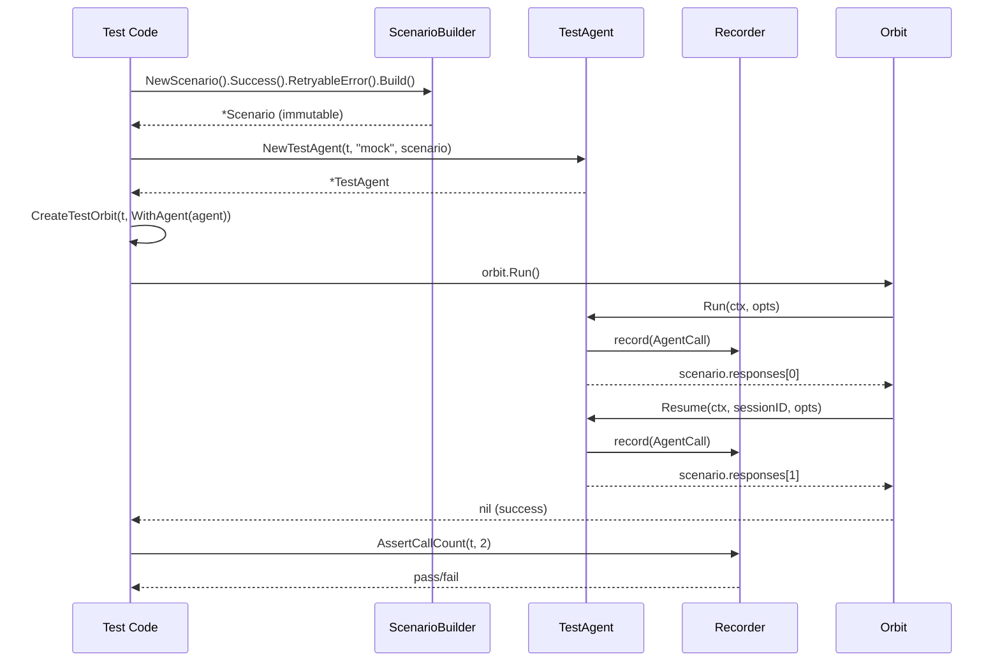

# Integration Test Framework Design

## Overview

This document describes the design for a test framework that enables integration testing of Orbit's orchestration layer without invoking real AI agents. The framework provides mock agents with configurable behaviors, call recording for verification, and helpers for testing complex multi-phase scenarios.

### Goals

1. Enable testing of orchestration logic without real agent CLIs
2. Provide readable, maintainable test setup via fluent API
3. Support deterministic timing tests via fake clock
4. Enable property-based testing for edge case discovery
5. Migrate existing tests to a consistent framework

### Package Location

`internal/testutil/`

---

## Architecture

```
┌─────────────────────────────────────────────────────────────────┐
│                         Test Code                                │
│  scenario := NewScenario().Success(...).RetryableError(...)     │
│  agent := NewTestAgent(t, "mock", scenario)                     │
│  orbit := CreateTestOrbit(t, WithAgent(agent))                  │
│  orbit.Run()                                                    │
│  agent.Recorder().AssertCallCount(t, 3)                         │
└─────────────────────────────────────────────────────────────────┘
                              │
                              ▼
┌─────────────────────────────────────────────────────────────────┐
│                       testutil Package                           │
│ ┌─────────────┐ ┌─────────────┐ ┌─────────────┐ ┌─────────────┐│
│ │ TestAgent   │ │ScenarioBuilder│ │  Recorder   │ │  FakeClock  ││
│ │implements   │ │ fluent API  │ │call tracking│ │time control ││
│ │agents.Agent │ │ for setup   │ │& assertions │ │             ││
│ └─────────────┘ └─────────────┘ └─────────────┘ └─────────────┘│
│ ┌─────────────────────────────┐ ┌─────────────────────────────┐│
│ │         Fixtures            │ │  Property-Based Generators  ││
│ │  CreateTestOrbit            │ │  rapid generators for       ││
│ │  CreateTasksFile            │ │  RunResult, CostMetrics     ││
│ └─────────────────────────────┘ └─────────────────────────────┘│
└─────────────────────────────────────────────────────────────────┘
                              │
                              ▼
┌─────────────────────────────────────────────────────────────────┐
│                    Orbit Orchestration                           │
│                  (production code under test)                    │
└─────────────────────────────────────────────────────────────────┘
```

### Component Interaction



---

## Components and Interfaces

### 1. TestAgent

Implements the full `agents.Agent` interface for testing.

```go
// TestAgent is a mock agent for integration testing.
// It returns pre-configured responses based on a scenario.
type TestAgent struct {
    t        testing.TB
    name     string
    scenario *Scenario
    recorder *Recorder
    clock    Clock
    config   TestAgentConfig

    mu         sync.Mutex
    callIndex  int
    exportPath string // for SessionExporter interface
}

// TestAgentConfig holds identity configuration.
type TestAgentConfig struct {
    Name        string
    CLICommand  string
    Installed   bool
    Version     string
    SessionDir  string
    ExportPath  string // if set, implements SessionExporter
}

// NewTestAgent creates a test agent with the given scenario.
func NewTestAgent(t testing.TB, name string, scenario *Scenario, opts ...TestAgentOption) *TestAgent

// Agent interface implementation
func (a *TestAgent) Name() string
func (a *TestAgent) CLICommand() string
func (a *TestAgent) IsInstalled() bool
func (a *TestAgent) Version() (string, error)
func (a *TestAgent) DefaultSessionDir() string
func (a *TestAgent) DiscoverSessions(ctx context.Context, projectDir string) ([]agents.SessionInfo, error)
func (a *TestAgent) Run(ctx context.Context, opts agents.RunOptions) (*agents.RunResult, error)
func (a *TestAgent) Resume(ctx context.Context, sessionID string, opts agents.RunOptions) (*agents.RunResult, error)

// Test utilities
func (a *TestAgent) Recorder() *Recorder
func (a *TestAgent) AssertAllConsumed(t testing.TB) // Verify all scenario responses were used
```

**Scenario Exhaustion Verification:**

```go
// AssertAllConsumed verifies that all scenario responses were consumed.
// Call this at the end of a test or via t.Cleanup() to ensure the expected
// number of calls were made.
func (a *TestAgent) AssertAllConsumed(t testing.TB) {
    t.Helper()
    a.mu.Lock()
    defer a.mu.Unlock()

    if a.callIndex < len(a.scenario.responses) {
        t.Fatalf("TestAgent %q: %d unconsumed scenario responses (consumed %d of %d)\n"+
            "Calls made:\n%s",
            a.name,
            len(a.scenario.responses)-a.callIndex,
            a.callIndex,
            len(a.scenario.responses),
            a.recorder.formatCalls())
    }
}

// Usage: typically via t.Cleanup()
func TestExample(t *testing.T) {
    agent := NewTestAgent(t, "mock", scenario)
    t.Cleanup(func() { agent.AssertAllConsumed(t) })
    // ... test code ...
}
```

**Thread Safety (Req 1.5):**
- `callIndex` protected by mutex
- `scenario.responses` is read-only after Build()
- `recorder` has its own synchronization

**Traceability:**
| Requirement | Implementation |
|-------------|----------------|
| 1.1 | Implements all 8 Agent methods |
| 1.2 | Run/Resume return responses from scenario |
| 1.3 | All calls recorded via Recorder |
| 1.4 | Configurable via TestAgentConfig |
| 1.5 | Mutex protects callIndex, pass `go test -race` |
| 1.6 | ExportPath option enables SessionExporter |
| 1.7 | Requires testing.TB parameter |

---

### 2. ScenarioBuilder

Fluent API for defining agent response sequences. This is the **only** mechanism for defining agent behavior - there are no separate "behavior functions" to avoid API confusion.

```go
// Scenario holds an immutable sequence of responses.
type Scenario struct {
    responses []CallResponse
}

// CallResponse defines what the agent returns for one call.
type CallResponse struct {
    Result     *agents.RunResult
    Delay      time.Duration
    ErrorClass agents.ErrorClass
    Output     string // Agent stdout
    Stderr     string // Agent stderr
    CustomFunc func(*AgentCall) *CallResponse // For dynamic behavior (rare)
}

// ScenarioBuilder constructs scenarios with a fluent API.
type ScenarioBuilder struct {
    responses []CallResponse
    current   *CallResponse // for chaining modifiers
}

// NewScenario creates a new scenario builder.
func NewScenario() *ScenarioBuilder

// Response methods (return *ScenarioBuilder for chaining)
func (b *ScenarioBuilder) Success(sessionID string, cost float64) *ScenarioBuilder
func (b *ScenarioBuilder) RetryableError(message string) *ScenarioBuilder
func (b *ScenarioBuilder) FatalError(message string) *ScenarioBuilder
func (b *ScenarioBuilder) SessionInvalid() *ScenarioBuilder
func (b *ScenarioBuilder) RateLimitWait(waitDuration time.Duration) *ScenarioBuilder

// Modifiers (apply to the last added response)
func (b *ScenarioBuilder) WithDelay(d time.Duration) *ScenarioBuilder
func (b *ScenarioBuilder) WithOutput(output, stderr string) *ScenarioBuilder
func (b *ScenarioBuilder) WithCost(metrics *agents.CostMetrics) *ScenarioBuilder
func (b *ScenarioBuilder) Repeat(n int) *ScenarioBuilder // Duplicate last response n times

// Escape hatch for dynamic behavior (use sparingly)
func (b *ScenarioBuilder) Custom(fn func(*AgentCall) *CallResponse) *ScenarioBuilder

// Build returns an immutable Scenario.
func (b *ScenarioBuilder) Build() *Scenario
```

**Example Usage:**

```go
// Basic sequence
scenario := NewScenario().
    RetryableError("connection timeout").
    RetryableError("connection timeout").
    Success("session-123", 0.05).
    Success("session-123", 0.03).WithDelay(100*time.Millisecond).
    Build()

// Using Repeat for multiple identical responses
scenario := NewScenario().
    Success("session-1", 0.05).Repeat(5).  // 5 identical successes
    Build()

// Using Custom for dynamic behavior (rare edge cases)
scenario := NewScenario().
    Custom(func(call *AgentCall) *CallResponse {
        // Return different response based on call properties
        if strings.Contains(call.Options.Prompt, "phase") {
            return &CallResponse{Result: successResult}
        }
        return &CallResponse{Result: errorResult}
    }).
    Build()
```

**Design Decision: ScenarioBuilder Only (No AgentBehavior)**

The design consolidates all response definition into ScenarioBuilder. This provides:
- **One mental model**: Developers don't choose between approaches
- **Explicit test intent**: Forces thinking about exact call sequences
- **Alignment with codebase**: Matches existing `MockGit` sequential pattern
- **Easier debugging**: Clear which call in sequence failed

The `Repeat(n)` modifier handles "multiple identical responses" use case.
The `Custom(fn)` escape hatch handles truly dynamic edge cases.

**Traceability:**
| Requirement | Implementation |
|-------------|----------------|
| 2.1 | ScenarioBuilder with method chaining |
| 2.2 | Success(sessionID, cost) |
| 2.3 | RetryableError(message) |
| 2.4 | FatalError(message) |
| 2.5 | SessionInvalid() |
| 2.6 | RateLimitWait(duration) |
| 2.7 | WithDelay(duration) |
| 2.8 | WithOutput(output, stderr) |
| 2.9 | WithCost(metrics) |
| 2.10 | responses accessed by index |
| 2.11 | t.Fatalf when index >= len(responses) |
| 2.12 | Build() returns immutable *Scenario |

---

### 3. Recorder

Captures and verifies agent calls.

```go
// AgentCall represents a recorded call to Run or Resume.
type AgentCall struct {
    Index       int               // 0-based call index
    Method      string            // "Run" or "Resume"
    Options     agents.RunOptions // Copy of options passed
    SessionID   string            // For Resume calls
    Timestamp   time.Time         // When call was made (uses clock if provided)
    HasDeadline bool              // Whether context had a deadline
    Deadline    time.Time         // Context deadline if present
}

// Recorder tracks all calls made to a TestAgent.
type Recorder struct {
    mu    sync.Mutex
    calls []AgentCall
}

// Recording (called by TestAgent)
func (r *Recorder) record(call AgentCall)

// Query methods (return copies for thread safety)
func (r *Recorder) CallCount() int
func (r *Recorder) Calls() []AgentCall
func (r *Recorder) CallsWithPrompt(pattern string) []AgentCall
func (r *Recorder) PhasePromptCalls() []AgentCall

// Assertion methods
func (r *Recorder) AssertCallCount(t testing.TB, expected int)
func (r *Recorder) AssertCallOrder(t testing.TB, patterns ...string)
```

**Note on Context:** The `AgentCall` struct does not store `context.Context` directly (storing contexts is an anti-pattern in Go). Instead, it extracts and stores specific values that tests might need to verify: `HasDeadline` and `Deadline`.

**Thread Safety (Req 3.9):**
- `record()` acquires mutex, appends to slice
- `Calls()` acquires mutex, returns a copy of the slice
- `CallCount()` acquires mutex, returns int

**Failure Messages (Req 3.10):**

```go
func (r *Recorder) AssertCallCount(t testing.TB, expected int) {
    t.Helper()
    actual := r.CallCount()
    if actual != expected {
        t.Fatalf("call count mismatch: got %d, want %d\nCalls:\n%s",
            actual, expected, r.formatCalls())
    }
}
```

**Traceability:**
| Requirement | Implementation |
|-------------|----------------|
| 3.1 | Recorder struct |
| 3.2 | AgentCall struct with all fields |
| 3.3 | CallCount() |
| 3.4 | Calls() returns copy |
| 3.5 | CallsWithPrompt(pattern) |
| 3.6 | PhasePromptCalls() |
| 3.7 | AssertCallOrder(t, ...patterns) |
| 3.8 | AssertCallCount(t, expected) |
| 3.9 | mutex + copy-on-read |
| 3.10 | Descriptive failure messages |

---

### 4. FakeClock

Provides controllable time for deterministic tests.

```go
// Clock interface for time operations.
type Clock interface {
    Now() time.Time
    Sleep(d time.Duration)
}

// RealClock uses actual time functions.
type RealClock struct{}

func (RealClock) Now() time.Time        { return time.Now() }
func (RealClock) Sleep(d time.Duration) { time.Sleep(d) }

// FakeClock provides controllable time for tests.
type FakeClock struct {
    mu      sync.Mutex
    current time.Time
    sleeps  []time.Duration
}

// NewFakeClock creates a fake clock starting at the given time.
func NewFakeClock(start time.Time) *FakeClock

func (c *FakeClock) Now() time.Time
func (c *FakeClock) Advance(d time.Duration)
func (c *FakeClock) Sleep(d time.Duration)        // records sleep, returns immediately
func (c *FakeClock) Sleeps() []time.Duration      // returns recorded sleeps
func (c *FakeClock) AssertSleeps(t testing.TB, expected []time.Duration)
```

**Scope Limitation (Req 6.7):**

The FakeClock provides time control for `Now()` and `Sleep()` only. Timer-based code (`time.After`, `time.NewTimer`, `time.NewTicker`) is not supported in MVP. This limitation is documented in the package doc.go.

**Traceability:**
| Requirement | Implementation |
|-------------|----------------|
| 6.1 | FakeClock implements Clock interface |
| 6.2 | Now() returns controlled time |
| 6.3 | Advance(d) moves time forward |
| 6.4 | Sleep(d) records and returns immediately |
| 6.5 | TestAgent accepts WithClock option |
| 6.6 | TestAgent uses clock.Sleep for delays |
| 6.7 | Documented in doc.go |

---

### 5. Test Fixtures

Helper functions for test setup.

```go
// CreateTasksFile creates a minimal tasks.md in a temp directory.
func CreateTasksFile(t testing.TB, phases int) string

// CreateConfig creates an .orbit.yaml with the specified options.
func CreateConfig(t testing.TB, opts ConfigOptions) string

// ConfigOptions for CreateConfig.
type ConfigOptions struct {
    Agent       string
    PrePrompt   string
    PostPrompt  string
    AutoApprove bool
    // ... other config fields
}

// CreateTestOrbit creates a configured Orbit instance for testing.
func CreateTestOrbit(t testing.TB, opts ...OrbitOption) *orbit.Orbit

// OrbitOption configures CreateTestOrbit.
type OrbitOption func(*orbitConfig)

func WithAgent(agent agents.Agent) OrbitOption
func WithAgents(agents map[string]agents.Agent) OrbitOption
func WithRuneClient(client RuneClient) OrbitOption
func WithClock(clock Clock) OrbitOption
func WithTasksFile(path string) OrbitOption
func WithPrePrompt(prompt string) OrbitOption
func WithPostPrompt(prompt string) OrbitOption

// CreateRuneClient creates a mock rune client for testing.
func CreateRuneClient(t testing.TB, tasksFile string) RuneClient

// SuccessScenario creates a scenario with N successful responses.
// Convenience helper for common case.
func SuccessScenario(t testing.TB, phases int) *Scenario
```

**Dependency Injection - Full Wiring Detail:**

Instead of modifying the global agent registry, agents are injected via `CreateTestOrbit` options. Here's the complete wiring:

```go
// TestAgentResolver implements AgentResolver for tests.
type TestAgentResolver struct {
    agents map[string]agents.Agent
}

func NewTestAgentResolver() *TestAgentResolver {
    return &TestAgentResolver{agents: make(map[string]agents.Agent)}
}

func (r *TestAgentResolver) Add(name string, agent agents.Agent) {
    r.agents[name] = agent
}

func (r *TestAgentResolver) GetAgent(name string, cfg agents.AgentConfig) (agents.Agent, error) {
    if agent, ok := r.agents[name]; ok {
        return agent, nil
    }
    return nil, fmt.Errorf("test agent %q not registered", name)
}

// CreateTestOrbit wires everything together
func CreateTestOrbit(t testing.TB, opts ...OrbitOption) *orbit.Orbit {
    t.Helper()

    cfg := &orbitConfig{
        resolver: NewTestAgentResolver(),
        clock:    RealClock{},
    }
    for _, opt := range opts {
        opt(cfg)
    }

    // Wire the agent(s) into the resolver
    if cfg.agent != nil {
        cfg.resolver.Add(cfg.agent.Name(), cfg.agent)
    }
    for name, agent := range cfg.agents {
        cfg.resolver.Add(name, agent)
    }

    // Create Orbit with test dependencies
    orbitCfg := orbit.Config{
        TasksFile:     cfg.tasksFile,
        AgentResolver: cfg.resolver,
        Clock:         cfg.clock,
        PrePrompt:     cfg.prePrompt,
        PostPrompt:    cfg.postPrompt,
        // ... other config
    }

    o, err := orbit.New(orbitCfg)
    if err != nil {
        t.Fatalf("CreateTestOrbit: %v", err)
    }
    return o
}

// Usage examples:

// Single agent test
agent := NewTestAgent(t, "claude-code", scenario)
orbit := CreateTestOrbit(t, WithAgent(agent))

// Multi-variant test with different agents
agents := map[string]agents.Agent{
    "claude-sonnet": NewTestAgent(t, "claude-sonnet", scenario1),
    "claude-opus":   NewTestAgent(t, "claude-opus", scenario2),
}
orbit := CreateTestOrbit(t, WithAgents(agents))
```

**Traceability:**
| Requirement | Implementation |
|-------------|----------------|
| 4.1 | CreateTasksFile(t, phases) |
| 4.2 | CreateConfig(t, options) |
| 4.3 | CreateTestOrbit(t, options...) |
| 4.4 | WithAgent(agent) |
| 4.5 | WithAgents(map[string]Agent) |
| 4.6 | WithRuneClient(client) |
| 4.7 | WithClock(clock) |
| 4.8 | Uses t.TempDir() |
| 4.9 | Uses t.Helper() |
| 4.10 | CreateRuneClient(t, tasksFile) |

---

### 6. Property-Based Testing Generators

Rapid generators for agent types.

```go
import "pgregory.net/rapid"

// RunResultGen generates valid RunResult values.
func RunResultGen() *rapid.Generator[*agents.RunResult] {
    return rapid.Custom(func(t *rapid.T) *agents.RunResult {
        isError := rapid.Bool().Draw(t, "isError")

        sessionID := ""
        exitCode := 0
        if !isError {
            sessionID = rapid.StringMatching(`[a-f0-9-]{36}`).Draw(t, "sessionID")
        } else {
            exitCode = rapid.IntRange(1, 255).Draw(t, "exitCode")
        }

        return &agents.RunResult{
            SessionID: sessionID,
            ExitCode:  exitCode,
            IsError:   isError,
            Duration:  time.Duration(rapid.Int64Range(0, int64(time.Hour)).Draw(t, "duration")),
            NumTurns:  rapid.IntRange(0, 100).Draw(t, "numTurns"),
            Cost:      CostMetricsGen().Draw(t, "cost"),
        }
    })
}

// CostMetricsGen generates valid CostMetrics values.
func CostMetricsGen() *rapid.Generator[*agents.CostMetrics] {
    return rapid.Custom(func(t *rapid.T) *agents.CostMetrics {
        return &agents.CostMetrics{
            InputTokens:  rapid.IntMin(0).Draw(t, "inputTokens"),
            OutputTokens: rapid.IntMin(0).Draw(t, "outputTokens"),
            CostUSD:      rapid.Float64Range(0, 100).Draw(t, "costUSD"),
        }
    })
}

// ErrorClassGen generates error classifications.
func ErrorClassGen() *rapid.Generator[agents.ErrorClass] {
    return rapid.SampledFrom([]agents.ErrorClass{
        agents.ErrorClassRetryable,
        agents.ErrorClassFatal,
        agents.ErrorClassSessionInvalid,
        agents.ErrorClassRateLimitWait,
    })
}

// RandomScenarioGen generates a valid scenario of given length.
func RandomScenarioGen(length int) *rapid.Generator[*Scenario] {
    return rapid.Custom(func(t *rapid.T) *Scenario {
        builder := NewScenario()
        for i := 0; i < length; i++ {
            // Generate mostly successes with occasional errors
            if rapid.Float64Range(0, 1).Draw(t, "successProb") > 0.3 {
                sessionID := rapid.StringMatching(`session-[a-z0-9]{8}`).Draw(t, "sessionID")
                cost := rapid.Float64Range(0, 1).Draw(t, "cost")
                builder.Success(sessionID, cost)
            } else {
                errClass := ErrorClassGen().Draw(t, "errClass")
                switch errClass {
                case agents.ErrorClassRetryable:
                    builder.RetryableError("random retryable error")
                case agents.ErrorClassFatal:
                    builder.FatalError("random fatal error")
                case agents.ErrorClassSessionInvalid:
                    builder.SessionInvalid()
                case agents.ErrorClassRateLimitWait:
                    builder.RateLimitWait(time.Duration(rapid.IntRange(1, 300).Draw(t, "wait")) * time.Second)
                }
            }
        }
        return builder.Build()
    })
}
```

**Invariants (Req 7.5):**

| Invariant | Generator Enforcement |
|-----------|----------------------|
| SessionID non-empty when !IsError | Conditional generation in RunResultGen |
| ExitCode 0 for success | Set to 0 when !isError |
| CostUSD non-negative | Float64Range(0, 100) |
| Error class matches exit code | ErrorClassGen produces valid values |

**Property Tests (Req 7.6):**

```go
func TestProperty_OrchestrationHandlesAnyErrorSequence(t *testing.T) {
    rapid.Check(t, func(rt *rapid.T) {
        length := rapid.IntRange(1, 10).Draw(rt, "length")
        scenario := RandomScenarioGen(length).Draw(rt, "scenario")

        agent := NewTestAgent(t, "mock", scenario)
        orbit := CreateTestOrbit(t, WithAgent(agent))

        // Should not panic regardless of error sequence
        _ = orbit.Run()
    })
}

func TestProperty_RetryCountBounded(t *testing.T) {
    rapid.Check(t, func(rt *rapid.T) {
        // Generate scenario with N retryable errors followed by success
        retryCount := rapid.IntRange(0, 10).Draw(rt, "retryCount")
        builder := NewScenario()
        for i := 0; i < retryCount; i++ {
            builder.RetryableError("transient error")
        }
        builder.Success("session-final", 0.05)
        scenario := builder.Build()

        agent := NewTestAgent(t, "mock", scenario)
        clock := NewFakeClock(time.Now())
        orbit := CreateTestOrbit(t, WithAgent(agent), WithClock(clock))

        err := orbit.Run()

        // maxRetries is 5 in orbit
        if retryCount <= 5 {
            // Should succeed (reached the success response)
            if err != nil {
                rt.Fatalf("expected success with %d retries, got error: %v", retryCount, err)
            }
        }
        // If retryCount > 5, should fail before reaching success
    })
}
```

**Traceability:**
| Requirement | Implementation |
|-------------|----------------|
| 7.1 | RunResultGen() |
| 7.2 | CostMetricsGen() |
| 7.3 | ErrorClassGen() |
| 7.4 | RandomScenarioGen(length) |
| 7.5 | Invariants enforced in generators |
| 7.6 | Two property tests provided |

---

## Data Models

### AgentCall

```go
type AgentCall struct {
    Index       int               // 0-based call index
    Method      string            // "Run" or "Resume"
    Options     agents.RunOptions // Copy of options passed
    SessionID   string            // For Resume calls
    Timestamp   time.Time         // When call was made
    HasDeadline bool              // Whether context had a deadline
    Deadline    time.Time         // Context deadline if HasDeadline is true
}
```

### CallResponse

```go
type CallResponse struct {
    Result     *agents.RunResult
    Delay      time.Duration
    ErrorClass agents.ErrorClass
    Output     string // Agent stdout (set on Result.Output)
    Stderr     string // Agent stderr (set on Result.Stderr)
    CustomFunc func(*AgentCall) *CallResponse // For Custom() escape hatch
}
```

### Scenario

```go
type Scenario struct {
    responses []CallResponse // Immutable after Build()
}
```

---

## Error Handling

### Unexpected Call Handling (Decision 6)

When more calls are made than responses defined:

```go
func (a *TestAgent) Run(ctx context.Context, opts agents.RunOptions) (*agents.RunResult, error) {
    a.mu.Lock()
    index := a.callIndex
    a.callIndex++
    a.mu.Unlock()

    // Extract context values (don't store the context itself)
    deadline, hasDeadline := ctx.Deadline()

    // Record the call
    call := AgentCall{
        Index:       index,
        Method:      "Run",
        Options:     opts,
        Timestamp:   a.clock.Now(),
        HasDeadline: hasDeadline,
        Deadline:    deadline,
    }
    a.recorder.record(call)

    // Check bounds
    if index >= len(a.scenario.responses) {
        a.t.Fatalf("TestAgent: unexpected call at index %d (scenario has %d responses)\n"+
            "  Prompt: %q\n"+
            "  Previous calls: %s",
            index, len(a.scenario.responses), opts.Prompt, a.recorder.formatCalls())
    }

    // Handle Custom() escape hatch
    resp := a.scenario.responses[index]
    if resp.CustomFunc != nil {
        resp = *resp.CustomFunc(&call)
    }

    // Apply delay
    if resp.Delay > 0 {
        a.clock.Sleep(resp.Delay)
    }

    // Apply output/stderr to result
    result := resp.Result
    if resp.Output != "" {
        result.Output = resp.Output
    }
    if resp.Stderr != "" {
        result.Stderr = resp.Stderr
    }

    return result, nil
}
```

### Assertion Failure Messages (Req 3.10)

```go
func (r *Recorder) AssertCallOrder(t testing.TB, patterns ...string) {
    t.Helper()
    calls := r.Calls()

    if len(calls) != len(patterns) {
        t.Fatalf("call count mismatch: got %d calls, want %d patterns\nCalls:\n%s",
            len(calls), len(patterns), r.formatCalls())
    }

    for i, pattern := range patterns {
        matched, err := regexp.MatchString(pattern, calls[i].Options.Prompt)
        if err != nil {
            t.Fatalf("invalid pattern %q at index %d: %v", pattern, i, err)
        }
        if !matched {
            t.Fatalf("call %d prompt mismatch:\n  got:  %q\n  want: pattern %q\nAll calls:\n%s",
                i, calls[i].Options.Prompt, pattern, r.formatCalls())
        }
    }
}
```

---

## Integration with Orbit

### Required Changes to Orbit

To support dependency injection and FakeClock, Orbit needs these changes:

```go
// internal/orbit/orbit.go

// Clock interface for time operations (used for sleep/backoff)
type Clock interface {
    Now() time.Time
    Sleep(d time.Duration)
}

// RealClock uses actual time functions.
type RealClock struct{}

func (RealClock) Now() time.Time        { return time.Now() }
func (RealClock) Sleep(d time.Duration) { time.Sleep(d) }

// AgentResolver looks up agents by name.
type AgentResolver interface {
    GetAgent(name string, cfg agents.AgentConfig) (agents.Agent, error)
}

// DefaultAgentResolver uses the global registry.
var DefaultAgentResolver AgentResolver = registryResolver{}

type registryResolver struct{}

func (r registryResolver) GetAgent(name string, cfg agents.AgentConfig) (agents.Agent, error) {
    return agents.Get(name, cfg)
}

// Config additions
type Config struct {
    // ... existing fields ...
    AgentResolver AgentResolver // Optional, defaults to DefaultAgentResolver
    Clock         Clock         // Optional, defaults to RealClock{}
}

// In New():
func New(config Config) (*Orbit, error) {
    // Set defaults
    if config.AgentResolver == nil {
        config.AgentResolver = DefaultAgentResolver
    }
    if config.Clock == nil {
        config.Clock = RealClock{}
    }
    // ... rest of initialization
}

// In retry logic (e.g., runPhaseWithRetry):
// Replace:
//   time.Sleep(backoff)
// With:
//   o.config.Clock.Sleep(backoff)
```

This change is backward-compatible - existing code continues to use real time and the global registry by default.

---

## Testing Strategy

### Unit Tests for Framework (Req 11)

```go
// scenario_test.go
func TestScenarioBuilder_Immutability(t *testing.T)
func TestScenarioBuilder_Chaining(t *testing.T)
func TestScenarioBuilder_AllMethods(t *testing.T)
func TestScenarioBuilder_Repeat(t *testing.T)
func TestScenarioBuilder_Custom(t *testing.T)

// recorder_test.go
func TestRecorder_ConcurrentAccess(t *testing.T)
func TestRecorder_CallsReturnsCopy(t *testing.T)
func TestRecorder_AssertCallCount(t *testing.T)
func TestRecorder_AssertCallOrder(t *testing.T)

// clock_test.go
func TestFakeClock_Advance(t *testing.T)
func TestFakeClock_Sleep(t *testing.T)
func TestFakeClock_Concurrent(t *testing.T)
func TestFakeClock_AssertSleeps(t *testing.T)

// agent_test.go
func TestTestAgent_AssertAllConsumed(t *testing.T)
func TestTestAgent_UnexpectedCall(t *testing.T)
```

### Concurrency Tests

```go
func TestRecorder_ConcurrentAccess(t *testing.T) {
    r := &Recorder{}

    var wg sync.WaitGroup
    for i := 0; i < 100; i++ {
        wg.Add(1)
        go func(idx int) {
            defer wg.Done()
            r.record(AgentCall{Index: idx})
            _ = r.Calls()
            _ = r.CallCount()
        }(i)
    }
    wg.Wait()

    if r.CallCount() != 100 {
        t.Fatalf("expected 100 calls, got %d", r.CallCount())
    }
}
```

### Property-Based Tests

As specified in requirements 7.6:
- `TestProperty_OrchestrationHandlesAnyErrorSequence`
- `TestProperty_RetryCountBounded`

---

## File Organization

```
internal/testutil/
├── doc.go              # Package documentation with examples
├── agent.go            # TestAgent, TestAgentConfig, TestAgentOption
├── agent_test.go       # TestAgent unit tests
├── scenario.go         # Scenario, ScenarioBuilder, CallResponse
├── scenario_test.go    # ScenarioBuilder unit tests
├── recorder.go         # Recorder, AgentCall
├── recorder_test.go    # Recorder unit tests (including concurrency)
├── clock.go            # Clock interface, FakeClock, RealClock
├── clock_test.go       # FakeClock unit tests
├── fixtures.go         # CreateTasksFile, CreateConfig, CreateTestOrbit, TestAgentResolver
├── fixtures_test.go    # Fixture unit tests
├── generators.go       # Rapid generators for property-based testing
└── generators_test.go  # Generator invariant tests
```

---

## Documentation (Req 8)

### doc.go Example

```go
// Package testutil provides testing utilities for Orbit integration tests.
//
// The primary components are:
//
//   - TestAgent: A mock agent implementing agents.Agent
//   - ScenarioBuilder: Fluent API for defining agent behavior sequences
//   - Recorder: Call recording and assertions
//   - FakeClock: Deterministic time control
//
// Basic Usage:
//
//	func TestOrchestration(t *testing.T) {
//	    // Define the expected agent behavior sequence
//	    scenario := testutil.NewScenario().
//	        Success("session-1", 0.05).
//	        Success("session-2", 0.03).
//	        Build()
//
//	    // Create a test agent
//	    agent := testutil.NewTestAgent(t, "mock-agent", scenario)
//	    t.Cleanup(func() { agent.AssertAllConsumed(t) })
//
//	    // Create an Orbit instance with the test agent
//	    orbit := testutil.CreateTestOrbit(t,
//	        testutil.WithAgent(agent),
//	        testutil.WithTasksFile(testutil.CreateTasksFile(t, 2)),
//	    )
//
//	    // Run and verify
//	    err := orbit.Run()
//	    require.NoError(t, err)
//
//	    agent.Recorder().AssertCallCount(t, 2)
//	}
//
// Error Injection:
//
//	scenario := testutil.NewScenario().
//	    RetryableError("connection timeout").  // Phase 1, attempt 1
//	    RetryableError("connection timeout").  // Phase 1, attempt 2
//	    Success("session-1", 0.05).            // Phase 1, attempt 3
//	    Build()
//
// Using Repeat for Multiple Identical Responses:
//
//	scenario := testutil.NewScenario().
//	    Success("session-1", 0.05).Repeat(5).  // 5 identical successes
//	    Build()
//
// Timing Tests with FakeClock:
//
//	clock := testutil.NewFakeClock(time.Now())
//	orbit := testutil.CreateTestOrbit(t,
//	    testutil.WithAgent(agent),
//	    testutil.WithClock(clock),
//	)
//	// After test, verify sleep durations
//	clock.AssertSleeps(t, []time.Duration{time.Second, 2*time.Second})
//
// Limitations:
//
// FakeClock only supports Now() and Sleep(). Timer-based code (time.After,
// time.NewTimer, time.NewTicker) is not supported and will use real time.
package testutil
```

### CLAUDE.md Section

```markdown
## Testing

Orbit uses a custom test framework in `internal/testutil/` for integration testing.
The framework provides mock agents that simulate real agent behavior without invoking CLIs.

### Quick Start

```go
func TestMyFeature(t *testing.T) {
    // 1. Define expected agent behavior
    scenario := testutil.NewScenario().
        Success("session-1", 0.05).
        Success("session-2", 0.03).
        Build()

    // 2. Create test agent and orbit
    agent := testutil.NewTestAgent(t, "mock", scenario)
    t.Cleanup(func() { agent.AssertAllConsumed(t) })
    orbit := testutil.CreateTestOrbit(t, testutil.WithAgent(agent))

    // 3. Run and verify
    err := orbit.Run()
    require.NoError(t, err)
    agent.Recorder().AssertCallCount(t, 2)
}
```

### Common Patterns

**Testing Error Recovery:**
```go
scenario := testutil.NewScenario().
    RetryableError("timeout").
    RetryableError("timeout").
    Success("session-1", 0.05).
    Build()
```

**Multiple Identical Responses:**
```go
scenario := testutil.NewScenario().
    Success("session-1", 0.05).Repeat(5).
    Build()
```

**Testing with Timing:**
```go
clock := testutil.NewFakeClock(time.Now())
orbit := testutil.CreateTestOrbit(t,
    testutil.WithAgent(agent),
    testutil.WithClock(clock),
)
```

See `internal/testutil/doc.go` for complete API documentation.
```

---

## Migration Strategy (Req 9)

### Step 1: Add Clock to Orbit

Modify `internal/orbit/orbit.go` to accept and use `Clock` interface.

### Step 2: Create testutil package (no changes to existing tests)

### Step 3: Migrate tests incrementally by file section

For each test using `mockAgent`:
1. Replace `mockAgent` with `NewTestAgent(t, name, scenario)`
2. Replace manual response setup with `ScenarioBuilder`
3. Add `t.Cleanup(func() { agent.AssertAllConsumed(t) })`
4. Add assertions using `Recorder`

### Step 4: Remove old mocks after all tests migrated

### Step 5: Verify coverage hasn't decreased

```bash
# Before migration
go test -coverprofile=before.out ./internal/orbit/...
go tool cover -func=before.out > before.txt

# After migration
go test -coverprofile=after.out ./internal/orbit/...
go tool cover -func=after.out > after.txt

# Compare
diff before.txt after.txt
```

---

## Requirements Traceability Matrix

| Requirement | Design Component | Test |
|-------------|-----------------|------|
| 1.1-1.7 | TestAgent | agent_test.go |
| 2.1-2.12 | ScenarioBuilder | scenario_test.go |
| 3.1-3.10 | Recorder | recorder_test.go |
| 4.1-4.10 | Fixtures | fixtures_test.go |
| 5.1-5.6 | DI via CreateTestOrbit | fixtures_test.go |
| 6.1-6.7 | FakeClock | clock_test.go |
| 7.1-7.6 | Generators | generators_test.go |
| 8.1-8.5 | doc.go, CLAUDE.md | - |
| 9.1-9.6 | Migration | Integration tests |
| 10.1-10.6 | Framework enables | Existing tests |
| 11.1-11.4 | Package tests | *_test.go files |
