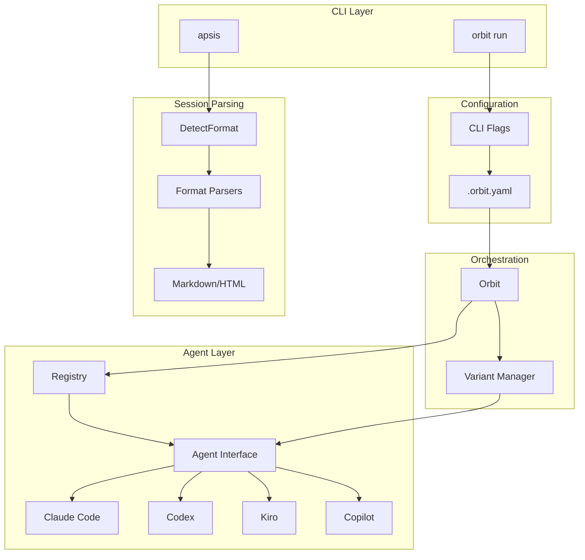
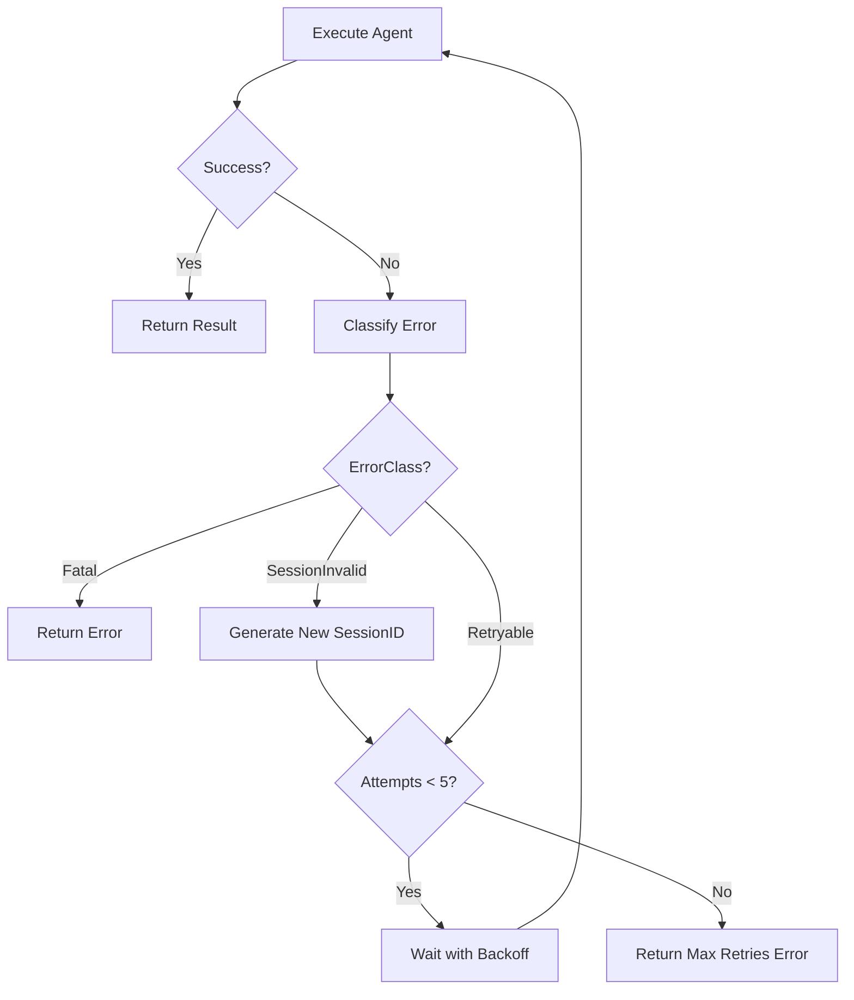

# Multi-Agent Support - Design Document

## Overview

This document describes the technical design for adding multi-agent support to Orbit. The implementation introduces an agent abstraction layer that enables orchestration and session viewing across multiple AI coding agents (Claude Code, OpenAI Codex, AWS Kiro, GitHub Copilot) while preserving existing functionality.

### Design Principles

1. **Interface-First**: Define a clean `Agent` interface that all implementations satisfy
2. **Content-Based Detection**: Extend existing format detection pattern for session parsing
3. **Backward Compatible Behavior**: Existing orchestration workflows remain unchanged (default to Claude Code)
4. **Minimal Dependencies**: No new Go dependencies; reuse existing patterns

### Requirements Traceability

| Requirement Section | Design Component |
|---------------------|------------------|
| 1. Agent Abstraction | Agent interface, Registry |
| 2. Claude Code Agent | `agents/claudecode/` package |
| 3. Codex Agent | `agents/codex/` package |
| 4. Kiro Agent | `agents/kiro/` package |
| 5. Copilot Agent | `agents/copilot/` package |
| 6. Agent Selection | Config, CLI flags |
| 7. Session Discovery | Agent.DiscoverSessions(), DetectFormat() |
| 8. Error Handling | ErrorClass, agent-specific classifiers |
| 9. Configuration | Config.Agents map |
| 10. Per-Variant Selection | Variant.Agent field |

---

## Architecture

### Package Structure

```
internal/
├── agents/                      # NEW - Agent abstraction layer
│   ├── agent.go                 # Agent interface definition [Req 1.1-1.5]
│   ├── registry.go              # Agent lookup and registration [Req 1.6]
│   ├── errors.go                # ErrorClass and classification [Req 8.1-8.2]
│   ├── claudecode/              # Claude Code implementation [Req 2.1-2.7]
│   │   ├── agent.go             # Agent interface implementation
│   │   ├── client.go            # CLI execution (refactored from internal/claude/)
│   │   └── errors.go            # Error pattern matching
│   ├── codex/                   # OpenAI Codex implementation [Req 3.1-3.6]
│   │   ├── agent.go
│   │   ├── client.go
│   │   └── errors.go
│   ├── kiro/                    # AWS Kiro implementation [Req 4.1-4.6]
│   │   ├── agent.go
│   │   ├── client.go
│   │   └── errors.go
│   └── copilot/                 # GitHub Copilot implementation [Req 5.1-5.6]
│       ├── agent.go
│       ├── client.go
│       └── errors.go
├── claude/                      # DEPRECATED - refactor into agents/claudecode/
├── transcript/                  # EXISTING - extend for new formats
│   ├── parser.go                # Extend DetectFormat() [Req 7.1-7.3]
│   ├── kiro_parser.go           # NEW - Kiro JSON parser
│   ├── kiro_types.go            # NEW - Kiro type definitions
│   └── copilot_parser.go        # NEW - Copilot parser (placeholder)
├── variants/                    # EXISTING - add Agent field
│   └── types.go                 # Add Agent field to Variant [Req 10.5]
├── config/                      # EXISTING - extend for agents
│   └── config.go                # Add agents section [Req 9.1-9.7]
└── orbit/                       # EXISTING - use agent interface
    └── orbit.go                 # Replace claude.Client with Agent [Req 2.3]
```

### Component Interaction



---

## Components and Interfaces

### Agent Interface

**File:** `internal/agents/agent.go`

```go
package agents

import (
    "context"
    "io"
    "time"
)

// Agent defines the interface for AI coding agent implementations.
// All supported agents (Claude Code, Codex, Kiro, Copilot) implement this interface.
type Agent interface {
    // Identity methods [Req 1.2]
    Name() string        // e.g., "claude-code", "codex", "kiro", "copilot"
    CLICommand() string  // Command to execute (may be path or name, resolved via exec.LookPath)

    // Capability detection [Req 1.3]
    IsInstalled() bool
    Version() (string, error)

    // Session management [Req 1.5]
    // Note: Session parsing is handled by internal/transcript package, not agents.
    // Format detection uses content-based approach (see DetectFormat).
    DefaultSessionDir() string
    DiscoverSessions(ctx context.Context, projectDir string) ([]SessionInfo, error)

    // Execution [Req 1.4, 1.8]
    Run(ctx context.Context, opts RunOptions) (*RunResult, error)
    Resume(ctx context.Context, sessionID string, opts RunOptions) (*RunResult, error)
}

// SessionExporter is an optional interface for agents that require explicit session export.
// Kiro implements this interface because it doesn't store sessions automatically.
type SessionExporter interface {
    ExportSession(ctx context.Context, filename string) error
}

// SessionInfo contains metadata about a discovered session.
type SessionInfo struct {
    ID        string
    Agent     string
    Path      string
    CreatedAt time.Time
    Size      int64
    Project   string
}

// RunOptions configures an execution.
type RunOptions struct {
    Prompt      string
    WorkDir     string
    SessionID   string            // Pre-generated UUID for tracking
    AutoApprove bool
    Timeout     time.Duration     // 0 = no timeout [Req 9.6, 9.7]
    Env         map[string]string
    ExtraArgs   []string          // Agent-specific CLI arguments [Req 9.4]
}

// RunResult contains the outcome of an execution.
type RunResult struct {
    SessionID  string
    ExitCode   int
    Duration   time.Duration
    Cost       *CostMetrics
    LogPath    string
    Output     string
    Stderr     string
    RawJSON    []byte
    Error      error
    ErrorClass ErrorClass
}

// CostMetrics tracks usage costs in agent-specific units.
type CostMetrics struct {
    // Token-based (Claude, Codex)
    InputTokens  int
    OutputTokens int
    TotalTokens  int

    // Credit-based (Kiro, Copilot) - if applicable
    Credits         float64
    PremiumRequests int

    // Universal
    CostUSD float64
}

// Note: Parsing uses transcript.ParseResult directly - no agents.ParseResult type.
// This avoids type collision and keeps parsing logic in the transcript package.
```

### Error Classification

**File:** `internal/agents/errors.go`

The error system uses two complementary types:
- **ErrorType** (existing in `internal/errors/`): Specific error categories (Connection, RateLimit, Overloaded)
- **ErrorClass** (new): Orchestrator-level classification for retry decisions

This separation allows agents to provide detailed error information while giving the orchestrator a simple classification for retry logic.

```go
package agents

import "time"

// ErrorClass categorizes errors for orchestrator retry logic [Req 8.2]
// This is distinct from internal/errors.ErrorType which provides specific categories.
type ErrorClass int

const (
    ErrorClassUnknown       ErrorClass = iota
    ErrorClassRetryable                // Rate limits, transient network issues [Req 8.4]
    ErrorClassFatal                    // Auth failures, invalid config [Req 8.5]
    ErrorClassSessionInvalid           // Session expired or not found [Req 8.6]
)

// String returns a human-readable name for the error class.
func (ec ErrorClass) String() string {
    switch ec {
    case ErrorClassRetryable:
        return "retryable"
    case ErrorClassFatal:
        return "fatal"
    case ErrorClassSessionInvalid:
        return "session-invalid"
    default:
        return "unknown"
    }
}

// IsRetryable returns true if the error class indicates the operation can be retried.
func (ec ErrorClass) IsRetryable() bool {
    return ec == ErrorClassRetryable
}

// ClassifiedError wraps an error with classification metadata.
type ClassifiedError struct {
    Original   error
    Class      ErrorClass
    RetryAfter time.Duration
    Message    string
    Agent      string
}

func (e *ClassifiedError) Error() string {
    return e.Message
}

func (e *ClassifiedError) Unwrap() error {
    return e.Original
}

// ErrorClassifier is implemented by each agent to classify errors.
type ErrorClassifier interface {
    Classify(exitCode int, stderr, stdout string, errMsgs []string) *ClassifiedError
}
```

### Registry

**File:** `internal/agents/registry.go`

```go
package agents

import (
    "fmt"
    "sort"
    "sync"
)

var (
    registry = make(map[string]func(AgentConfig) Agent)
    mu       sync.RWMutex
)

// AgentConfig holds per-agent configuration from .orbit.yaml [Req 9.1-9.5]
type AgentConfig struct {
    CLIPath     string            // Override CLI command path [Req 9.2]
    AutoApprove bool              // Tool approval behavior [Req 9.3]
    ExtraArgs   []string          // Additional CLI arguments [Req 9.4]
    Timeout     time.Duration     // Execution timeout [Req 9.6]
    Options     map[string]string // Agent-specific options [Req 9.5]
}

// Register adds an agent factory to the registry.
func Register(name string, factory func(AgentConfig) Agent) {
    mu.Lock()
    defer mu.Unlock()
    registry[name] = factory
}

// Get returns an agent by name with configuration. [Req 1.6]
func Get(name string, cfg AgentConfig) (Agent, error) {
    mu.RLock()
    factory, ok := registry[name]
    mu.RUnlock()

    if !ok {
        return nil, fmt.Errorf("unknown agent: %s (available: %v)", name, List())
    }
    return factory(cfg), nil
}

// List returns all registered agent names. [Req 1.6]
func List() []string {
    mu.RLock()
    defer mu.RUnlock()

    names := make([]string, 0, len(registry))
    for name := range registry {
        names = append(names, name)
    }
    sort.Strings(names)
    return names
}

// Default returns the default agent name. [Req 6.4]
func Default() string {
    return "claude-code"
}
```

### Claude Code Agent Implementation

**File:** `internal/agents/claudecode/agent.go`

```go
package claudecode

import (
    "context"
    "os/exec"
    "path/filepath"

    "github.com/arjenschwarz/orbit/internal/agents"
)

func init() {
    agents.Register("claude-code", New)
}

// Agent implements the agents.Agent interface for Claude Code.
type Agent struct {
    config agents.AgentConfig
    client *Client // Refactored from internal/claude/client.go
}

// New creates a new Claude Code agent.
func New(cfg agents.AgentConfig) agents.Agent {
    cliPath := cfg.CLIPath
    if cliPath == "" {
        cliPath = "claude"
    }
    return &Agent{
        config: cfg,
        client: NewClient(ClientConfig{
            CLIPath:         cliPath,
            SkipPermissions: cfg.AutoApprove,
        }),
    }
}

func (a *Agent) Name() string        { return "claude-code" }
func (a *Agent) CLICommand() string  { return a.config.CLIPath }

func (a *Agent) IsInstalled() bool {
    cliPath := a.config.CLIPath
    if cliPath == "" {
        cliPath = "claude"
    }
    _, err := exec.LookPath(cliPath)
    return err == nil
}

func (a *Agent) Version() (string, error) {
    // Run: claude --version
    // Parse output
    return "", nil // Implementation detail
}

func (a *Agent) DefaultSessionDir() string {
    home, _ := os.UserHomeDir()
    return filepath.Join(home, ".claude", "projects")
}

// Run executes a prompt in a new session. [Req 2.5]
func (a *Agent) Run(ctx context.Context, opts agents.RunOptions) (*agents.RunResult, error) {
    // Build args: claude -p <prompt> --session-id <id> --output-format json
    // If AutoApprove: add --dangerously-skip-permissions [Req 2.7]
    return a.client.Execute(ctx, opts, false)
}

// Resume continues an existing session. [Req 2.6]
func (a *Agent) Resume(ctx context.Context, sessionID string, opts agents.RunOptions) (*agents.RunResult, error) {
    // Build args: claude -p <prompt> --resume <id>
    opts.SessionID = sessionID
    return a.client.Execute(ctx, opts, true)
}
```

### Codex Agent Implementation

**File:** `internal/agents/codex/agent.go`

```go
package codex

import (
    "context"
    "os/exec"
    "path/filepath"

    "github.com/arjenschwarz/orbit/internal/agents"
)

func init() {
    agents.Register("codex", New)
}

type Agent struct {
    config agents.AgentConfig
}

func New(cfg agents.AgentConfig) agents.Agent {
    return &Agent{config: cfg}
}

func (a *Agent) Name() string       { return "codex" }
func (a *Agent) CLICommand() string {
    if a.config.CLIPath != "" {
        return a.config.CLIPath
    }
    return "codex"
}

func (a *Agent) IsInstalled() bool {
    _, err := exec.LookPath(a.CLICommand())
    return err == nil
}

func (a *Agent) DefaultSessionDir() string {
    home, _ := os.UserHomeDir()
    return filepath.Join(home, ".codex", "sessions")
}

// Run executes: codex exec "<prompt>" [Req 3.2]
// If AutoApprove: add --full-auto [Req 3.3]
func (a *Agent) Run(ctx context.Context, opts agents.RunOptions) (*agents.RunResult, error) {
    args := []string{"exec"}
    if a.config.AutoApprove {
        args = append(args, "--full-auto")
    }
    args = append(args, opts.Prompt)
    args = append(args, a.config.ExtraArgs...)

    return a.execute(ctx, args, opts)
}

// Resume executes: codex exec resume <session-id> [Req 3.4]
func (a *Agent) Resume(ctx context.Context, sessionID string, opts agents.RunOptions) (*agents.RunResult, error) {
    args := []string{"exec", "resume", sessionID}
    return a.execute(ctx, args, opts)
}
```

### Kiro Agent Implementation

**File:** `internal/agents/kiro/agent.go`

```go
package kiro

import (
    "context"
    "os/exec"
    "path/filepath"

    "github.com/arjenschwarz/orbit/internal/agents"
)

func init() {
    agents.Register("kiro", New)
}

type Agent struct {
    config agents.AgentConfig
}

// Compile-time interface checks
var _ agents.Agent = (*Agent)(nil)
var _ agents.SessionExporter = (*Agent)(nil)

func New(cfg agents.AgentConfig) agents.Agent {
    return &Agent{config: cfg}
}

func (a *Agent) Name() string       { return "kiro" }
func (a *Agent) CLICommand() string {
    if a.config.CLIPath != "" {
        return a.config.CLIPath
    }
    return "kiro-cli"
}

func (a *Agent) DefaultSessionDir() string {
    // Kiro doesn't have automatic session storage [Decision 7]
    return ""
}

// Run executes: kiro-cli chat --no-interactive "<prompt>" [Req 4.2]
// If AutoApprove: add --trust-all-tools [Req 4.3]
func (a *Agent) Run(ctx context.Context, opts agents.RunOptions) (*agents.RunResult, error) {
    args := []string{"chat", "--no-interactive"}
    if a.config.AutoApprove {
        args = append(args, "--trust-all-tools")
    }
    args = append(args, opts.Prompt)
    args = append(args, a.config.ExtraArgs...)

    return a.execute(ctx, args, opts)
}

// Resume executes: kiro-cli chat --resume [Req 4.4]
func (a *Agent) Resume(ctx context.Context, sessionID string, opts agents.RunOptions) (*agents.RunResult, error) {
    args := []string{"chat", "--resume"}
    return a.execute(ctx, args, opts)
}

// ExportSession implements agents.SessionExporter [Req 4.5]
// This runs a follow-up command to save the session since Kiro doesn't store logs automatically.
// Called by the orchestrator after each phase completes.
func (a *Agent) ExportSession(ctx context.Context, filename string) error {
    args := []string{"chat", "--no-interactive", "/chat save " + filename, "--resume"}
    _, err := a.execute(ctx, args, agents.RunOptions{})
    return err
}
```

### Copilot Agent Implementation

**File:** `internal/agents/copilot/agent.go`

```go
package copilot

import (
    "context"
    "os/exec"
    "path/filepath"

    "github.com/arjenschwarz/orbit/internal/agents"
)

func init() {
    agents.Register("copilot", New)
}

type Agent struct {
    config agents.AgentConfig
}

func New(cfg agents.AgentConfig) agents.Agent {
    return &Agent{config: cfg}
}

func (a *Agent) Name() string       { return "copilot" }
func (a *Agent) CLICommand() string {
    if a.config.CLIPath != "" {
        return a.config.CLIPath
    }
    return "copilot"
}

func (a *Agent) DefaultSessionDir() string {
    home, _ := os.UserHomeDir()
    return filepath.Join(home, ".copilot", "session-state")
}

// Run executes: copilot -p "<prompt>" [Req 5.2]
// If AutoApprove: add --allow-all-paths and per-tool flags [Req 5.3]
func (a *Agent) Run(ctx context.Context, opts agents.RunOptions) (*agents.RunResult, error) {
    args := []string{"-p", opts.Prompt}
    if a.config.AutoApprove {
        args = append(args, "--allow-all-paths")
        // Add per-tool approval flags as needed
    }
    args = append(args, a.config.ExtraArgs...)

    return a.execute(ctx, args, opts)
}

// Resume executes: copilot --continue [Req 5.4]
// LIMITATION: Copilot CLI only supports resuming the most recent session.
// The sessionID parameter is accepted for interface compatibility but ignored.
// Orchestrator should be aware that Copilot cannot resume arbitrary sessions by ID.
func (a *Agent) Resume(ctx context.Context, sessionID string, opts agents.RunOptions) (*agents.RunResult, error) {
    // Note: sessionID is ignored - Copilot only supports "most recent" resume
    args := []string{"--continue"}
    return a.execute(ctx, args, opts)
}
```

---

## Data Models

### Configuration Extension

**File:** `internal/config/config.go` (additions)

```go
// AgentConfig holds per-agent settings [Req 9.1-9.7]
type AgentConfig struct {
    CLIPath     string        `yaml:"cli-path"`     // [Req 9.2]
    AutoApprove bool          `yaml:"auto-approve"` // [Req 9.3]
    ExtraArgs   []string      `yaml:"extra-args"`   // [Req 9.4]
    Timeout     string        `yaml:"timeout"`      // [Req 9.6] - parsed to time.Duration
    Model       string        `yaml:"model"`        // [Req 9.5] - agent-specific
}

// Config extended with agent support
type Config struct {
    // ... existing fields ...

    // Agent selection [Req 6.1-6.4]
    Agent string `yaml:"agent"` // Default agent for project

    // Per-agent configuration [Req 9.1]
    Agents map[string]AgentConfig `yaml:"agents"`

    // Variant agent selection [Req 10.1]
    VariantAgents []string `yaml:"-"` // From --variant-agents flag
}

// GetAgentConfig returns configuration for a specific agent.
// Falls back to defaults if not configured.
func (c *Config) GetAgentConfig(name string) agents.AgentConfig {
    cfg := agents.AgentConfig{}

    if ac, ok := c.Agents[name]; ok {
        cfg.CLIPath = ac.CLIPath
        cfg.AutoApprove = ac.AutoApprove
        cfg.ExtraArgs = ac.ExtraArgs
        if ac.Timeout != "" {
            if d, err := time.ParseDuration(ac.Timeout); err == nil {
                cfg.Timeout = d
            }
        }
        cfg.Options = map[string]string{"model": ac.Model}
    }

    return cfg
}
```

### Variant Extension

**File:** `internal/variants/types.go` (additions)

```go
// Variant with agent tracking [Req 10.5]
type Variant struct {
    // ... existing fields ...

    Agent string `json:"agent,omitempty"` // Agent used for this variant
}
```

### Kiro Session Format

**File:** `internal/transcript/kiro_types.go`

Based on the sample file analysis:

```go
package transcript

// KiroSession represents the root structure of a Kiro export file.
type KiroSession struct {
    ConversationID string            `json:"conversation_id"`
    NextMessage    interface{}       `json:"next_message"`
    History        []KiroHistoryItem `json:"history"`
}

// KiroHistoryItem represents a single turn in the conversation.
type KiroHistoryItem struct {
    User            KiroUserMessage     `json:"user"`
    Assistant       KiroAssistant       `json:"assistant"`
    RequestMetadata KiroRequestMetadata `json:"request_metadata"`
}

// KiroUserMessage represents user input or tool results.
type KiroUserMessage struct {
    AdditionalContext string         `json:"additional_context"`
    EnvContext        KiroEnvContext `json:"env_context"`
    Content           KiroContent    `json:"content"`
    Timestamp         *string        `json:"timestamp"` // nullable
    Images            interface{}    `json:"images"`
}

// KiroContent is a sum type for user content.
type KiroContent struct {
    Prompt         *KiroPrompt         `json:"Prompt,omitempty"`
    ToolUseResults *KiroToolUseResults `json:"ToolUseResults,omitempty"`
}

// KiroPrompt is a user prompt.
type KiroPrompt struct {
    Prompt string `json:"prompt"`
}

// KiroToolUseResults contains results from tool executions.
type KiroToolUseResults struct {
    ToolUseResults []KiroToolResult `json:"tool_use_results"`
}

// KiroToolResult is a single tool execution result.
type KiroToolResult struct {
    ToolUseID string             `json:"tool_use_id"`
    Content   []KiroContentItem  `json:"content"`
    Status    string             `json:"status"`
}

// KiroContentItem can be Text or other types.
type KiroContentItem struct {
    Text string `json:"Text,omitempty"`
}

// KiroAssistant represents assistant response.
type KiroAssistant struct {
    ToolUse *KiroToolUse `json:"ToolUse,omitempty"`
}

// KiroToolUse is an assistant response with tool calls.
type KiroToolUse struct {
    MessageID string     `json:"message_id"`
    Content   string     `json:"content"`
    ToolUses  []KiroTool `json:"tool_uses"`
}

// KiroTool is a tool invocation.
type KiroTool struct {
    ID       string                 `json:"id"`
    Name     string                 `json:"name"`
    OrigName string                 `json:"orig_name"`
    Args     map[string]interface{} `json:"args"`
    OrigArgs map[string]interface{} `json:"orig_args"`
}

// KiroEnvContext contains environment information.
type KiroEnvContext struct {
    EnvState KiroEnvState `json:"env_state"`
}

// KiroEnvState contains OS and directory info.
type KiroEnvState struct {
    OperatingSystem         string   `json:"operating_system"`
    CurrentWorkingDirectory string   `json:"current_working_directory"`
    EnvironmentVariables    []string `json:"environment_variables"`
}

// KiroRequestMetadata contains timing and usage info.
type KiroRequestMetadata struct {
    RequestID             string      `json:"request_id"`
    MessageID             string      `json:"message_id"`
    ModelID               string      `json:"model_id"`
    ChatConversationType  string      `json:"chat_conversation_type"`
    UserPromptLength      int         `json:"user_prompt_length"`
    ResponseSize          int         `json:"response_size"`
}
```

### Copilot Session Format

**File:** `internal/transcript/copilot_types.go`

Based on sample file analysis (`events.jsonl`):

```go
package transcript

// CopilotEntry represents a single JSONL line from Copilot session log.
type CopilotEntry struct {
    Type      string          `json:"type"`
    ID        string          `json:"id"`
    Timestamp string          `json:"timestamp"`
    ParentID  *string         `json:"parentId"`
    Data      json.RawMessage `json:"data"`
}

// CopilotSessionStart is the session.start event data.
type CopilotSessionStart struct {
    SessionID      string `json:"sessionId"`
    Version        int    `json:"version"`
    Producer       string `json:"producer"`
    CopilotVersion string `json:"copilotVersion"`
    StartTime      string `json:"startTime"`
}

// CopilotSessionInfo is the session.info event data.
type CopilotSessionInfo struct {
    InfoType string `json:"infoType"` // authentication, mcp, folder_trust
    Message  string `json:"message"`
}

// CopilotUserMessage is the user.message event data.
type CopilotUserMessage struct {
    Content            string        `json:"content"`
    TransformedContent string        `json:"transformedContent"`
    Attachments        []interface{} `json:"attachments"`
}

// CopilotAssistantMessage is the assistant.message event data.
type CopilotAssistantMessage struct {
    MessageID    string                `json:"messageId"`
    Content      string                `json:"content"`
    ToolRequests []CopilotToolRequest  `json:"toolRequests"`
}

// CopilotToolRequest is a tool invocation request.
type CopilotToolRequest struct {
    ToolCallID string                 `json:"toolCallId"`
    Name       string                 `json:"name"`
    Arguments  map[string]interface{} `json:"arguments"`
}

// CopilotAssistantReasoning is the assistant.reasoning event data.
type CopilotAssistantReasoning struct {
    ReasoningID string `json:"reasoningId"`
    Content     string `json:"content"`
}

// CopilotToolExecution is the tool.execution_start/complete event data.
type CopilotToolExecution struct {
    ToolCallID string                 `json:"toolCallId"`
    ToolName   string                 `json:"toolName"`
    Arguments  map[string]interface{} `json:"arguments,omitempty"`
    Success    bool                   `json:"success,omitempty"`
    Result     *CopilotToolResult     `json:"result,omitempty"`
}

// CopilotToolResult contains tool execution output.
type CopilotToolResult struct {
    Content string `json:"content"`
}

// CopilotTurnEvent is the assistant.turn_start/turn_end event data.
type CopilotTurnEvent struct {
    TurnID string `json:"turnId"`
}
```

---

## Error Handling

### Error Classification Mapping [Req 8.7]

The existing error types in `internal/errors/` map to the new error classes:

| Existing ErrorType | New ErrorClass | Behavior |
|--------------------|----------------|----------|
| `ErrUnknown` | `ErrorClassUnknown` | No retry, propagate |
| `ErrConnection` | `ErrorClassRetryable` | Retry with backoff |
| `ErrRateLimit` | `ErrorClassRetryable` | Retry after delay |
| `ErrOverloaded` | `ErrorClassRetryable` | Retry after 30s |
| (new) Auth errors | `ErrorClassFatal` | No retry, fail fast |
| (new) Session not found | `ErrorClassSessionInvalid` | Retry with new session |
| (new) Timeout | `ErrorClassRetryable` | Retry |

### Agent-Specific Error Patterns

Each agent has different error message formats:

**Claude Code:**
- Rate limit: "rate limit", "429", "too many requests"
- Auth: "not authenticated", "api key"
- Session: "session not found", "invalid session"

**Codex:**
- Rate limit: "rate limited", "429"
- Auth: "authentication failed", "invalid token"

**Kiro:**
- Rate limit: "rate limit exceeded"
- Auth: "credentials", "unauthorized"

**Copilot:**
- Rate limit: "rate limit"
- Auth: "not logged in", "authentication required"

### Retry Flow [Req 8.3]



---

## Testing Strategy

### Unit Tests

| Component | Test File | Coverage |
|-----------|-----------|----------|
| Agent interface | `agents/agent_test.go` | Interface contract |
| Registry | `agents/registry_test.go` | Register, Get, List, Default |
| Error classification | `agents/errors_test.go` | All ErrorClass values |
| Claude agent | `agents/claudecode/agent_test.go` | Run, Resume, CLI args |
| Codex agent | `agents/codex/agent_test.go` | Run, Resume, CLI args |
| Kiro agent | `agents/kiro/agent_test.go` | Run, Resume, Export |
| Copilot agent | `agents/copilot/agent_test.go` | Run, Resume, CLI args |
| Format detection | `transcript/parser_test.go` | FormatKiro, FormatCopilot |
| Kiro parser | `transcript/kiro_parser_test.go` | Parse sample file |
| Config | `config/config_test.go` | Agent config loading |

### Integration Tests

| Test | Description | Requirements |
|------|-------------|--------------|
| `TestClaudeCodeE2E` | Full orchestration with Claude | [Req 2.*] |
| `TestCodexE2E` | Full orchestration with Codex | [Req 3.*] |
| `TestAgentNotInstalled` | Error when CLI missing | [Req 6.5, 6.6] |
| `TestAgentSelection` | --agent flag and config | [Req 6.1-6.4] |
| `TestVariantAgentSelection` | Per-variant agents | [Req 10.1-10.5] |

### Golden File Tests

Use existing `internal/transcript/testdata/` pattern:

```
internal/transcript/testdata/
├── kiro/
│   ├── session.json      # Sample Kiro export
│   └── expected.md       # Expected markdown output
└── copilot/
    ├── session.jsonl     # Sample Copilot log
    └── expected.md       # Expected markdown output
```

### Property-Based Testing Considerations

For this feature, traditional example-based tests are more appropriate than property-based testing because:
1. Format parsing is specification-driven (specific JSON schemas)
2. CLI invocation patterns are deterministic
3. Error classification uses pattern matching with known inputs

However, the Kiro JSON parser could benefit from property-based testing for:
- Round-trip serialization/deserialization
- Handling of malformed input gracefully

---

## Format Detection Extension

**File:** `internal/transcript/parser.go` (modifications)

```go
// Format enum extension [Req 7.3]
const (
    FormatUnknown Format = iota
    FormatClaude
    FormatCodex
    FormatKiro    // NEW
    FormatCopilot // NEW
)

// DetectFormat examines file content to determine format. [Req 7.1, 7.2]
//
// Detection strategy:
// 1. Read a chunk of content (up to 4KB)
// 2. Try parsing as complete JSON - if successful with Kiro markers, it's Kiro format
// 3. Otherwise, treat as JSONL and detect based on first line's type field
//
// Note: Cannot use first-byte check alone because both JSON and JSONL start with '{'
func DetectFormat(r io.Reader) (Format, []byte, error) {
    // Read up to 4KB for detection
    chunk := make([]byte, 4096)
    n, err := io.ReadFull(r, chunk)
    if err != nil && err != io.EOF && err != io.ErrUnexpectedEOF {
        return FormatUnknown, nil, err
    }
    chunk = chunk[:n]

    // First, try to detect Kiro format (plain JSON with specific structure)
    if format := detectKiroFormat(chunk); format != FormatUnknown {
        return format, chunk, nil
    }

    // Fall back to JSONL detection based on first line
    return detectJSONLFormat(chunk)
}

func detectKiroFormat(data []byte) Format {
    // Kiro format is a single JSON object with conversation_id and history fields
    var kiroCheck struct {
        ConversationID string `json:"conversation_id"`
        History        []any  `json:"history"`
    }

    if err := json.Unmarshal(data, &kiroCheck); err != nil {
        return FormatUnknown
    }

    // Must have both fields populated to be valid Kiro format
    if kiroCheck.ConversationID != "" && len(kiroCheck.History) > 0 {
        return FormatKiro
    }

    return FormatUnknown
}

func detectJSONLFormat(data []byte) (Format, []byte, error) {
    // Extract first non-empty line
    firstLine := bytes.SplitN(data, []byte("\n"), 2)[0]
    firstLine = bytes.TrimSpace(firstLine)
    firstLine = stripBOM(firstLine)

    if len(firstLine) == 0 {
        return FormatUnknown, nil, fmt.Errorf("empty content")
    }

    var obj struct {
        Type string `json:"type"`
    }
    if err := json.Unmarshal(firstLine, &obj); err != nil {
        return FormatUnknown, nil, err
    }

    if claudeTypes[obj.Type] {
        return FormatClaude, data, nil
    }
    if codexTypes[obj.Type] {
        return FormatCodex, data, nil
    }
    if copilotTypes[obj.Type] {
        return FormatCopilot, data, nil
    }

    return FormatUnknown, data, fmt.Errorf("unrecognized type: %s", obj.Type)
}

// Type markers for Copilot [analyzed from sample]
var copilotTypes = map[string]bool{
    "session.start":            true,
    "session.info":             true,
    "user.message":             true,
    "assistant.turn_start":     true,
    "assistant.message":        true,
    "assistant.reasoning":      true,
    "assistant.turn_end":       true,
    "tool.execution_start":     true,
    "tool.execution_complete":  true,
}
```

---

## CLI Integration

### Orbit Run Command [Req 6.1, 10.1]

**File:** `cmd/orbit/run.go` (additions)

```go
var (
    agentFlag        string   // --agent <name>
    variantAgentsFlag string  // --variant-agents <list>
)

func init() {
    runCmd.Flags().StringVar(&agentFlag, "agent", "", "Agent to use (claude-code, codex, kiro, copilot)")
    runCmd.Flags().StringVar(&variantAgentsFlag, "variant-agents", "", "Comma-separated agent list for variants")
}

func runOrbit(cmd *cobra.Command, args []string) error {
    cfg := config.Load()

    // Agent selection priority [Req 6.3]:
    // 1. CLI flag
    // 2. Config file
    // 3. Default (claude-code) [Req 6.4]
    agentName := agentFlag
    if agentName == "" {
        agentName = cfg.Agent
    }
    if agentName == "" {
        agentName = agents.Default()
    }

    // Validate agent is installed [Req 6.5]
    agentCfg := cfg.GetAgentConfig(agentName)
    agent, err := agents.Get(agentName, agentCfg)
    if err != nil {
        return err
    }
    if !agent.IsInstalled() {
        // [Req 6.6]
        return fmt.Errorf("agent %q CLI (%s) not found. Install it from: %s",
            agentName, agent.CLICommand(), getInstallURL(agentName))
    }

    // Parse variant agents [Req 10.1]
    if variantAgentsFlag != "" {
        cfg.VariantAgents = strings.Split(variantAgentsFlag, ",")
    }

    // ... continue with orchestration
}

// assignVariantAgents populates the Agent field for each variant [Req 10.3, 10.5]
func assignVariantAgents(variants []variants.Variant, variantAgents []string, defaultAgent string) {
    for i := range variants {
        if len(variantAgents) > 0 {
            // Cycle through agent list if fewer agents than variants [Req 10.3]
            variants[i].Agent = variantAgents[i % len(variantAgents)]
        } else {
            variants[i].Agent = defaultAgent
        }
    }
}

// Example usage in orchestrator:
//   assignVariantAgents(variants, cfg.VariantAgents, agentName)
//   for _, v := range variants {
//       agentImpl, _ := agents.Get(v.Agent, cfg.GetAgentConfig(v.Agent))
//       result, err := agentImpl.Run(ctx, opts)
//       // ...
//   }
```

### Apsis Command [Req 7.4]

**File:** `cmd/apsis/main.go` (additions)

```go
var agentFlag string // --agent <name>

func init() {
    flag.StringVar(&agentFlag, "agent", "", "Force agent format (auto-detect if not specified)")
}
```

---

## Migration Path

### Phase 1: Foundation [Decision 2 - Breaking Changes OK]

1. Create `internal/agents/` package with interface and registry
2. Move `internal/claude/` to `internal/agents/claudecode/`
3. Update imports throughout codebase
4. Register Claude Code agent in registry
5. Update `internal/orbit/orbit.go` to use agent interface
6. All existing tests must pass

### Phase 2: Session Parsing

1. Add `FormatKiro` and `FormatCopilot` to Format enum
2. Implement Kiro JSON parser
3. Update `DetectFormat()` for plain JSON detection
4. Add golden file tests

### Phase 3: Additional Agents

1. Implement Codex agent
2. Implement Kiro agent
3. Implement Copilot agent (parser pending sample analysis)
4. Add CLI flags and config support

### Phase 4: Variant Support

1. Add `Agent` field to `Variant` struct
2. Implement `--variant-agents` flag
3. Update comparison report to show agent per variant
4. Update comparison prompt with agent context

---

## Known Limitations

The following limitations are documented for the initial implementation:

1. **Cross-Agent Rate Limit Coordination**: When running mixed-agent parallel variants, each agent handles its own rate limits independently. There is no coordination mechanism. This may result in suboptimal throughput when multiple agents hit rate limits simultaneously. Each agent's retry logic with backoff should handle most cases adequately.

2. **Copilot Session Resume**: Copilot CLI only supports resuming the most recent session via `--continue`. It cannot resume an arbitrary session by ID. The Resume method accepts sessionID for interface compatibility but ignores it.

3. **Kiro Session Discovery**: Kiro does not store session logs automatically. Sessions must be explicitly exported using the `/chat save` command. Orbit exports sessions after each phase as a workaround.

---

## Open Items

1. **Cost Normalization**: How to compare costs across different agent pricing models in variant comparison reports? Current approach: display raw metrics per agent without normalization.
