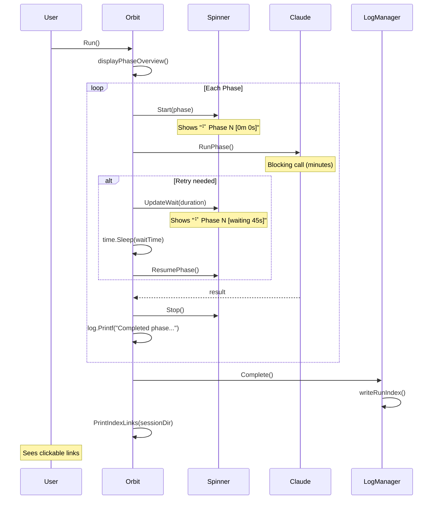

# Design: Orbit UX Improvements

## Overview

This design implements two UX improvements for orbit runs:

1. **Completion Links** - Display clickable OSC 8 terminal hyperlinks to index.md and index.html upon run completion
2. **Progress Spinner** - Show an animated spinner with phase info and elapsed time during phase execution

The implementation adds a new `internal/display` package for terminal output helpers and modifies the orchestration loop to use these helpers.

## Architecture

```
┌─────────────────────────────────────────────────────────────────┐
│                         cmd/orbit/main.go                       │
│                    (entry point, unchanged)                      │
└─────────────────────────────────────────────────────────────────┘
                                │
                                ▼
┌─────────────────────────────────────────────────────────────────┐
│                    internal/orbit/orbit.go                       │
│  ┌─────────────────┐  ┌─────────────────┐  ┌─────────────────┐  │
│  │   Run()         │  │  runPhase()     │  │  complete()     │  │
│  │                 │  │                 │  │                 │  │
│  │ • Start phase   │  │ • Start spinner │  │ • Stop spinner  │  │
│  │ • Loop phases   │  │ • Run Claude    │  │ • Print links   │  │
│  │ • Handle errors │  │ • Stop spinner  │  │ • Call Complete │  │
│  └─────────────────┘  └─────────────────┘  └─────────────────┘  │
└─────────────────────────────────────────────────────────────────┘
                                │
                                ▼
┌─────────────────────────────────────────────────────────────────┐
│                  internal/display (NEW PACKAGE)                  │
│  ┌──────────────────────────┐  ┌─────────────────────────────┐  │
│  │      spinner.go          │  │       hyperlink.go          │  │
│  │                          │  │                             │  │
│  │  • Spinner struct        │  │  • FormatOSC8Link()         │  │
│  │  • Start(phase)          │  │  • FormatFileLink()         │  │
│  │  • UpdateWait(remaining) │  │  • PrintIndexLinks()        │  │
│  │  • Stop()                │  │  • IsTTY()                  │  │
│  │  • SetupSignalHandler()  │  │                             │  │
│  └──────────────────────────┘  └─────────────────────────────┘  │
└─────────────────────────────────────────────────────────────────┘
                                │
                                ▼
┌─────────────────────────────────────────────────────────────────┐
│                   external dependencies                          │
│  ┌──────────────────────────┐  ┌─────────────────────────────┐  │
│  │  github.com/briandowns/  │  │  os (for TTY detection)     │  │
│  │  spinner                 │  │                             │  │
│  └──────────────────────────┘  └─────────────────────────────┘  │
└─────────────────────────────────────────────────────────────────┘
```

## Components and Interfaces

### 1. Display Package (`internal/display`)

A new package that encapsulates terminal display functionality.

#### 1.1 Spinner Component (`spinner.go`)

```go
// Spinner wraps briandowns/spinner with orbit-specific behavior.
type Spinner struct {
    spinner     *spinner.Spinner
    startTime   time.Time
    phase       int
    isWaiting   bool
    waitEndTime time.Time
    done        chan struct{}
    mu          sync.Mutex
    started     bool       // Idempotency guard
    stopOnce    sync.Once  // Ensures Stop() is only executed once
}

// NewSpinner creates a spinner configured for orbit.
// Returns nil if stderr is not a TTY (uses mattn/go-isatty).
func NewSpinner() *Spinner

// Start begins the spinner animation for a phase.
// Format: "⠋ Phase 3 [0m 12s]"
// Idempotent: calling Start() when already started is a no-op.
func (s *Spinner) Start(phase int)

// StartPostCompletion begins spinner for post-completion command.
// Format: "⠋ Post-completion [0m 12s]"
func (s *Spinner) StartPostCompletion()

// UpdateWait switches to wait mode with countdown.
// Format: "⠋ Phase 3 [waiting 45s]"
func (s *Spinner) UpdateWait(remaining time.Duration)

// ResumePhase switches back from wait mode to normal phase mode.
func (s *Spinner) ResumePhase()

// Pause temporarily stops the spinner to allow log output.
// Call Resume() after logging to restart.
func (s *Spinner) Pause()

// Resume restarts the spinner after Pause().
func (s *Spinner) Resume()

// Stop halts the spinner and clears the line.
// Idempotent: calling Stop() multiple times is safe.
func (s *Spinner) Stop()
```

**Implementation Details:**

- Uses `spinner.CharSets[14]` (Braille dots) for smooth animation
- Update interval: 100ms (as per requirement 2.4)
- Writes to stderr via `spinner.WithWriter(os.Stderr)`
- Elapsed time updated via goroutine that periodically calls `s.spinner.Suffix`
- Thread-safe via mutex for concurrent updates
- Uses `mattn/go-isatty` (already an indirect dependency) for TTY detection
- `sync.Once` ensures `Stop()` cleanup runs exactly once
- `started` flag makes `Start()` idempotent
- **Color**: Uses cyan color for spinner via `spinner.WithColor("fgCyan")`

**Spinner Configuration (easily adjustable):**

The spinner settings are defined as package-level constants/variables for easy experimentation:

```go
const (
    spinnerCharSet    = 14               // Braille dots (CharSets[14])
    spinnerInterval   = 100 * time.Millisecond
    spinnerColor      = "fgCyan"         // Options: fgRed, fgGreen, fgYellow, fgBlue, fgMagenta, fgCyan, fgWhite
)
```

Available colors from briandowns/spinner:
- `fgRed`, `fgGreen`, `fgYellow`, `fgBlue`, `fgMagenta`, `fgCyan`, `fgWhite`
- Bold variants: `fgHiRed`, `fgHiGreen`, `fgHiYellow`, `fgHiBlue`, `fgHiMagenta`, `fgHiCyan`, `fgHiWhite`

#### 1.2 Hyperlink Component (`hyperlink.go`)

```go
// FormatOSC8Link creates an OSC 8 terminal hyperlink.
// Format: ESC]8;;URI ST text ESC]8;;ST
// Returns plain text if not a TTY.
func FormatOSC8Link(uri, text string) string

// FormatFileLink creates a file:// URI from an absolute path.
// Properly encodes special characters using net/url.
func FormatFileLink(absPath string) string

// PrintIndexLinks outputs the index file links to stderr.
// Does nothing if sessionDir is empty or stderr is not a TTY.
// Uses mattn/go-isatty for TTY detection.
func PrintIndexLinks(sessionDir string)
```

**OSC 8 Format:**
```
\x1b]8;;<uri>\x1b\\<text>\x1b]8;;\x1b\\
```

Where:
- `\x1b]8;;` - OSC 8 sequence start with empty params
- `<uri>` - The file:// URI
- `\x1b\\` - String terminator (ST)
- `<text>` - Visible link text
- Final `\x1b]8;;\x1b\\` - Close the hyperlink

### 2. Modified Orbit Component (`internal/orbit/orbit.go`)

#### 2.1 Struct Changes

```go
type Orbit struct {
    config         Config
    runeClient     *rune.Client
    claudeClient   claudeRunner
    logManager     *logs.Manager
    phaseSummaries []rune.PhaseSummary
    spinner        *display.Spinner  // NEW: spinner instance
    shutdownCtx    context.Context   // NEW: for graceful shutdown
    shutdownCancel context.CancelFunc
}
```

#### 2.2 Method Changes

**`New()` - Add spinner and signal handling:**
```go
func New(config Config) (*Orbit, error) {
    // ... existing code ...

    var spin *display.Spinner
    if !config.DryRun {
        spin = display.NewSpinner()
    }

    // Set up graceful shutdown context
    ctx, cancel := signal.NotifyContext(context.Background(),
        os.Interrupt, syscall.SIGTERM)

    return &Orbit{
        // ... existing fields ...
        spinner:        spin,
        shutdownCtx:    ctx,
        shutdownCancel: cancel,
    }, nil
}

// Close releases resources and should be called via defer in main().
func (o *Orbit) Close() {
    o.shutdownCancel()
    if o.spinner != nil {
        o.spinner.Stop()
    }
}
```

**`runPhase()` - Add spinner start/stop:**
```go
func (o *Orbit) runPhase(phase int) error {
    startTime := time.Now()

    // Start spinner before Claude execution
    if o.spinner != nil {
        o.spinner.Start(phase)
    }

    // ... existing session ID logic ...

    result, err := o.claudeClient.RunPhase(sessionID, isResume)

    // Stop spinner after Claude returns
    if o.spinner != nil {
        o.spinner.Stop()
    }

    // ... rest of existing error handling and logging ...
}
```

**`runPhaseWithRetry()` - Add wait countdown with log coordination:**
```go
// In the retry wait section:
if o.spinner != nil {
    o.spinner.Pause()  // Pause before log output
}
log.Printf("Rate limited. Waiting %s before retry...", waitTime)
if o.spinner != nil {
    o.spinner.UpdateWait(waitTime)  // Resume with wait mode
}
time.Sleep(waitTime)
if o.spinner != nil {
    o.spinner.ResumePhase()
}
```

**`runPostCommand()` - Add spinner for post-completion:**
```go
func (o *Orbit) runPostCommand() error {
    startTime := time.Now()

    // Start spinner for post-completion
    if o.spinner != nil {
        o.spinner.StartPostCompletion()
    }

    // ... existing session ID logic ...

    result, err := o.claudeClient.RunCustomPromptWithSession(...)

    // Stop spinner after Claude returns
    if o.spinner != nil {
        o.spinner.Stop()
    }

    // ... rest of existing error handling ...
}
```

**`complete()` - Add index links:**
```go
func (o *Orbit) complete() error {
    // ... existing post-command logic ...

    if o.logManager != nil {
        if err := o.logManager.Complete(); err != nil {
            return err
        }
        // Print index links after successful completion
        display.PrintIndexLinks(o.logManager.SessionDir())
    }
    return nil
}
```

**`fail()` - Add index links on failure:**
```go
func (o *Orbit) fail(err error) error {
    if o.spinner != nil {
        o.spinner.Stop()
    }
    if o.logManager != nil {
        _ = o.logManager.Fail(err)
        // Print index links even on failure for debugging
        display.PrintIndexLinks(o.logManager.SessionDir())
    }
    return err
}
```

### 3. Logs Manager Extension (`internal/logs/manager.go`)

Add a method to get the session directory (already exists as `SessionDir()`), no changes needed.

### 4. Demo Command (`cmd/orbit/demo.go`)

A standalone demo command that showcases the spinner and completion links without requiring a real orbit run.

```go
// RunDemo executes a demonstration of orbit's UX features.
// It shows a simulated phase overview, runs spinner animations,
// and displays completion links when interrupted.
func RunDemo() error
```

**Demo Flow:**

```
$ orbit demo

Phase Overview (Demo)
┌───┬─────────────────┬───────┬───────────┬─────────┬──────────┐
│ # │ Phase           │ Tasks │ Completed │ Pending │ Status   │
├───┼─────────────────┼───────┼───────────┼─────────┼──────────┤
│ 1 │ Setup           │     3 │         3 │       0 │ complete │
│ 2 │ Implementation  │     5 │         2 │       3 │ running  │
│ 3 │ Testing         │     4 │         0 │       4 │ pending  │
└───┴─────────────────┴───────┴───────────┴─────────┴──────────┘

⠋ Phase 2 [0m 5s]       <- spinner animates, elapsed time updates
⠙ Phase 2 [0m 10s]
...
⠹ Phase 2 [waiting 5s]  <- simulates retry wait
⠸ Phase 2 [waiting 4s]
...
⠼ Phase 3 [0m 2s]       <- progresses to next phase

Press Ctrl+C to exit...

^C
Session Logs:
  Markdown: file:///tmp/orbit-demo/index.md
  HTML:     file:///tmp/orbit-demo/index.html
```

**Implementation:**

```go
func RunDemo() error {
    // Create spinner
    spin := display.NewSpinner()
    if spin == nil {
        return fmt.Errorf("demo requires a TTY terminal")
    }

    // Set up signal handler for graceful exit
    ctx, cancel := signal.NotifyContext(context.Background(),
        os.Interrupt, syscall.SIGTERM)
    defer cancel()

    // Display mock phase overview
    displayMockPhaseOverview()

    // Run spinner simulation
    phase := 1
    for {
        spin.Start(phase)

        // Simulate work for 10-15 seconds per phase
        select {
        case <-ctx.Done():
            spin.Stop()
            displayDemoLinks()
            return nil
        case <-time.After(10 * time.Second):
            // Simulate retry wait every other phase
            if phase%2 == 0 {
                spin.UpdateWait(5 * time.Second)
                time.Sleep(5 * time.Second)
            }
            spin.Stop()
            phase++
            if phase > 3 {
                phase = 1 // Loop back
            }
        }
    }
}
```

**Integration with main.go:**

```go
func main() {
    // Check for demo subcommand before flag parsing
    if len(os.Args) > 1 && os.Args[1] == "demo" {
        if err := demo.RunDemo(); err != nil {
            log.Fatalf("Demo failed: %v", err)
        }
        return
    }

    // ... existing flag parsing ...
}
```

## Data Models

### Spinner State

```go
type spinnerState int

const (
    stateIdle spinnerState = iota
    stateRunning
    stateWaiting
)
```

The spinner tracks:
- Current phase number
- Start time (for elapsed calculation)
- Current state (idle/running/waiting)
- Wait end time (for countdown in wait state)

### OSC 8 URI Encoding

File URIs must be properly encoded:
- Spaces → `%20`
- Special characters → percent-encoded
- Path must be absolute

Example:
```
/Users/foo/My Project/.orbit/index.html
→ file:///Users/foo/My%20Project/.orbit/index.html
```

## Error Handling

| Scenario | Behavior |
|----------|----------|
| Stderr not a TTY | Spinner disabled, links printed as plain text |
| Spinner fails to start | Logged as warning, execution continues |
| Signal received (SIGINT/SIGTERM) | Spinner stopped, terminal restored, then exit |
| File path encoding error | Log warning, print unencoded path as fallback |

### Signal Handling Flow

Uses `signal.NotifyContext` for graceful shutdown that preserves cleanup:

```
SIGINT/SIGTERM received
        │
        ▼
┌────────────────────────┐
│ shutdownCtx cancelled  │
│ (context.Done() fires) │
└────────────────────────┘
        │
        ▼
┌────────────────────────┐
│ Run loop detects       │
│ context cancellation   │
└────────────────────────┘
        │
        ▼
┌────────────────────────┐
│ o.fail() called        │
│ - Stops spinner        │
│ - Prints index links   │
│ - Saves log state      │
└────────────────────────┘
        │
        ▼
┌────────────────────────┐
│ defer o.Close() runs   │
│ (from main)            │
└────────────────────────┘
        │
        ▼
┌────────────────────────┐
│ main() returns error   │
│ (log.Fatalf handles)   │
└────────────────────────┘
```

**Usage in main.go:**
```go
func main() {
    // ... flag parsing ...

    o, err := orbit.New(orbitCfg)
    if err != nil {
        log.Fatalf("Failed to initialize Orbit: %v", err)
    }
    defer o.Close()  // Ensures cleanup on any exit path

    if err := o.Run(); err != nil {
        log.Fatalf("Orchestration failed: %v", err)
    }
}
```

## Testing Strategy

### Unit Tests

#### Display Package Tests

| Test | Requirement | Description |
|------|-------------|-------------|
| `TestFormatOSC8Link` | 1.3 | Verify escape sequence format |
| `TestFormatFileLink` | 1.4 | Verify file:// URI construction with encoding |
| `TestFormatFileLinkWithSpaces` | 1.4 | Path with spaces encoded correctly |
| `TestSpinnerStart` | 2.1, 2.2 | Spinner shows phase number |
| `TestSpinnerStartPostCompletion` | 2.1 | Post-completion spinner format |
| `TestSpinnerElapsedTime` | 2.3 | Elapsed time updates |
| `TestSpinnerStop` | 2.6 | Spinner clears line on stop |
| `TestSpinnerWaitMode` | 2.7 | Wait countdown displayed |
| `TestSpinnerNilOnNonTTY` | 3.5 | Returns nil when not TTY |
| `TestSpinnerStartIdempotent` | - | Double Start() is safe |
| `TestSpinnerStopIdempotent` | - | Double Stop() is safe |
| `TestSpinnerPauseResume` | 4.5 | Pause clears line, Resume restarts |

#### Orbit Integration Tests

| Test | Requirement | Description |
|------|-------------|-------------|
| `TestRunPhaseStartsSpinner` | 2.1 | Spinner started before Claude call |
| `TestRunPhaseStopsSpinner` | 2.6 | Spinner stopped after Claude returns |
| `TestRunPostCommandSpinner` | 2.1 | Spinner runs during post-completion |
| `TestCompleteShowsLinks` | 1.1, 4.3 | Links printed on success |
| `TestFailShowsLinks` | 1.2 | Links printed on failure |
| `TestDryRunNoSpinner` | 2.8 | Spinner not created in dry-run |
| `TestDryRunNoLinks` | 1.7 | Links not printed in dry-run |
| `TestSignalStopsSpinner` | 2.9 | SIGINT triggers graceful shutdown |
| `TestCloseIdempotent` | - | Multiple Close() calls are safe |

#### Demo Tests

| Test | Requirement | Description |
|------|-------------|-------------|
| `TestDemoRequiresTTY` | 5.7 | Demo fails gracefully without TTY |
| `TestDemoDisplaysMockTable` | 5.2 | Phase overview rendered correctly |

### Manual Testing Checklist

- [ ] Verify spinner animation in iTerm2
- [ ] Verify spinner animation in macOS Terminal.app
- [ ] Verify OSC 8 links clickable in iTerm2
- [ ] Verify OSC 8 links degrade to plain text in Terminal.app
- [ ] Verify spinner disabled when piped (`orbit 2>&1 | cat`)
- [ ] Verify Ctrl+C cleanly stops spinner and exits
- [ ] Verify links shown after both success and failure

## Requirements Traceability

| Requirement | Design Element |
|-------------|----------------|
| 1.1 | `complete()` calls `PrintIndexLinks()` |
| 1.2 | `fail()` calls `PrintIndexLinks()` |
| 1.3 | `FormatOSC8Link()` uses escape sequence format |
| 1.4 | `FormatFileLink()` creates file:// URI |
| 1.5 | `PrintIndexLinks()` outputs two lines |
| 1.6 | `PrintIndexLinks()` prefixes "Markdown:" and "HTML:" |
| 1.7 | Nil check on `logManager` before printing |
| 2.1 | `Spinner.Start()` called in `runPhase()` |
| 2.2 | Spinner suffix includes phase number |
| 2.3 | Goroutine updates elapsed time periodically |
| 2.4 | `spinner.New()` with 100ms interval |
| 2.5 | Spinner runs in goroutine while `RunPhase()` blocks |
| 2.6 | `Spinner.Stop()` called after `RunPhase()` returns |
| 2.7 | `Spinner.UpdateWait()` in retry loop |
| 2.8 | Nil spinner when `config.DryRun` |
| 2.9 | `SetupSignalHandler()` for SIGINT/SIGTERM |
| 3.1 | OSC 8 format per specification |
| 3.2 | OSC 8 degrades gracefully (inherent to format) |
| 3.3 | Braille charset is ASCII-compatible |
| 3.4 | `spinner.WithWriter(os.Stderr)` |
| 3.5 | `IsTTY()` check in `NewSpinner()` |
| 4.1 | Spinner starts after phase overview (natural flow) |
| 4.2 | Spinner shows phase/time, log shows details |
| 4.3 | Links after "All tasks complete!" (in `complete()`) |
| 4.4 | Verbose output uses `log` package, independent |
| 4.5 | `Spinner.Stop()` clears line before log output |
| 5.1 | `orbit demo` subcommand in main.go |
| 5.2 | `displayMockPhaseOverview()` in demo.go |
| 5.3 | Demo loop cycles through phases |
| 5.4 | Demo simulates retry wait on even phases |
| 5.5 | Demo runs until ctx.Done() (Ctrl+C) |
| 5.6 | `displayDemoLinks()` on exit |
| 5.7 | Demo requires no external files |

## Sequence Diagram



## File Changes Summary

| File | Change Type | Description |
|------|-------------|-------------|
| `internal/display/spinner.go` | New | Spinner wrapper with orbit-specific behavior |
| `internal/display/hyperlink.go` | New | OSC 8 link formatting and printing |
| `internal/display/spinner_test.go` | New | Spinner unit tests |
| `internal/display/hyperlink_test.go` | New | Hyperlink unit tests |
| `internal/orbit/orbit.go` | Modified | Integrate spinner, links, and signal handling |
| `internal/orbit/orbit_test.go` | Modified | Add integration tests |
| `cmd/orbit/main.go` | Modified | Add defer o.Close(), demo subcommand dispatch |
| `cmd/orbit/demo.go` | New | Demo command implementation |
| `go.mod` | Modified | Add briandowns/spinner dependency |

## Dependencies

| Package | Version | Purpose |
|---------|---------|---------|
| `github.com/briandowns/spinner` | latest | Terminal spinner animation |
| `github.com/mattn/go-isatty` | (existing) | TTY detection |
