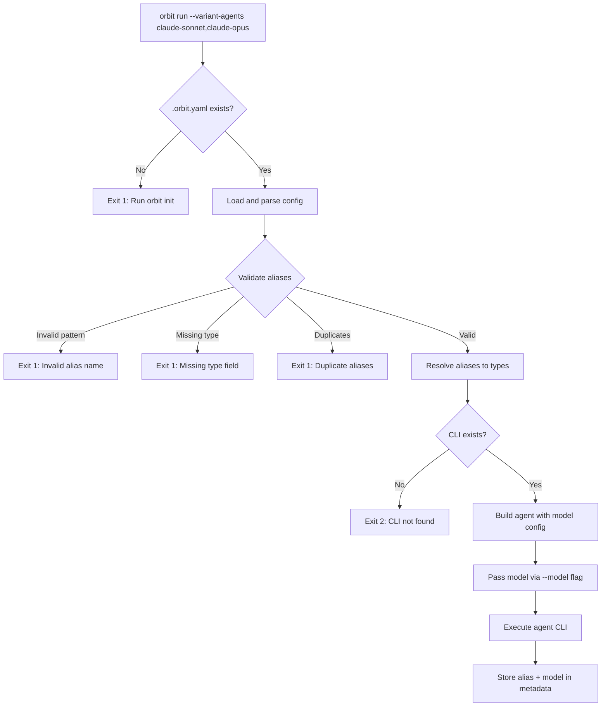

# Design: Per-Variant Model Selection

## Overview

This design introduces **agent aliases** - named configurations in `.orbit.yaml` that combine an agent type with model and other settings. This enables running parallel variants with different models using the same underlying agent (e.g., claude-sonnet-4 vs claude-opus-4) through the existing `--variant-agents` flag.

The key architectural change is decoupling agent names from agent types: currently, agent names like "claude-code" map directly to registered agent implementations. After this change, agent names become user-defined aliases that reference an underlying agent type plus configuration.

### Key Changes

1. **New `type` field** - Each agent alias must specify which agent implementation to use
2. **New `model` field** - Control model selection per alias (each agent type knows its own CLI flag)
3. **Required configuration** - Orbit requires `.orbit.yaml` with at least one agent
4. **New `orbit init` command** - Creates default configuration file
5. **Alias validation** - Names normalized to lowercase, validated against pattern

---

## Architecture

```
┌─────────────────────────────────────────────────────────────────────────────┐
│                              orbit CLI                                       │
├─────────────────────────────────────────────────────────────────────────────┤
│  main.go                                                                     │
│  ├── init subcommand (NEW) ──────────► GenerateDefaultConfig()              │
│  └── run subcommand ─────────────────► runCommand()                         │
│                                            │                                 │
│                                            ▼                                 │
│  ┌─────────────────────────────────────────────────────────────────────┐   │
│  │                    config.Load(workingDir)                           │   │
│  │  ┌─────────────────────────────────────────────────────────────┐    │   │
│  │  │  1. Check .orbit.yaml exists (REQUIRED)                      │    │   │
│  │  │  2. Parse agents section with new fields:                    │    │   │
│  │  │     - type (required)                                        │    │   │
│  │  │     - model (optional)                                       │    │   │
│  │  │     - model-flag (optional, default: --model)                │    │   │
│  │  │  3. Validate alias names (pattern + uniqueness)              │    │   │
│  │  │  4. Return Config with ResolvedAgents map                    │    │   │
│  │  └─────────────────────────────────────────────────────────────┘    │   │
│  └─────────────────────────────────────────────────────────────────────┘   │
│                                            │                                 │
│                                            ▼                                 │
│  ┌─────────────────────────────────────────────────────────────────────┐   │
│  │               ResolveAgent(aliasName, config) (MODIFIED)             │   │
│  │  1. Lookup alias in config.ResolvedAgents                           │   │
│  │  2. Get agent type from alias                                       │   │
│  │  3. Look up agent factory in agents.Registry by type                │   │
│  │  4. Create agent with merged config (model in ExtraArgs/Options)    │   │
│  └─────────────────────────────────────────────────────────────────────┘   │
│                                            │                                 │
│                                            ▼                                 │
│  ┌─────────────────────────────────────────────────────────────────────┐   │
│  │                    agents.Agent.Run(opts)                            │   │
│  │  - Model passed via ExtraArgs: [--model, <value>]                   │   │
│  │  - Or custom flag: [<model-flag>, <value>]                          │   │
│  └─────────────────────────────────────────────────────────────────────┘   │
└─────────────────────────────────────────────────────────────────────────────┘
```

### Data Flow



---

## Components and Interfaces

### 1. Config Package Changes (`internal/config/config.go`)

#### New Types

```go
// AgentAliasConfig holds per-alias settings from .orbit.yaml.
// This replaces the current AgentConfig which maps names directly to settings.
type AgentAliasConfig struct {
    Type        string   `yaml:"type"`        // Required: underlying agent type
    CLIPath     string   `yaml:"cli-path"`    // Override CLI command path
    AutoApprove bool     `yaml:"auto-approve"`// Tool approval behavior
    ExtraArgs   []string `yaml:"extra-args"`  // Additional CLI arguments
    Timeout     string   `yaml:"timeout"`     // Execution timeout
    Model       string   `yaml:"model"`       // Model to use
}

// ResolvedAgent contains a validated and resolved agent alias.
type ResolvedAgent struct {
    Alias     string           // Original alias name (normalized to lowercase)
    Type      string           // Underlying agent type (e.g., "claude-code")
    Config    AgentAliasConfig
}
```

#### Modified Config Struct

```go
type Config struct {
    // ... existing fields ...

    // Agent selection and configuration
    Agent          string                      // Default agent alias for project
    Agents         map[string]AgentAliasConfig // Raw alias configs from YAML
    ResolvedAgents map[string]ResolvedAgent    // Validated and resolved aliases

    // Config file state
    ConfigFileFound bool                       // Whether .orbit.yaml was found
}
```

#### New Functions

```go
// ValidateAliasName checks if a name matches the required pattern.
// Pattern: [a-z0-9]+(-[a-z0-9]+)* (lowercase alphanumeric with hyphens)
func ValidateAliasName(name string) error

// NormalizeAliasName converts a name to lowercase for case-insensitive comparison.
func NormalizeAliasName(name string) string

// ResolveAliases validates all aliases and builds ResolvedAgents map.
// Returns error if validation fails (missing type, invalid name, duplicates).
func (c *Config) ResolveAliases() error

// GetResolvedAgent returns the resolved agent for an alias.
// Returns error if alias not found.
func (c *Config) GetResolvedAgent(alias string) (ResolvedAgent, error)

// GenerateDefaultConfig creates a default .orbit.yaml content.
func GenerateDefaultConfig() []byte

// RequireConfigFile returns an error if no config file was found.
func (c *Config) RequireConfigFile() error
```

### 2. New Init Command (`cmd/orbit/init.go`)

```go
// initCommand executes the orbit init subcommand.
// Creates a default .orbit.yaml in the current directory.
func initCommand(args []string) error {
    // Parse --force flag
    // Check if .orbit.yaml exists
    // If exists and no --force, exit 1
    // Write default config
    // Log success message
}
```

#### Exit Codes
- 0: Config file created successfully
- 1: Config file already exists (without --force)

### 3. Modified Agent Resolution (`cmd/orbit/run.go`)

The current flow:
```go
agentName := resolveAgent(*agentFlag, cfg)
agentCfg := cfg.GetAgentConfig(agentName)
agent, err := agents.Get(agentName, agentCfg)
```

New flow:
```go
// Require config file
if err := cfg.RequireConfigFile(); err != nil {
    return err // Exit 1
}

// Resolve and validate aliases
if err := cfg.ResolveAliases(); err != nil {
    return err // Exit 1
}

// Get resolved agent (alias -> type + config)
aliasName := resolveAgent(*agentFlag, cfg)
resolved, err := cfg.GetResolvedAgent(aliasName)
if err != nil {
    return err // Exit 1
}

// Get agent factory by type
agentCfg := buildAgentConfig(resolved)
agent, err := agents.Get(resolved.Type, agentCfg)
if err != nil {
    // Unknown type - this means type is not a registered agent
    return fmt.Errorf("unknown agent type %q for alias %q", resolved.Type, aliasName)
}

// Check CLI exists
if !agent.IsInstalled() {
    return &CLINotFoundError{...} // Exit 2
}
```

### 4. Model Passing to Agents

Model values are passed to agents via the `Options` map in `agents.AgentConfig`. Each agent implementation is responsible for adding the appropriate CLI flag.

```go
// buildAgentConfig creates agents.AgentConfig from resolved alias.
func buildAgentConfig(resolved ResolvedAgent) agents.AgentConfig {
    cfg := agents.AgentConfig{
        CLIPath:     resolved.Config.CLIPath,
        AutoApprove: resolved.Config.AutoApprove,
        ExtraArgs:   resolved.Config.ExtraArgs,
        // ... timeout parsing ...
    }

    // Store model in Options - agent implementations will add the appropriate flag
    if resolved.Config.Model != "" {
        cfg.Options = map[string]string{
            "model": resolved.Config.Model,
        }
    }

    return cfg
}
```

Each agent implementation reads the model from `Options` and adds its own flag:

```go
// In internal/agents/claudecode/agent.go (and similar for other agents)
func (a *Agent) buildArgs(opts agents.RunOptions, resume bool) []string {
    // ... existing args ...

    // Add model flag if configured
    if model, ok := a.config.Options["model"]; ok && model != "" {
        args = append(args, "--model", model)
    }

    // ... rest of args ...
}
```

All registered agents (claude-code, codex, kiro, copilot) use `--model` as their flag.

### 5. YAML Type Coercion for Model Values

The `model` field accepts strings and numbers from YAML. Other types (bool, array, map) cause validation errors.

**Location:** In `parseAgentsConfig()` within `internal/config/config.go`

```go
// Handle model field with type coercion
switch v := cfgMap["model"].(type) {
case string:
    agentCfg.Model = v
case int, int64, float64:
    // Coerce numeric types to string (model: 4 → "4")
    agentCfg.Model = fmt.Sprintf("%v", v)
case nil:
    // Not specified, leave empty
case bool, []interface{}, map[string]interface{}:
    // Invalid types - will be caught during validation
    validationErrors = append(validationErrors,
        fmt.Errorf("alias %q: model must be a string or number, got %T", name, v))
}
```

**Valid:**
- `model: "gpt-4"` → `"gpt-4"`
- `model: gpt-4` → `"gpt-4"` (unquoted string)
- `model: 4` → `"4"` (YAML int)
- `model: 4.5` → `"4.5"` (YAML float)

**Invalid (validation error):**
- `model: true` → Error: model must be a string or number
- `model: [a, b]` → Error: model must be a string or number
- `model: {key: value}` → Error: model must be a string or number

### 6. Variant Metadata Changes (`internal/variants/types.go`)

```go
// Variant represents a single implementation variant.
type Variant struct {
    ID           int           `json:"id"`
    Branch       string        `json:"branch"`
    WorktreePath string        `json:"worktree_path"`
    Status       VariantStatus `json:"status"`
    Error        string        `json:"error,omitempty"`
    Guidance     string        `json:"guidance,omitempty"`
    Agent        string        `json:"agent,omitempty"`      // Alias name used
    AgentType    string        `json:"agent_type,omitempty"` // NEW: Underlying type
    Model        string        `json:"model,omitempty"`      // NEW: Model used

    // Metrics populated after completion
    Cost     float64       `json:"cost,omitempty"`
    Duration time.Duration `json:"duration,omitempty"`
    NumTurns int           `json:"num_turns,omitempty"`
}
```

### 7. Log Summary Changes (`internal/logs/manager.go`)

```go
// SessionEntry records metadata about a completed session.
type SessionEntry struct {
    Phase      int       `json:"phase"`
    SessionID  string    `json:"session_id"`
    DurationMS int64     `json:"duration_ms"`
    CostUSD    float64   `json:"cost_usd"`
    NumTurns   int       `json:"num_turns"`
    StartedAt  time.Time `json:"started_at"`
    EndedAt    time.Time `json:"ended_at"`
    IsError    bool      `json:"is_error,omitempty"`
    RunNumber  int       `json:"run_number"`
    AgentAlias string    `json:"agent_alias,omitempty"` // NEW
    AgentType  string    `json:"agent_type,omitempty"`  // NEW
    Model      string    `json:"model,omitempty"`       // NEW
}
```

---

## Data Models

### Configuration Schema (`.orbit.yaml`)

```yaml
# Required: At least one agent must be defined
agents:
  # Alias name must match: [a-z0-9]+(-[a-z0-9]+)*
  claude-sonnet:
    type: claude-code          # Required: must be a registered agent type
    model: claude-sonnet-4-20250514  # Optional: model to use
    auto-approve: true         # Optional: default true

  claude-opus:
    type: claude-code
    model: claude-opus-4-20250514
    timeout: 30m               # Optional: execution timeout

  codex-o3:
    type: codex
    model: o3
    extra-args:                # Optional: additional CLI args
      - --verbose
      - --no-cache

# Default agent alias (optional)
agent: claude-sonnet

# ... other existing config fields ...
```

#### Valid Agent Types

The `type` field must be one of the registered agent types:
- `claude-code` - Claude Code CLI (`claude`)
- `codex` - OpenAI Codex CLI (`codex`)
- `kiro` - AWS Kiro CLI (`kiro-cli`)
- `copilot` - GitHub Copilot CLI (`copilot`)

Unknown types will result in an error at startup.

#### Field Defaults

| Field | Type | Default | Description |
|-------|------|---------|-------------|
| `type` | string | *required* | Must be a registered agent type |
| `model` | string | `""` (agent default) | Model to pass to CLI |
| `cli-path` | string | `""` (use type's default) | Override CLI command path |
| `auto-approve` | bool | `true` | Enable automatic tool approval |
| `timeout` | string | `""` (no timeout) | Execution timeout (e.g., "30m") |
| `extra-args` | []string | `[]` | Additional CLI arguments |

Note: `auto-approve` defaults to `true` because Orbit runs agents in automated mode where interactive approval isn't possible. Each agent type hardcodes its own model flag (all use `--model`).

### Commands Requiring Configuration

Only commands that need to execute agents require `.orbit.yaml`:

| Command | Requires Config | Reason |
|---------|----------------|--------|
| `orbit init` | No | Creates the config file |
| `orbit run` | **Yes** | Executes agents |
| `orbit serve` | No | Only uses port/bind settings, not agents |
| `orbit status` | No | Reads variants.json only |
| `orbit compare` | **Yes** | Uses agent for AI-powered comparison analysis |
| `orbit consolidate` | **Yes** | Uses agent for consolidation |
| `orbit finalize` | No | Git operations only |
| `orbit cleanup` | No | Worktree management only |
| `orbit register` | No | Registry writes only |

### Config File Merge Behavior

Orbit uses Viper's `MergeConfigMap` to combine home (`~/.orbit.yaml`) and project (`.orbit.yaml`) configs:

1. Home config is loaded first (lower priority)
2. Project config merges on top (higher priority)
3. For the `agents` section:
   - Agents defined only in home config are available
   - Agents defined only in project config are available
   - If both define the same alias, Viper performs **deep merge at field level**

**Example:**
```yaml
# ~/.orbit.yaml (home)
agents:
  claude-code:
    type: claude-code
    model: claude-sonnet-4-20250514
    timeout: 30m

# .orbit.yaml (project)
agents:
  claude-code:
    type: claude-code
    model: claude-opus-4-20250514
    # timeout not specified - inherited from home
```

Result: `claude-code` uses `claude-opus-4-20250514` with `30m` timeout (Viper deep merges nested maps).

**Note:** This is Viper's default behavior for `MergeConfigMap`. Field-level merging means project values override home values for fields that are set, but unset fields inherit from home.

**Config file requirement:** The `RequireConfigFile()` check passes if **either** home or project config exists and contains at least one agent. Both are optional but at least one must define agents.

### Alias Resolution Precedence

When resolving an agent name (from `--agent` flag or `--variant-agents`):

1. **Normalize to lowercase** - `Claude-Opus` → `claude-opus`
2. **Look up in config's agents map** - check `Config.ResolvedAgents[normalizedName]`
3. **If not found, error** - no fallback to registered agent types

**Important:** Aliases can shadow built-in agent type names. If a user defines:
```yaml
agents:
  claude-code:
    type: claude-code
    model: claude-opus-4  # Alias named "claude-code" with specific model
```

This is valid. The alias `claude-code` resolves to agent type `claude-code` with model `claude-opus-4`. There is no implicit lookup of registered types - all agent references must be configured aliases.

### Alias Name Validation

```
Pattern: ^[a-z0-9]+(-[a-z0-9]+)*$

Valid:
  - claude-sonnet
  - my-agent-v2
  - agent1
  - a

Invalid:
  - Claude-Sonnet  (uppercase - normalized but may cause duplicates)
  - -agent         (starts with hyphen)
  - agent-         (ends with hyphen)
  - my_agent       (underscore)
  - my.agent       (dot)
```

### variants.json Schema Changes

```json
{
  "run_id": "uuid",
  "base_commit": "abc123",
  "original_branch": "main",
  "started_at": "2026-01-24T10:00:00Z",
  "variants": [
    {
      "id": 1,
      "branch": "orbit-impl-1",
      "worktree_path": "/path/to/worktree",
      "status": "completed",
      "agent": "claude-sonnet",
      "agent_type": "claude-code",
      "model": "claude-sonnet-4-20250514",
      "cost": 0.05,
      "duration": 300000000000,
      "num_turns": 15
    },
    {
      "id": 2,
      "branch": "orbit-impl-2",
      "worktree_path": "/path/to/worktree2",
      "status": "completed",
      "agent": "claude-opus",
      "agent_type": "claude-code",
      "model": "claude-opus-4-20250514",
      "cost": 0.15,
      "duration": 450000000000,
      "num_turns": 12
    }
  ]
}
```

---

## Error Handling

### Exit Codes

| Code | Category | Conditions |
|------|----------|------------|
| 0 | Success | Command completed successfully |
| 1 | Configuration Error | Missing `.orbit.yaml`, missing `type` field, invalid alias name, duplicate aliases, unconfigured agent, empty agents section |
| 2 | CLI Not Found | `cli-path` doesn't exist, agent type not in PATH |
| N | Agent Error | Exit code propagated from agent CLI |

### Error Messages

#### Missing Config File (Exit 1)
```
Error: configuration file .orbit.yaml not found

Run 'orbit init' to create a default configuration file.
```

#### Missing Type Field (Exit 1)
```
Error: agent alias "my-agent" is missing required "type" field

Add a type field to specify the underlying agent:

agents:
  my-agent:
    type: claude-code  # or codex, kiro, copilot, custom
    model: ...
```

#### Invalid Alias Name (Exit 1)
```
Error: invalid agent alias name "My-Agent"

Alias names must:
  - Use only lowercase letters, numbers, and hyphens
  - Not start or end with a hyphen
  - Match pattern: [a-z0-9]+(-[a-z0-9]+)*

Examples: claude-sonnet, my-agent-v2, agent1
```

#### Duplicate Aliases (Exit 1)
```
Error: duplicate agent aliases after case normalization

The following aliases conflict:
  - "Claude-Sonnet" and "claude-sonnet" both normalize to "claude-sonnet"

Remove duplicate definitions from .orbit.yaml.
```

#### Unconfigured Agent (Exit 1)
```
Error: agent "claude-fast" is not configured in .orbit.yaml

Available agents: claude-sonnet, claude-opus, codex-o3

To add this agent:

agents:
  claude-fast:
    type: claude-code
    model: ...
```

#### CLI Not Found (Exit 2)
```
Error: CLI for agent "my-custom" not found

Configured cli-path: /usr/local/bin/my-agent
Path does not exist or is not executable.

Either:
  - Install the CLI at the configured path
  - Update cli-path in .orbit.yaml to the correct location
```

#### Unknown Agent Type (Exit 1)
```
Error: unknown agent type "custom" for alias "my-agent"

Valid agent types: claude-code, codex, kiro, copilot

Update the type field in .orbit.yaml to use a registered agent type.
```

#### Agent Type Not in PATH (Exit 2)
```
Error: CLI "claude" not found in PATH for agent "claude-sonnet"

The agent type "claude-code" requires the "claude" CLI to be installed.

Install from: https://docs.anthropic.com/en/docs/agents-and-tools/claude-code/overview
```

---

## Testing Strategy

### Unit Tests

#### Config Validation Tests (`internal/config/config_test.go`)

| Test Case | Input | Expected |
|-----------|-------|----------|
| Valid alias name | `claude-sonnet` | No error |
| Valid alias name with numbers | `agent-v2` | No error |
| Invalid: uppercase | `Claude-Sonnet` | Normalized to `claude-sonnet` |
| Invalid: starts with hyphen | `-agent` | Error |
| Invalid: ends with hyphen | `agent-` | Error |
| Invalid: underscore | `my_agent` | Error |
| Missing type field | `{model: x}` | Error |
| Unknown type field | `{type: custom}` | Error |
| Duplicate after normalization | `A` and `a` | Error |
| Empty agents section | `agents: {}` | Error |

#### Model Passing Tests

| Test Case | Model | Expected in Options |
|-----------|-------|---------------------|
| No model | `""` | Options is nil or empty |
| Model specified | `gpt-4` | `Options["model"] = "gpt-4"` |
| Model as number in YAML | `4` (int) | `Options["model"] = "4"` |
| Model as float in YAML | `4.5` (float) | `Options["model"] = "4.5"` |

#### Agent Model Flag Tests (per agent implementation)

| Agent | Model in Options | Expected CLI Args |
|-------|------------------|-------------------|
| claude-code | `claude-opus-4` | `--model claude-opus-4` |
| codex | `o3` | `--model o3` |
| kiro | `kiro-model` | `--model kiro-model` |
| copilot | `copilot-model` | `--model copilot-model` |

#### YAML Type Validation Tests

| Test Case | YAML Value | Expected |
|-----------|------------|----------|
| String model | `model: "gpt-4"` | Valid, Model = "gpt-4" |
| Unquoted string | `model: gpt-4` | Valid, Model = "gpt-4" |
| Integer model | `model: 4` | Valid, Model = "4" |
| Float model | `model: 4.5` | Valid, Model = "4.5" |
| Boolean model | `model: true` | Validation error |
| Array model | `model: [a, b]` | Validation error |
| Map model | `model: {k: v}` | Validation error |

#### Config Merge Tests (`internal/config/config_test.go`)

| Test Case | Home Config | Project Config | Expected |
|-----------|-------------|----------------|----------|
| Project only | None | `{claude: {type: claude-code}}` | Uses project |
| Home only | `{claude: {type: claude-code}}` | None | Uses home |
| Deep merge | `{claude: {type: claude-code, timeout: 30m}}` | `{claude: {type: claude-code, model: opus}}` | `{type: claude-code, timeout: 30m, model: opus}` |
| Different aliases | `{sonnet: {...}}` | `{opus: {...}}` | Both available |
| Alias shadows type | `{claude-code: {type: claude-code, model: opus}}` | None | Uses alias, model = opus |

#### Alias Resolution Tests

| Test Case | Input | Config | Expected |
|-----------|-------|--------|----------|
| Valid alias | `claude-sonnet` | Has `claude-sonnet` | Resolves to alias config |
| Alias with type name | `claude-code` | Has `claude-code` alias | Resolves to alias (no implicit type lookup) |
| Unknown alias | `unknown` | No `unknown` alias | Error: not configured |
| Case normalization | `Claude-Sonnet` | Has `claude-sonnet` | Resolves to `claude-sonnet` |

#### Init Command Tests (`cmd/orbit/init_test.go`)

| Test Case | Condition | Expected |
|-----------|-----------|----------|
| No existing config | Dir is empty | Creates file, exit 0 |
| Existing config | File exists | Error, exit 1 |
| Existing config with --force | File exists | Overwrites, exit 0 |
| Write permission error | Dir not writable | Error, exit 1 |

### Integration Tests

#### End-to-End Variant Run

```go
func TestVariantRunWithDifferentModels(t *testing.T) {
    // Setup: Create .orbit.yaml with two aliases
    // Run: orbit run --variants 2 --variant-agents claude-sonnet,claude-opus
    // Verify: variants.json contains correct agent, agent_type, model fields
    // Verify: Both agents were called with correct --model flags
}
```

#### Config File Requirement

```go
func TestRunWithoutConfig(t *testing.T) {
    // Setup: No .orbit.yaml
    // Run: orbit run
    // Verify: Exit code 1, error message mentions orbit init
}
```

### Property-Based Tests

The alias name validation is a good candidate for property-based testing:

```go
func TestPropertyAliasNameValidation(t *testing.T) {
    rapid.Check(t, func(t *rapid.T) {
        // Generate valid alias names
        validName := rapid.StringMatching(`[a-z0-9]+(-[a-z0-9]+)*`).Draw(t, "validName")
        err := ValidateAliasName(validName)
        if err != nil {
            t.Fatalf("valid name %q rejected: %v", validName, err)
        }
    })

    rapid.Check(t, func(t *rapid.T) {
        // Names starting with hyphen should fail
        invalidName := rapid.StringMatching(`-[a-z0-9]+`).Draw(t, "invalidName")
        err := ValidateAliasName(invalidName)
        if err == nil {
            t.Fatalf("invalid name %q accepted", invalidName)
        }
    })
}

func TestPropertyCaseNormalization(t *testing.T) {
    rapid.Check(t, func(t *rapid.T) {
        // Any case variant normalizes to same result
        name := rapid.StringMatching(`[a-zA-Z0-9]+(-[a-zA-Z0-9]+)*`).Draw(t, "name")
        n1 := NormalizeAliasName(name)
        n2 := NormalizeAliasName(strings.ToUpper(name))
        n3 := NormalizeAliasName(strings.ToLower(name))

        if n1 != n2 || n2 != n3 {
            t.Fatalf("inconsistent normalization: %q -> %q, %q, %q", name, n1, n2, n3)
        }
    })
}
```

---

## Requirements Traceability

| Requirement | Design Element |
|-------------|----------------|
| [1.1](#1.1) agents section in .orbit.yaml | `Config.Agents` map parsing in `parseAgentsConfig()` |
| [1.2](#1.2) Alias name pattern | `ValidateAliasName()` function |
| [1.3](#1.3) Case-insensitive | `NormalizeAliasName()` function |
| [1.4](#1.4) Unique after normalization | Duplicate check in `ResolveAliases()` |
| [1.5](#1.5) Required type field | Validation in `ResolveAliases()` |
| [1.6](#1.6) Optional model field | `AgentAliasConfig.Model` field |
| [1.7](#1.7) Existing config options | `AgentAliasConfig` struct fields |
| [1.8](#1.8) Default model when unspecified | Model not added to Options |
| [2.1](#2.1) Require .orbit.yaml | `Config.RequireConfigFile()` method |
| [2.2](#2.2) Error directing to orbit init | Error message in `RequireConfigFile()` |
| [2.3](#2.3) At least one agent required | Validation in `ResolveAliases()` |
| [2.4](#2.4) Empty agents error | Validation in `ResolveAliases()` |
| [2.5](#2.5) Unconfigured agent error | `GetResolvedAgent()` returns error |
| [2.6](#2.6) Example syntax in error | Error message formatting |
| [3.1](#3.1) orbit init subcommand | `initCommand()` function |
| [3.2](#3.2) Creates .orbit.yaml | File write in `initCommand()` |
| [3.3](#3.3) Fails if exists | File existence check |
| [3.4](#3.4) --force flag | Flag parsing in `initCommand()` |
| [3.5](#3.5) Default config content | `GenerateDefaultConfig()` function |
| [3.6](#3.6) Success message | Log output in `initCommand()` |
| [4.1](#4.1) --variant-agents accepts aliases | Alias resolution in `runCommand()` |
| [4.2](#4.2) Resolve to type + config | `GetResolvedAgent()` method |
| [4.3](#4.3) Cycle through list | Existing `AssignVariantAgents()` unchanged |
| [4.4](#4.4) Store alias in metadata | `Variant.Agent`, `.AgentType`, `.Model` fields |
| [5.1](#5.1) Validate type at startup | `ResolveAliases()` call in `runCommand()` |
| [5.2](#5.2) Missing type error | Error message in `ResolveAliases()` |
| [5.3](#5.3) Invalid name error | `ValidateAliasName()` error |
| [5.4](#5.4) Duplicate error | Duplicate check error |
| [5.5](#5.5) cli-path not found error | Exit code 2, `CLINotFoundError` |
| [5.6](#5.6) Type not in PATH error | Exit code 2, `agent.IsInstalled()` check |
| [5.7](#5.7) Propagate agent error | Return agent exit code |
| [5.8](#5.8) No model validation | No model validation code |
| [6.1](#6.1) Model via --model flag | Agent implementations add `--model` flag |
| [6.2](#6.2) No flag when no model | Model not in Options |
| [6.3](#6.3) Pass model as-is | Direct string from Options |
| [6.4](#6.4) Convert YAML types | Type coercion in `parseAgentsConfig()` |
| [7.1](#7.1) Alias/model in variants.json | `Variant` struct fields |
| [7.2](#7.2) Alias/model in summary.json | `SessionEntry` struct fields |
| [7.3](#7.3) Verbose logging | Log output in `runCommand()` |
| [7.4](#7.4) Comparison report | Report generation uses variant metadata |
