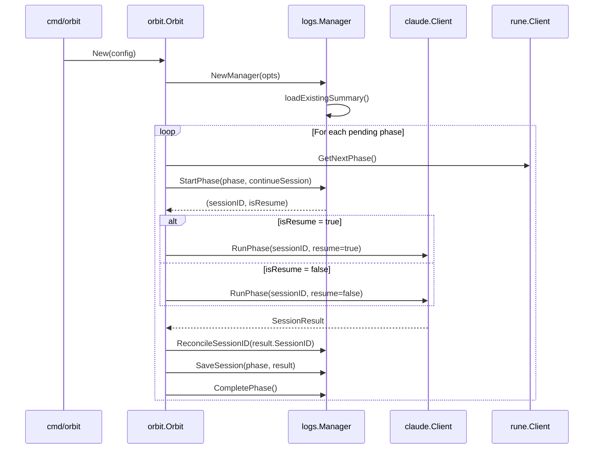

# Session Management Design

## Overview

This document describes the design for enhancing Orbit's log storage and Claude session handling. The changes span four packages: `logs`, `claude`, `orbit`, and `config`.

**Key Changes:**
1. Log manager supports flat directory mode with persistent summary
2. Claude client accepts session ID and resume parameters
3. Orchestrator coordinates session lifecycle and retry logic
4. Config adds new options for `date_subdirs` and `continue_session`

---

## Architecture



---

## Components and Interfaces

### 1. Log Manager (`internal/logs/manager.go`)

#### New Types

```go
// ManagerOptions configures the log manager behavior
type ManagerOptions struct {
    UseSubdirs bool // If true, use timestamped subdirectories
}

// PhaseState tracks an in-progress phase for crash recovery
type PhaseState struct {
    Phase     int       `json:"phase"`
    SessionID string    `json:"session_id"`
    StartedAt time.Time `json:"started_at"`
}

// PostCompletionState tracks in-progress post-completion command
type PostCompletionState struct {
    SessionID string    `json:"session_id"`
    StartedAt time.Time `json:"started_at"`
}
```

#### Updated Summary Struct

```go
type Summary struct {
    StartedAt       time.Time      `json:"started_at"`
    CompletedAt     *time.Time     `json:"completed_at,omitempty"`
    Status          string         `json:"status"`
    PhasesCompleted int            `json:"phases_completed"`
    TotalCostUSD    float64        `json:"total_cost_usd"`
    TotalDurationMS int64          `json:"total_duration_ms"`
    Sessions        []SessionEntry `json:"sessions"`
    Error           string         `json:"error,omitempty"`
    // New fields
    CurrentPhase    *PhaseState           `json:"current_phase,omitempty"`
    PostCompletion  *PostCompletionState  `json:"post_completion,omitempty"`
    RunNumber       int                   `json:"run_number"`
    BranchName      string                `json:"branch_name,omitempty"`
}

type SessionEntry struct {
    Phase      int       `json:"phase"`
    SessionID  string    `json:"session_id"`
    DurationMS int64     `json:"duration_ms"`
    CostUSD    float64   `json:"cost_usd"`
    NumTurns   int       `json:"num_turns"`
    StartedAt  time.Time `json:"started_at"`
    EndedAt    time.Time `json:"ended_at"`
    IsError    bool      `json:"is_error,omitempty"`
    RunNumber  int       `json:"run_number"` // New field
}
```

#### Updated Manager Struct

```go
type Manager struct {
    baseDir    string
    sessionDir string
    workingDir string
    summary    Summary
    useSubdirs bool   // New: controls directory mode
    branchName string // New: stored for branch mismatch warning
}
```

#### New/Modified Methods

| Method | Signature | Purpose | Requirements |
|--------|-----------|---------|--------------|
| `NewManager` | `(baseDir, branchName, workingDir string, opts ManagerOptions) (*Manager, error)` | Constructor with options | [1.1], [1.5] |
| `loadExistingSummary` | `() error` | Load existing summary.json in flat mode | [1.3] |
| `StartPhase` | `(phase int, continueSession bool) (sessionID string, isResume bool, err error)` | Begin phase, return session info | [2.1]-[2.4], [3.1]-[3.3] |
| `SetCurrentPhaseSessionID` | `(sessionID string)` | Update session ID for current phase (used on resume failure) | [3.8] |
| `ReconcileSessionID` | `(returnedID string)` | Update stored ID if Claude returned different | [2.5], [2.6] |
| `CompletePhase` | `()` | Clear current_phase after success | [2.7] |
| `StartPostCompletion` | `(continueSession bool) (sessionID string, isResume bool, err error)` | Begin post-completion, return session info | Post-completion tracking |
| `CompletePostCompletion` | `()` | Clear post-completion state | Post-completion tracking |
| `phaseFileName` | `(phase int, suffix string) string` | Generate run-numbered filename | [1.2] |

#### NewManager Logic

```go
func NewManager(baseDir, branchName, workingDir string, opts ManagerOptions) (*Manager, error) {
    sessionDir := baseDir

    if opts.UseSubdirs {
        // Timestamped subdirectory (existing behavior)
        timestamp := time.Now().Format("2006-01-02-150405")
        sessionDir = filepath.Join(baseDir, fmt.Sprintf("%s-%s", timestamp, sanitizeName(branchName)))
    }

    if err := os.MkdirAll(sessionDir, 0755); err != nil {
        return nil, fmt.Errorf("failed to create log directory: %w", err)
    }

    m := &Manager{
        baseDir:    baseDir,
        sessionDir: sessionDir,
        workingDir: workingDir,
        useSubdirs: opts.UseSubdirs,
        branchName: branchName,
    }

    // Try to load existing summary in flat mode
    if !opts.UseSubdirs {
        if err := m.loadExistingSummary(); err != nil {
            // No existing summary or corrupt - start fresh
            m.summary = Summary{
                StartedAt:  time.Now(),
                Status:     "running",
                Sessions:   []SessionEntry{},
                RunNumber:  1,
                BranchName: branchName,
            }
        } else {
            // Check for branch mismatch
            if m.summary.BranchName != "" && m.summary.BranchName != branchName {
                log.Printf("Warning: Branch changed from '%s' to '%s'. Session continuation may have unexpected results.",
                    m.summary.BranchName, branchName)
            }
            // Increment run number for new orchestration run
            m.summary.RunNumber++
            m.summary.Status = "running"
            m.summary.BranchName = branchName // Update to current branch
        }
    } else {
        // Fresh run with subdirectory
        m.summary = Summary{
            StartedAt:  time.Now(),
            Status:     "running",
            Sessions:   []SessionEntry{},
            RunNumber:  1,
            BranchName: branchName,
        }
    }

    if err := m.writeSummary(); err != nil {
        return nil, err
    }

    return m, nil
}
```

#### StartPhase Logic

```go
func (m *Manager) StartPhase(phase int, continueSession bool) (string, bool, error) {
    // Check for existing in-progress phase
    if m.summary.CurrentPhase != nil && m.summary.CurrentPhase.Phase == phase {
        if continueSession {
            // Resume existing session
            return m.summary.CurrentPhase.SessionID, true, nil
        }
        // Not continuing - clear old state
        m.summary.CurrentPhase = nil
    }

    // Generate new session ID
    sessionID := uuid.NewString()

    // Record phase start BEFORE invoking Claude (req 5.1)
    m.summary.CurrentPhase = &PhaseState{
        Phase:     phase,
        SessionID: sessionID,
        StartedAt: time.Now(),
    }

    if err := m.writeSummary(); err != nil {
        return "", false, err
    }

    return sessionID, false, nil
}
```

#### File Naming

```go
func (m *Manager) phaseFileName(phase int, suffix string) string {
    if m.summary.RunNumber > 1 && !m.useSubdirs {
        return fmt.Sprintf("phase-%d-run-%d-%s", phase, m.summary.RunNumber, suffix)
    }
    return fmt.Sprintf("phase-%d-%s", phase, suffix)
}
```

---

### 2. Claude Client (`internal/claude/client.go`)

#### Updated Method Signature

```go
// RunPhase executes a Claude session.
// - sessionID: UUID for this session (required)
// - resume: if true, use --resume <id>; if false, use --session-id <id>
func (c *Client) RunPhase(sessionID string, resume bool) (*SessionResult, error)
```

#### Command Construction

```go
func (c *Client) RunPhase(sessionID string, resume bool) (*SessionResult, error) {
    prompt := c.config.Prompt
    if prompt == "" {
        prompt = "Run /next-task --phase and when complete run /commit"
    }

    args := []string{}

    // Session handling (req 3.2, 3.3)
    if resume {
        args = append(args, "--resume", sessionID)
    } else {
        args = append(args, "--session-id", sessionID)
    }

    args = append(args, "-p", prompt, "--output-format", "json")

    if c.config.SkipPermissions {
        args = append(args, "--dangerously-skip-permissions")
    }

    cmd := exec.Command("claude", args...)
    // ... rest of execution
}
```

---

### 3. Orchestrator (`internal/orbit/orbit.go`)

#### Updated Config

```go
type Config struct {
    TasksFile       string
    LogDir          string
    BranchName      string
    SkipPermissions bool
    Verbose         bool
    DryRun          bool
    WorkingDir      string
    Command         string
    PostCommand     string
    // New fields
    DateSubdirs     bool
    ContinueSession bool
}
```

#### Updated Interface

```go
type claudeRunner interface {
    RunPhase(sessionID string, resume bool) (*SessionResult, error)
    RunCustomPrompt(prompt string) (*SessionResult, error)
}
```

#### Updated runPhase Method

```go
func (o *Orbit) runPhase(phase int) error {
    startTime := time.Now()

    // Get session ID and determine if resuming (req 3.1-3.3)
    var sessionID string
    var isResume bool
    if o.logManager != nil {
        var err error
        sessionID, isResume, err = o.logManager.StartPhase(phase, o.config.ContinueSession)
        if err != nil {
            return fmt.Errorf("failed to start phase: %w", err)
        }
    } else {
        sessionID = uuid.NewString()
        isResume = false
    }

    result, err := o.claudeClient.RunPhase(sessionID, isResume)

    // Handle resume failure (req 3.7-3.9)
    if err != nil && isResume && isSessionInvalidError(err, result) {
        log.Printf("Warning: Session resume failed, starting fresh session")
        sessionID = uuid.NewString()
        isResume = false
        if o.logManager != nil {
            o.logManager.SetCurrentPhaseSessionID(sessionID)
        }
        result, err = o.claudeClient.RunPhase(sessionID, false)
    }

    if err != nil {
        // Save failed session and classify error
        if o.logManager != nil && result != nil {
            _ = o.logManager.SaveSession(phase, result, startTime)
        }
        return orberrors.Classify(1, result.Stderr, result.Output)
    }

    // Reconcile session ID (req 2.5, 2.6)
    if o.logManager != nil && result.SessionID != sessionID {
        o.logManager.ReconcileSessionID(result.SessionID)
    }

    // Check for Claude error
    if result.IsError {
        if o.logManager != nil {
            _ = o.logManager.SaveSession(phase, result, startTime)
        }
        return orberrors.Classify(1, result.Stderr, result.Output)
    }

    // Save successful session and complete phase
    if o.logManager != nil {
        if err := o.logManager.SaveSession(phase, result, startTime); err != nil {
            log.Printf("Warning: failed to save session log: %v", err)
        }
        o.logManager.CompletePhase()
    }

    return nil
}
```

#### Resume Failure Detection (req 3.7)

```go
func isSessionInvalidError(err error, result *claude.SessionResult) bool {
    if result == nil {
        return false
    }

    // Check for session-related error messages
    combined := result.Stderr + result.Output
    sessionErrors := []string{
        "session not found",
        "invalid session",
        "session expired",
        "no such session",
    }

    combinedLower := strings.ToLower(combined)
    for _, msg := range sessionErrors {
        if strings.Contains(combinedLower, msg) {
            return true
        }
    }

    return false
}
```

#### Retry Logic Update (req 3.10, 3.11)

The existing `runPhaseWithRetry` needs modification:

```go
func (o *Orbit) runPhaseWithRetry(phase int) error {
    var lastErr error
    var sessionID string
    var isResume bool

    // Initial session setup
    if o.logManager != nil {
        var err error
        sessionID, isResume, err = o.logManager.StartPhase(phase, o.config.ContinueSession)
        if err != nil {
            return fmt.Errorf("failed to start phase: %w", err)
        }
    } else {
        sessionID = uuid.NewString()
        isResume = false
    }

    for attempt := range maxRetries {
        err := o.runPhaseAttempt(phase, sessionID, isResume)
        if err == nil {
            return nil
        }

        classified, ok := err.(*orberrors.ClassifiedError)
        if !ok {
            return err
        }

        lastErr = err

        if !classified.Type.IsRetryable() {
            return err
        }

        // On retry, use --resume with existing session (req 3.10)
        // unless it's a session-invalid error (req 3.11)
        if isSessionInvalidError(err, nil) {
            sessionID = uuid.NewString()
            isResume = false
            if o.logManager != nil {
                o.logManager.SetCurrentPhaseSessionID(sessionID)
            }
        } else {
            isResume = true // Use --resume for transient errors
        }

        // Wait and retry...
    }

    return fmt.Errorf("max retries exceeded: %w", lastErr)
}
```

---

### 4. Configuration (`internal/config/config.go`)

#### Updated Config Struct

```go
type Config struct {
    Command         string `mapstructure:"command"`
    PostCommand     string `mapstructure:"post_command"`
    DateSubdirs     bool   `mapstructure:"date_subdirs"`
    ContinueSession bool   `mapstructure:"continue_session"`

    postCommandExplicit bool
}
```

#### Updated Defaults

```go
func setDefaults() {
    viper.SetDefault("command", DefaultCommand)
    viper.SetDefault("post_command", DefaultPostCommand)
    viper.SetDefault("date_subdirs", false)      // New default
    viper.SetDefault("continue_session", true)   // New default
}
```

---

### 5. CLI (`cmd/orbit/main.go`)

#### New Flags

```go
dateSubdirs := flag.Bool("date-subdirs", false, "Use timestamped subdirectories for logs")
continueSession := flag.Bool("continue-session", true, "Continue existing Claude sessions when resuming")
```

#### Config Wiring

```go
// Resolve config with proper priority: CLI flag > config file
// For DateSubdirs: CLI can enable (true overrides false)
// For ContinueSession: CLI can disable (false overrides true)
dateSubdirsValue := cfg.DateSubdirs
if *dateSubdirs {
    dateSubdirsValue = true // CLI explicitly enabled
}

continueSessionValue := cfg.ContinueSession
if !*continueSession {
    continueSessionValue = false // CLI explicitly disabled
}

orbitCfg := orbit.Config{
    // ... existing fields ...
    DateSubdirs:     dateSubdirsValue,
    ContinueSession: continueSessionValue,
}
```

Note: Since Go flags have default values, we need special handling:
- `--date-subdirs` defaults to false, so we only override config if flag is true
- `--continue-session` defaults to true, so we only override config if flag is false

For more precise control, consider using flag.Visit() to detect if a flag was explicitly set.

---

## Data Models

### summary.json Schema

```json
{
  "started_at": "2025-12-22T10:00:00Z",
  "completed_at": "2025-12-22T10:30:00Z",
  "status": "success",
  "phases_completed": 3,
  "total_cost_usd": 1.5,
  "total_duration_ms": 180000,
  "run_number": 2,
  "branch_name": "feature/my-feature",
  "current_phase": null,
  "post_completion": null,
  "sessions": [
    {
      "phase": 1,
      "session_id": "abc123",
      "duration_ms": 60000,
      "cost_usd": 0.5,
      "num_turns": 10,
      "started_at": "2025-12-22T10:00:00Z",
      "ended_at": "2025-12-22T10:01:00Z",
      "is_error": false,
      "run_number": 1
    }
  ],
  "error": ""
}
```

### current_phase Object (during execution)

```json
{
  "current_phase": {
    "phase": 2,
    "session_id": "def456",
    "started_at": "2025-12-22T10:15:00Z"
  }
}
```

---

## Error Handling

| Scenario | Detection | Action | Requirement |
|----------|-----------|--------|-------------|
| Malformed summary.json | JSON unmarshal error | Start fresh run (run_number=1) | [5.2] |
| Session resume fails | Error message contains "session not found" / "invalid session" | Log warning, generate new UUID, retry with --session-id | [3.7], [3.8], [3.9] |
| Session ID mismatch | Returned ID != passed ID | Update current_phase.session_id | [2.5], [2.6] |
| Transient error (rate limit) | Classified as retryable | Retry with --resume using same session ID | [3.10] |
| Session-invalid during retry | Session error on retry | Generate new UUID, use --session-id | [3.11] |
| Disk write failure | os.WriteFile error | Return error, do not invoke Claude | [5.1] |

---

## Testing Strategy

### Unit Tests

| Component | Test | Requirements Covered |
|-----------|------|---------------------|
| `logs.Manager` | TestNewManager_FlatMode | [1.1] |
| `logs.Manager` | TestNewManager_SubdirMode | [1.5] |
| `logs.Manager` | TestLoadExistingSummary_Success | [1.3] |
| `logs.Manager` | TestLoadExistingSummary_Malformed | [5.2] |
| `logs.Manager` | TestStartPhase_NewSession | [2.1]-[2.4], [3.3] |
| `logs.Manager` | TestStartPhase_ResumeSession | [3.1], [3.2] |
| `logs.Manager` | TestStartPhase_NoResume | [3.5] |
| `logs.Manager` | TestReconcileSessionID | [2.5], [2.6] |
| `logs.Manager` | TestCompletePhase | [2.7] |
| `logs.Manager` | TestPhaseFileName_RunNumbered | [1.2] |
| `logs.Manager` | TestRunNumberIncrement | [1.4] |
| `claude.Client` | TestRunPhase_WithSessionID | [2.2], [3.3] |
| `claude.Client` | TestRunPhase_WithResume | [3.2] |
| `orbit.Orbit` | TestRunPhase_SessionContinuation | [3.1]-[3.3] |
| `orbit.Orbit` | TestRunPhase_ResumeFallback | [3.7]-[3.9] |
| `orbit.Orbit` | TestRunPhaseWithRetry_TransientError | [3.10] |
| `orbit.Orbit` | TestRunPhaseWithRetry_SessionInvalid | [3.11] |
| `config.Config` | TestConfig_DateSubdirsDefault | [4.2] |
| `config.Config` | TestConfig_ContinueSessionDefault | [4.3] |
| `config.Config` | TestConfig_Priority | [4.1] |

### Integration Tests

| Test | Description | Requirements Covered |
|------|-------------|---------------------|
| TestOrbit_FullRun_FlatMode | Complete orchestration with flat logs | [1.1]-[1.4], [2.1]-[2.8] |
| TestOrbit_FullRun_SubdirMode | Complete orchestration with subdirs | [1.5] |
| TestOrbit_Resume_AfterInterruption | Simulate crash and resume | [3.1]-[3.3], [5.1] |
| TestOrbit_Resume_SessionExpired | Resume with invalid session | [3.7]-[3.9], [5.3] |

### Test Helpers

```go
// mockClaudeRunner for testing session ID handling
type mockClaudeRunner struct {
    sessionIDToReturn string
    shouldFailResume  bool
    calls             []struct {
        sessionID string
        resume    bool
    }
}

func (m *mockClaudeRunner) RunPhase(sessionID string, resume bool) (*claude.SessionResult, error) {
    m.calls = append(m.calls, struct {
        sessionID string
        resume    bool
    }{sessionID, resume})

    if resume && m.shouldFailResume {
        return &claude.SessionResult{
            Stderr: "session not found",
        }, errors.New("resume failed")
    }

    return &claude.SessionResult{
        SessionID: m.sessionIDToReturn,
        Cost:      0.1,
        Duration:  time.Second,
        NumTurns:  5,
    }, nil
}
```

---

## Traceability Matrix

| Requirement | Design Element |
|-------------|----------------|
| [1.1] Flat .orbit/ directory | `ManagerOptions.UseSubdirs=false`, `NewManager()` logic |
| [1.2] Run-numbered filenames | `phaseFileName()` method |
| [1.3] Persistent summary.json | `loadExistingSummary()` method |
| [1.4] Run number increment | `RunNumber` field, incremented in `NewManager()` |
| [1.5] --date-subdirs flag | `ManagerOptions.UseSubdirs`, CLI flag |
| [1.6] date_subdirs in YAML | `config.Config.DateSubdirs` |
| [2.1] Generate UUID | `uuid.NewString()` in `StartPhase()` |
| [2.2] Pass --session-id | `RunPhase()` with `resume=false` |
| [2.3] Store before execution | `StartPhase()` calls `writeSummary()` |
| [2.4] current_phase contents | `PhaseState` struct |
| [2.5] Verify returned ID | Check in `runPhase()` |
| [2.6] Update if different | `ReconcileSessionID()` method |
| [2.7] Clear on success | `CompletePhase()` method |
| [2.8] Preserve in sessions | `SaveSession()` adds to array |
| [3.1] Detect unfinished | Check `CurrentPhase != nil` in `StartPhase()` |
| [3.2] --resume syntax | `RunPhase()` with `resume=true` |
| [3.3] --session-id for new | `RunPhase()` with `resume=false` |
| [3.4] --continue-session flag | CLI flag, `Config.ContinueSession` |
| [3.5] Fresh session when disabled | `StartPhase()` ignores `CurrentPhase` |
| [3.6] continue_session in YAML | `config.Config.ContinueSession` |
| [3.7] Detect resume failure | `isSessionInvalidError()` function |
| [3.8] Auto-start fresh | Retry logic in `runPhase()` |
| [3.9] Log warning | `log.Printf("Warning: ...")` |
| [3.10] --resume on transient retry | `runPhaseWithRetry()` sets `isResume=true` |
| [3.11] New ID on session-invalid retry | `runPhaseWithRetry()` generates new UUID |
| [4.1] Priority order | Viper configuration cascade |
| [4.2] date_subdirs default | `viper.SetDefault("date_subdirs", false)` |
| [4.3] continue_session default | `viper.SetDefault("continue_session", true)` |
| [5.1] Persist before Claude | `StartPhase()` writes summary first |
| [5.2] Handle malformed JSON | `loadExistingSummary()` error handling |
| [5.3] Handle missing session | `isSessionInvalidError()` triggers fallback |

---

## Dependencies

| Package | Purpose |
|---------|---------|
| `github.com/google/uuid` | UUID v4 generation |

Add to `go.mod`:
```
go get github.com/google/uuid
```

---

## Files to Modify

| File | Changes |
|------|---------|
| `go.mod` | Add `github.com/google/uuid` dependency |
| `internal/logs/manager.go` | New types, updated constructor, session state methods, filename helper |
| `internal/claude/client.go` | Update `RunPhase()` signature and implementation |
| `internal/orbit/orbit.go` | Update interface, config, session handling in `runPhase()` |
| `cmd/orbit/main.go` | Add `--date-subdirs` and `--continue-session` flags |
| `internal/config/config.go` | Add new config fields and defaults |
| `internal/logs/manager_test.go` | New tests for session state |
| `internal/orbit/orbit_test.go` | Update mock, add session tests |
| `internal/claude/client_test.go` | Test session ID flag handling |
