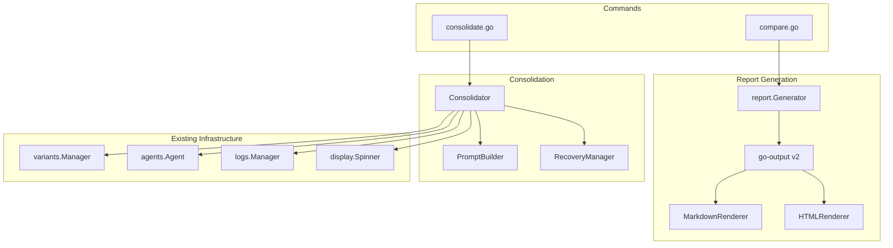
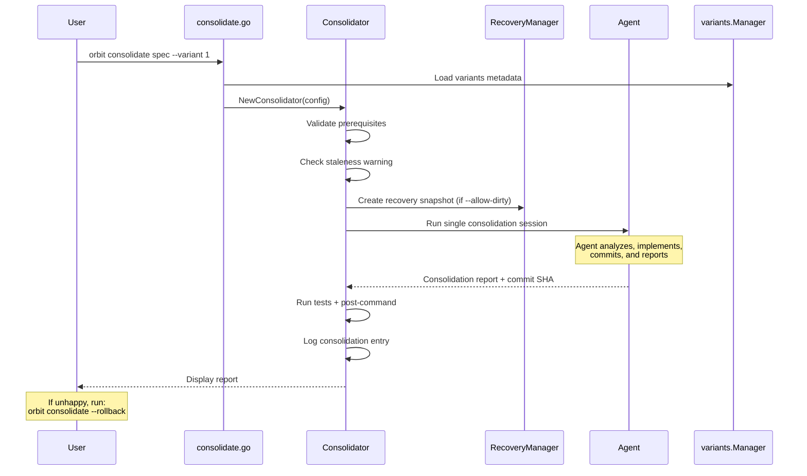
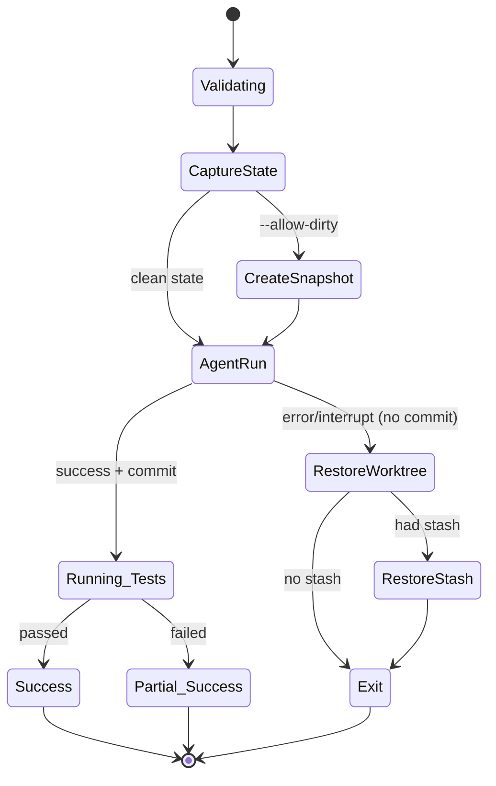

# Variant Consolidation Design

## Overview

This feature adds two capabilities to Orbit's multi-variant workflow:

1. **Markdown Report Generation**: The comparison report system will generate both HTML and Markdown outputs simultaneously using go-output v2, enabling AI agents to consume and reason about variant differences.

2. **Consolidate Command**: A new `orbit consolidate` command that orchestrates an AI agent to analyze the comparison report, identify actionable improvements from non-chosen variants, and apply them to the chosen variant.

The consolidate command differs from `finalize` (which adopts a single variant) by intelligently merging the best ideas from all variants into a unified implementation.

---

## Architecture

### Component Diagram



### Data Flow



**Key Design Decision**: The agent runs as a single session that autonomously:
1. Reads the comparison report and examines variant worktrees
2. Decides which improvements to implement (and which to skip)
3. Implements the improvements in the chosen variant
4. Commits all changes as a single commit
5. Produces a report of what was done

This eliminates the need for plan parsing, user confirmation mid-flow, and two separate agent sessions. If the user doesn't like the result, they simply run `orbit consolidate --rollback` to revert the commit.

---

## Components and Interfaces

### 1. Report Generation (Modified)

#### `internal/report/generator.go` (Modified)

The existing `Generator` will be extended to produce both HTML and Markdown using go-output v2.

```go
// Generator creates comparison reports in multiple formats.
type Generator struct {
    outputDir string
}

// Generate creates both HTML and Markdown report files.
// Uses go-output v2 for consistent multi-format rendering.
// Implements: [1.1], [1.2], [1.3], [1.4], [1.5], [1.6], [1.7]
func (g *Generator) Generate(data *ReportData) error

// buildDocument converts ReportData into a go-output v2 Document.
func (g *Generator) buildDocument(data *ReportData) *output.Document
```

#### `internal/report/types.go` (Modified)

Add metadata fields for staleness detection:

```go
// ReportData holds all data for report generation.
type ReportData struct {
    SpecName       string
    GeneratedAt    time.Time
    Variants       []VariantReportData
    Comparison     *comparison.Result
    BaseCommit     string
    OriginalBranch string

    // New: Per-variant commit SHAs for staleness detection [1.7]
    VariantCommits map[int]string `json:"variant_commits"`
}
```

### 2. Consolidate Command

#### `cmd/orbit/consolidate.go` (New)

Entry point for the consolidate subcommand.

```go
// consolidateCommand executes the orbit consolidate subcommand.
// Implements: [2.1], [2.2], [2.7], [2.8]
func consolidateCommand(args []string) error

// Flags:
// --variant <id>     Target variant ID (required for consolidation, not needed for --rollback)
// --allow-dirty      Allow uncommitted changes
// --prompt <text>    Custom instructions to influence consolidation decisions
// --rollback         Revert most recent consolidation commit (uses spec arg only)
//
// CLI Syntax:
//   orbit consolidate my-feature --variant 1              # Run consolidation
//   orbit consolidate my-feature --variant 1 --prompt "Focus on error handling"
//   orbit consolidate my-feature --rollback               # Revert last consolidation
```

### 3. Consolidation Engine

#### `internal/consolidation/consolidator.go` (New)

Core orchestration logic for the consolidate workflow.

```go
// Config holds consolidation configuration.
type Config struct {
    SpecName     string
    SpecDir      string
    VariantID    int
    Agent        agents.Agent
    AllowDirty   bool
    PostCommand  string
    CustomPrompt string // User-provided instructions via --prompt
}

// Consolidator orchestrates the consolidation workflow.
type Consolidator struct {
    config   Config
    manager  *variants.Manager
    recovery *RecoveryManager
    spinner  *display.Spinner
    logger   *ConsolidationLogger
}

// NewConsolidator creates a consolidator for a spec.
// Implements: [2.3], [2.4], [2.5], [2.6]
func NewConsolidator(cfg Config, mgr *variants.Manager) (*Consolidator, error)

// Run executes the consolidation workflow in a single agent session.
// The agent autonomously analyzes, implements, commits, and reports.
//
// Agent Interface Handling:
// - After agent.Run() completes, check if agent implements SessionExporter
// - If so (e.g., Kiro), call agent.ExportSession() to persist the session
// - This ensures transcript is saved regardless of agent type
//
// Implements: [3.1]-[3.3], [4.1]-[4.9], [5.1]-[5.8], [7.1]-[7.2]
func (c *Consolidator) Run(ctx context.Context) (*ConsolidationResult, error)

// Rollback reverts the most recent consolidation commit.
// 1. First checks consolidation-log.json for stored commit SHA
// 2. Falls back to searching recent commits (git log -n 20) for message pattern
// 3. Validates commit exists and message matches pattern before reverting
// Implements: [5.7]
func (c *Consolidator) Rollback(ctx context.Context) error

// checkStaleness compares report metadata against current variant HEADs.
// Returns a warning message if any variant's current commit differs from
// the commit SHA recorded when the comparison report was generated.
// Implements: [2.9]
func (c *Consolidator) checkStaleness(ctx context.Context) (warning string, err error)
// Implementation:
// 1. Parse YAML frontmatter from comparison-report.md to get variant_commits map
// 2. For each variant, run `git rev-parse HEAD` in its worktree
// 3. Compare current HEAD with recorded commit SHA
// 4. If any mismatch, return warning like:
//    "Warning: Comparison report may be stale. Variant 2 has new commits since report generation."

// checkEmptyImprovements validates the comparison report has actionable content.
// Returns an error if the CrossVariantImprovements section is empty or missing.
// This is a prerequisite check - if nothing to consolidate, exit early with message.
func (c *Consolidator) checkEmptyImprovements(ctx context.Context) error
// Implementation:
// 1. Parse comparison-report.md
// 2. Check if CrossVariantImprovements section exists and has entries
// 3. If empty: return ErrNoImprovements with message:
//    "No cross-variant improvements found in comparison report. Nothing to consolidate."
```

#### `internal/consolidation/types.go` (New)

Data structures for consolidation.

```go
// ConsolidationResult contains the outcome of a consolidation run.
type ConsolidationResult struct {
    CommitSHA         string
    AgentReport       string   // Raw report from agent (displayed to user)
    TestsPassed       bool
    PostCommandPassed bool
    Errors            []string
}

// ConsolidationReport is parsed from agent output for logging purposes.
// The agent produces this as part of its output; we parse it for the log.
type ConsolidationReport struct {
    Applied []AppliedImprovement
    Skipped []SkippedImprovement
}

// AppliedImprovement describes an improvement that was implemented.
type AppliedImprovement struct {
    SourceVariantID int
    Description     string
}

// SkippedImprovement describes an improvement that was not applied.
type SkippedImprovement struct {
    SourceVariantID int
    Description     string
    Reason          string
}
```

### 4. Agent Prompt Builder

#### `internal/consolidation/prompt.go` (New)

Constructs the prompt for the consolidation agent.

```go
// PromptBuilder constructs the agent prompt for consolidation.
type PromptBuilder struct {
    specName      string
    variantID     int
    reportPath    string
    worktreePaths map[int]string
    customPrompt  string // User-provided instructions
}

// NewPromptBuilder creates a prompt builder with context.
// Implements: [3.1], [3.2]
func NewPromptBuilder(specName string, variantID int, reportPath string, worktrees map[int]string, customPrompt string) *PromptBuilder

// Build generates the consolidation prompt.
// If customPrompt is provided, it's included as additional guidance.
// Implements: [2.8], [3.3], [4.1], [4.2], [4.3]
func (pb *PromptBuilder) Build() string
```

**Prompt Template**:

```
You are consolidating improvements into variant {variantID} for the "{specName}" feature.

## Context
- Comparison report: {reportPath}
- Chosen variant worktree: {worktreePaths[variantID]}
- Other variant worktrees: {worktreePaths[otherIDs]}

{IF customPrompt}
## Custom Instructions
{customPrompt}
{END IF}

## Instructions
1. Read the comparison report, focusing on the "Cross-Variant Improvements" section
2. For each improvement from non-chosen variants:
   - Examine the source variant's code to understand the implementation
   - Decide if it should be adopted based on feasibility, value, and any custom instructions above
   - If adopting: implement it in the chosen variant, adapting to fit existing patterns
3. Commit all changes as a single commit with EXACTLY this message format:
   feat(consolidate): Apply improvements from variants X, Y to variant {variantID} for {specName}
4. Output a report (see format below)

## Conflict Resolution Policy
If an improvement conflicts with the chosen variant's implementation:
- Prioritize the chosen variant's existing patterns and architecture
- Skip the conflicting improvement rather than forcing it
- Document the conflict clearly in your report

## Scope Constraints - DO NOT:
- Add new external dependencies
- Modify build configuration files (Makefile, go.mod, package.json, etc.)
- Make unrelated refactors or "improvements" not listed in the comparison report
- Change public APIs unless explicitly required by an improvement
- Modify files outside the chosen variant's worktree
- Modify binary files (images, compiled assets, etc.)

## Edge Case Handling:
- If a file was renamed/moved in the source variant, search for similar content in the chosen variant
- Before implementing, check if the improvement is already present (avoid duplicate changes)
- If a file path from the report doesn't exist, note in your report and skip that improvement

## Report Format (output this after committing)
```markdown
## Consolidation Report

### Applied
| Source | Files Modified | Description |
|--------|----------------|-------------|
| V{n} | path/to/file.go | Brief description of what was changed |

### Skipped
| Source | Reason |
|--------|--------|
| V{n} | Why this improvement was not applied |

### Commit
{commit SHA}
```
```

### 5. Recovery Manager

#### `internal/consolidation/recovery.go` (New)

Handles git state management for safe consolidation.

```go
// RecoveryManager handles git state for rollback on failure.
type RecoveryManager struct {
    git          variants.GitClient
    worktreePath string
    stashRef     string
    hasStash     bool
}

// NewRecoveryManager creates a recovery manager for a worktree.
func NewRecoveryManager(git variants.GitClient, worktreePath string) *RecoveryManager

// CaptureState records the current worktree state before agent runs.
// Called for ALL runs (not just --allow-dirty) to enable cleanup on failure.
func (rm *RecoveryManager) CaptureState(ctx context.Context) error

// CreateSnapshot stashes uncommitted changes if present.
// Only called when --allow-dirty is used.
// Implements: [5.4]
func (rm *RecoveryManager) CreateSnapshot(ctx context.Context) error

// RestoreOnFailure restores worktree to pre-session state if agent fails without committing.
// Uses git checkout -- . and git clean -fd to remove uncommitted modifications.
// Implements: [5.5]
func (rm *RecoveryManager) RestoreOnFailure(ctx context.Context) error

// RestoreStash restores stashed changes (for --allow-dirty interrupt).
// If stash pop causes merge conflicts:
// 1. Leave the stash in place (don't drop it)
// 2. Print warning: "Stash restore caused conflicts. Your changes are preserved in stash@{0}."
// 3. Print hint: "Resolve manually with: git stash pop"
// 4. Return nil (not an error - the stash is safe)
func (rm *RecoveryManager) RestoreStash(ctx context.Context) error

// Cleanup removes recovery artifacts after successful completion.
func (rm *RecoveryManager) Cleanup(ctx context.Context) error
```

### 6. Consolidation Logger

#### `internal/consolidation/logger.go` (New)

Logs consolidation activity for tracking.

```go
// LogEntry represents a single consolidation attempt.
// Implements: [6.1], [6.2]
type LogEntry struct {
    SchemaVersion         string    `json:"schema_version"`
    Timestamp             time.Time `json:"timestamp"`
    ChosenVariantID       int       `json:"chosen_variant_id"`
    CommitSHA             string    `json:"commit_sha,omitempty"`
    Agent                 string    `json:"agent"`
    ReportFile            string    `json:"report_file,omitempty"` // Path to saved report
    ImprovementsAttempted int       `json:"improvements_attempted"`
    ImprovementsApplied   int       `json:"improvements_applied"`
    ImprovementsSkipped   int       `json:"improvements_skipped"`
    TestsPassed           bool      `json:"tests_passed"`
    PostCommandPassed     bool      `json:"post_command_passed"`
    Errors                []string  `json:"errors,omitempty"`
}

// ConsolidationLog manages the consolidation-log.json file.
type ConsolidationLogger struct {
    orbitDir string
    logPath  string
    lockPath string // .orbit/consolidation-log.lock
}

// NewConsolidationLogger creates a logger for a spec's .orbit directory.
func NewConsolidationLogger(orbitDir string) *ConsolidationLogger

// Append adds a new entry to the log with file locking for concurrent safety.
// Uses flock-style locking to prevent race conditions when multiple
// consolidation runs occur simultaneously.
// Implements: [6.4]
func (cl *ConsolidationLogger) Append(entry LogEntry) error
// Implementation:
// 1. Acquire exclusive lock on .orbit/consolidation-log.lock
// 2. Read existing log (or create empty)
// 3. Append new entry
// 4. Write atomically (temp file + rename)
// 5. Release lock

// SaveReport saves the agent's report to a timestamped markdown file.
// Returns the file path for reference in the log entry.
// Implements: [6.3]
func (cl *ConsolidationLogger) SaveReport(report string) (string, error)

// GetLatestCommitSHA returns the commit SHA from the most recent log entry.
// Used by Rollback as the primary mechanism to find the consolidation commit.
func (cl *ConsolidationLogger) GetLatestCommitSHA() (string, error)
```

---

## Data Models

### Consolidation Log Schema (v1)

```json
{
  "schema_version": "1",
  "entries": [
    {
      "schema_version": "1",
      "timestamp": "2025-01-23T14:30:00Z",
      "chosen_variant_id": 1,
      "commit_sha": "abc123def456",
      "agent": "claude-code",
      "report_file": "consolidation-report-2025-01-23T14-30-00.md",
      "improvements_attempted": 3,
      "improvements_applied": 2,
      "improvements_skipped": 1,
      "tests_passed": true,
      "post_command_passed": true,
      "errors": []
    }
  ]
}
```

### Report Metadata Schema (Addition)

The Markdown report includes a YAML frontmatter metadata section:

```markdown
---
generated_at: 2025-01-23T14:30:00Z
base_commit: abc123
variant_commits:
  1: def456
  2: ghi789
  3: jkl012
---

# Comparison Report: my-feature
...
```

### Agent Report Format

Displayed to user after consolidation completes (produced by agent):

```markdown
## Consolidation Report for variant 1

### Improvements Applied

| Source | Description |
|--------|-------------|
| V2 | Better error handling in API - added structured errors in api/handler.go |
| V3 | Improved test coverage - added edge case tests in tests/api_test.go |

### Improvements Skipped

| Source | Description | Reason |
|--------|-------------|--------|
| V2 | Custom logging format | Conflicts with existing logger configuration |

### Commit
`abc123def` - feat(consolidate): Apply improvements from variants 2, 3 to variant 1 for my-feature

To undo: `orbit consolidate my-feature --rollback`
```

---

## Error Handling

### Error Classification

The consolidator uses the existing `agents.ErrorClassifier` interface for agent errors:

| Error Class | Behavior | Examples |
|-------------|----------|----------|
| `ErrorClassRetryable` | Exponential backoff retry | Rate limits, transient network errors |
| `ErrorClassFatal` | Stop immediately | Auth failures, invalid config |
| `ErrorClassSessionInvalid` | Start fresh session | Session expired |

### Consolidation-Specific Errors

| Error | Handling | Requirement |
|-------|----------|-------------|
| Variant not found | List available variants, exit | [5.1] |
| No markdown report | Offer to run `orbit compare` | [5.2] |
| No improvements to apply | Display message, exit with code 0 (not an error) | N/A |
| Worktree not found | Validate worktree exists, suggest `orbit status` | [4.1] |
| Agent error | Exit, display error | [5.3] |
| Interrupt (Ctrl+C) | Restore worktree, restore stash if present | [5.4], [5.5], [5.6] |
| Partial agent failure | Clean uncommitted changes, restore stash | [5.6] |
| Test failure | Report failure, keep commit (user can rollback) | [4.4] |
| Stash conflict on restore | Leave stash, warn user, provide hint | N/A |
| Concurrent run | File locking prevents race, second run waits | N/A |

### Recovery Flow



**Recovery behavior:**
- `CaptureState`: Records worktree state before agent runs (for all runs)
- `RestoreWorktree`: If agent fails without committing, restore worktree to captured state using `git checkout -- .` and `git clean -fd`
- `RestoreStash`: If `--allow-dirty` was used, also restore the stashed changes
- If the agent creates a commit but tests fail, the commit remains. User can inspect and either keep or rollback.

---

## Testing Strategy

### Unit Tests

| Component | Test File | Coverage |
|-----------|-----------|----------|
| Report Generator | `generator_test.go` | Multi-format output, metadata inclusion, empty sections |
| Consolidator | `consolidator_test.go` | Validation, state machine, error paths, staleness check |
| PromptBuilder | `prompt_test.go` | Prompt construction, escaping, custom prompt injection |
| RecoveryManager | `recovery_test.go` | Stash/restore operations, stash conflict handling |
| ConsolidationLogger | `logger_test.go` | Append behavior, schema versioning, file locking |

### Integration Tests

| Test | Description | Files |
|------|-------------|-------|
| `TestConsolidateE2E` | Full workflow with mock agent | `consolidate_test.go` |
| `TestConsolidateRollback` | Rollback functionality | `consolidate_test.go` |
| `TestReportMultiFormat` | HTML + Markdown generation | `generator_test.go` |
| `TestConsolidateEmptyImprovements` | Early exit when no improvements | `consolidate_test.go` |
| `TestRecoveryPartialFailure` | Agent fails mid-execution, worktree cleaned | `recovery_test.go` |
| `TestLoggerConcurrentAppend` | File locking prevents corruption | `logger_test.go` |
| `TestStashRestoreConflict` | Stash pop conflict handling | `recovery_test.go` |

### Test Patterns

**Table-driven tests** for validation scenarios:

```go
func TestConsolidatorValidation(t *testing.T) {
    tests := map[string]struct {
        config      Config
        setupFn     func(*variants.Manager)
        wantErr     string
    }{
        "variant not found": {
            config:  Config{VariantID: 99},
            wantErr: "variant 99 not found",
        },
        "no markdown report": {
            config:  Config{VariantID: 1},
            setupFn: func(m *variants.Manager) { /* no report */ },
            wantErr: "comparison-report.md not found",
        },
        // ...
    }

    for name, tc := range tests {
        t.Run(name, func(t *testing.T) {
            // ...
        })
    }
}
```

**Mock agent** for controlled testing:

```go
type mockAgent struct {
    analysisResult string
    applyResult    string
    applyError     error
}

func (m *mockAgent) Run(ctx context.Context, opts agents.RunOptions) (*agents.RunResult, error) {
    // Return pre-configured responses
}
```

---

## Implementation Notes

### go-output v2 Integration

The report generator will use go-output v2's document builder pattern:

```go
func (g *Generator) buildDocument(data *ReportData) *output.Document {
    builder := output.New()

    // Metadata as YAML frontmatter (for markdown)
    builder.Raw("markdown", g.buildMetadataYAML(data))

    // Header
    builder.Header(fmt.Sprintf("Comparison Report: %s", data.SpecName))

    // Recommendation section
    builder.Section("Recommendation", func(b *output.Builder) {
        b.Text(fmt.Sprintf("Recommended: Variant %d (%s confidence)",
            data.Comparison.Recommendation, data.Comparison.Confidence))
        b.Text(data.Comparison.Summary)
    })

    // Observations
    if len(data.Comparison.Observations) > 0 {
        builder.Section("Observations", func(b *output.Builder) {
            for _, obs := range data.Comparison.Observations {
                b.Text("- " + obs)
            }
        })
    }

    // Cross-variant improvements table
    if len(data.Comparison.CrossVariantImprovements) > 0 {
        improvements := g.improvementsToTableData(data.Comparison.CrossVariantImprovements)
        builder.Table("Cross-Variant Improvements", improvements,
            output.WithKeys("Source Variant", "Priority", "Description", "Rationale"))
    }

    // File analyses
    // ... (similar pattern)

    return builder.Build()
}
```

### Commit Message Format

The consolidation commit uses a standardized format for `--rollback` validation:

```
feat(consolidate): Apply improvements from variants 2, 3 to variant 1 for my-feature

Applied improvements:
- Better error handling (from variant 2)
- Improved test coverage (from variant 3)

Skipped:
- Custom logging format (from variant 2) - conflicts with existing logger
```

Rollback validation regex: `^feat\(consolidate\): Apply improvements from variants .+ to variant \d+ for .+$`

### Spinner Integration

The consolidator uses the existing `display.Spinner` with custom messages:

```go
func (c *Consolidator) Run(ctx context.Context) (*ConsolidationResult, error) {
    c.spinner.Start(0)
    c.spinner.UpdateMessage("Validating prerequisites...")

    // Validation...

    c.spinner.UpdateMessage("Running consolidation agent...")

    // Single agent session handles analysis, implementation, and commit

    c.spinner.UpdateMessage("Running tests...")

    // Run tests + post-command...

    c.spinner.Stop()
    // Display agent's report
}
```

Note: Since the agent runs autonomously, we can't show per-improvement progress. The spinner shows the overall stage (agent running, tests running, etc.).

### Signal Handling

Consolidation registers a signal handler for graceful interrupt:

```go
func (c *Consolidator) Run(ctx context.Context) (*ConsolidationResult, error) {
    ctx, cancel := context.WithCancel(ctx)
    defer cancel()

    sigChan := make(chan os.Signal, 1)
    signal.Notify(sigChan, syscall.SIGINT, syscall.SIGTERM)

    go func() {
        <-sigChan
        c.spinner.Stop()
        fmt.Println("\nInterrupted. Restoring state...")
        if err := c.recovery.Restore(context.Background()); err != nil {
            fmt.Fprintf(os.Stderr, "Warning: failed to restore: %v\n", err)
        }
        cancel()
    }()

    // ... rest of workflow
}
```

---

## File Structure

```
cmd/orbit/
    consolidate.go          # New: consolidate command entry point

internal/
    consolidation/          # New package
        consolidator.go     # Core orchestration
        types.go            # Data structures
        prompt.go           # Agent prompt construction
        recovery.go         # Git state management
        logger.go           # Consolidation logging
        consolidator_test.go
        prompt_test.go
        recovery_test.go
        logger_test.go

    report/
        generator.go        # Modified: add markdown generation
        types.go            # Modified: add VariantCommits field
        markdown.go         # New: markdown-specific helpers (if needed)
        generator_test.go   # Extended tests
```

---

## Requirements Traceability

| Requirement | Component | Method/Function |
|-------------|-----------|-----------------|
| [1.1] | report.Generator | Generate() |
| [1.2] | report.Generator | buildDocument() |
| [1.3] | go-output v2 | Markdown() format |
| [1.4] | report.Generator | Generate() |
| [1.5] | report.Generator | buildDocument() |
| [1.6] | report.Generator | processVariant() |
| [1.7] | report.ReportData | VariantCommits field |
| [2.1] | cmd/orbit | consolidateCommand() |
| [2.2] | cmd/orbit | consolidateCommand() |
| [2.3] | Consolidator | NewConsolidator() |
| [2.4] | Consolidator | Run() - validation |
| [2.5] | Consolidator | Run() |
| [2.6] | Consolidator | config.Agent |
| [2.7] | cmd/orbit | consolidateCommand() |
| [2.8] | Consolidator | checkStaleness() |
| [3.1] | PromptBuilder | Build() |
| [3.2] | PromptBuilder | Build() |
| [3.3] | PromptBuilder | Build() |
| [3.4] | PromptBuilder | Build() - scope constraints |
| [3.5] | Agent | Report output format |
| [4.1] | Consolidator | determineTargetPath() |
| [4.2] | PromptBuilder | Build() - commit message |
| [4.3] | Consolidator | runValidation() |
| [4.4] | Consolidator | runValidation() |
| [4.5] | Consolidator | Run() |
| [4.6] | ConsolidationLogger | Append() |
| [5.1] | Consolidator | validateVariant() |
| [5.2] | Consolidator | validateReport() |
| [5.3] | Consolidator | Run() |
| [5.4] | RecoveryManager | CaptureState() |
| [5.5] | RecoveryManager | CreateSnapshot() |
| [5.6] | RecoveryManager | RestoreOnFailure() |
| [5.7] | Consolidator | Rollback() |
| [5.8] | Consolidator | classifyError() |
| [5.9] | Consolidator | runWithRetry() |
| [6.1] | ConsolidationLogger | LogEntry.SchemaVersion |
| [6.2] | ConsolidationLogger | LogEntry struct |
| [6.3] | Consolidator | Run() - saves transcript |
| [6.4] | ConsolidationLogger | SaveReport() |
| [6.5] | ConsolidationLogger | Append() |
| [7.1] | Consolidator | Run() - spinner messages |
